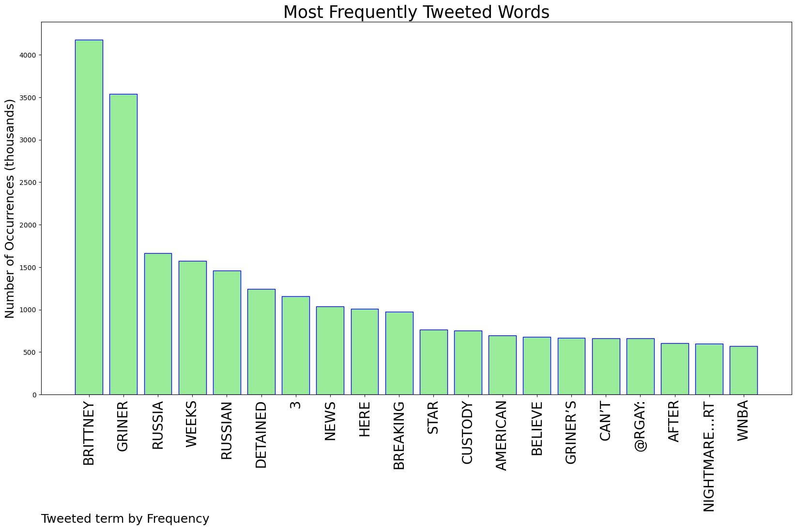
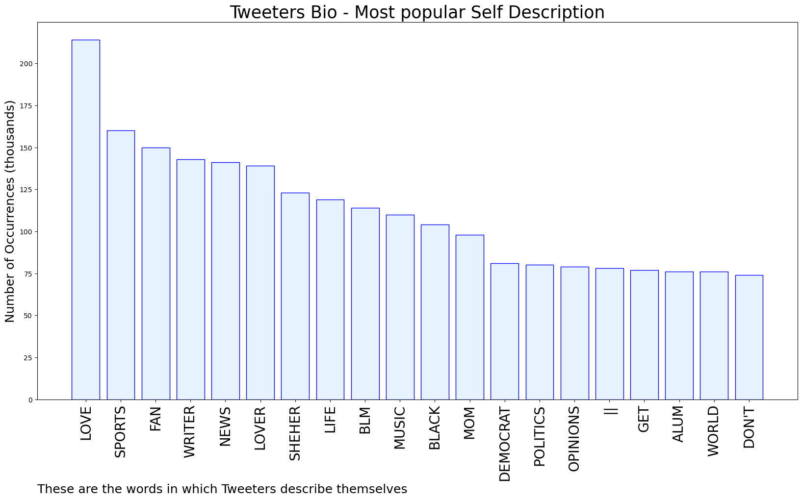

# MURCHIE85 TWITTER PROCESSING 
&#x1F34E; **TOPIC = "Brittney Griner"**

## AUTOMATED RESEARCH SUMMARY

*note: Image pulled from web automatically, not connected to author.
  
<b> This report is AUTOMATED and not hand crafted, it is designed for pulling metrics on a given keyword or hashtag and performs a series of reporting and analysis.</b>

|                **Sample-Tweets**        |
| :-------------: |
| RT @AntheaButler: I hate to say this, but we are not going to see Brittney Griner for awhile. Whether she had vape pens or not, this is a p… |
| RT @ShellyBellyPBJ: @IAmJohnAles Breaking News: Russian customs officials said they had detained a star American basketball player after fi… |
| RT @cmclymer: It taking three weeks for Brittney Griner’s detention in Russia to hit the news here is absurd and horrifying in a way that’s… |

The most popular user is: **SDEnyaRedRain**

 RT @nytimes: Breaking News: Russian customs officials said they had detained a star American basketball player after finding hashish oil in…

## RELATED METRICS 
| Metric | Value |
| ------------- | ------------- |
| #1 Most tweeted to  | **rgay** |
| #2 Most tweeted to  | **cmclymer** |
| #3 Most tweeted to  | **nytimes** |
| NewProfiles (less than 10 days) | 0.46%  |
| Tweeters with < 10 followers  | 2.1%|
| Tweeters with > 1000000 followers  | 0.1%  |

## MOST POPULAR TWEET TERMS 

| Popularity Rank  | Term |
| ------------- | ------------- |
| first  | **BRITTNEY**  |
| second  | **GRINER**  |
| third  | **RUSSIA** |
| fourth  | **WEEKS**  |
| fifth  | **RUSSIAN**  |

## Twitter Bio Analysis
### SENTIMENT ANALYSIS

VIEWS WERE : **SUBJECTIVE**  (33.33%) & **NEGATIVELY-SUBJECTIVE** (26.67%) **OBJECTIVE** (40.0%)

### TWEET SAMPLE 
| Random value picked from array |
| ------------- |
|RT @washingtonpost: WNBA star Brittney Griner has been arrested in Russia on suspicion of illegally bringing drugs into the country after b… |

### MOST RETWEETED 

| The most retweeted user is: **SDEnyaRedRain**  |
| ------------- |
| RT @nytimes: Breaking News: Russian customs officials said they had detained a star American basketball player after finding hashish oil in… |

### CONCLUSION & EXTERNAL ANALYSIS

*This is my [Adam McMurchie`s] opinion on the data from the tweets, it serves as no objective truth.Since the tweets themselves are a mixture of fact & opinion. 
Authors analytical summary on request.
**RECOMMENDATIONS** WILL BE UPDATED IN NEXT  24 HOURS  