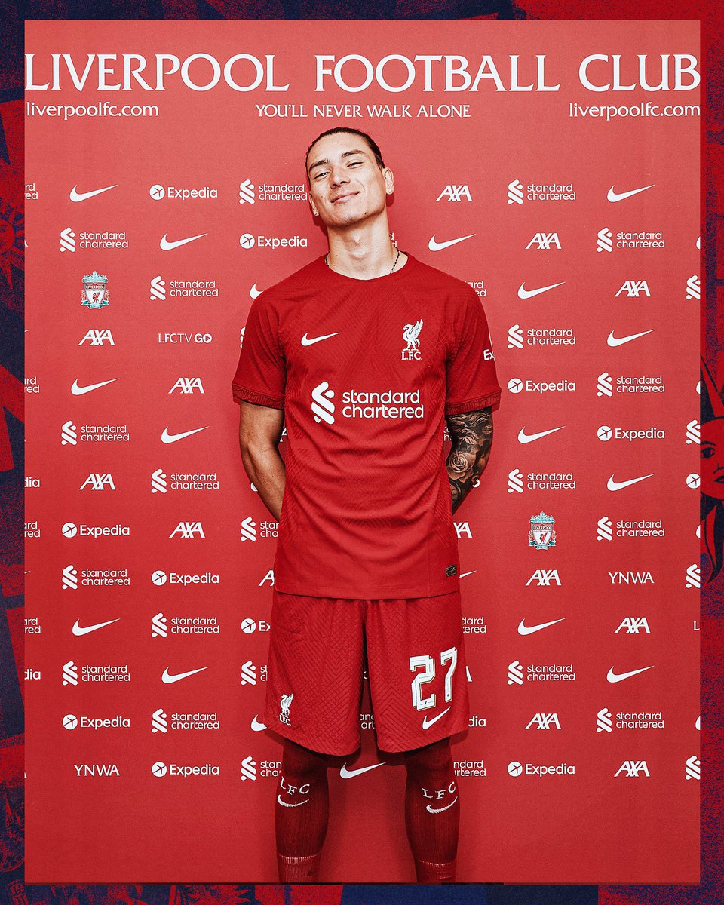
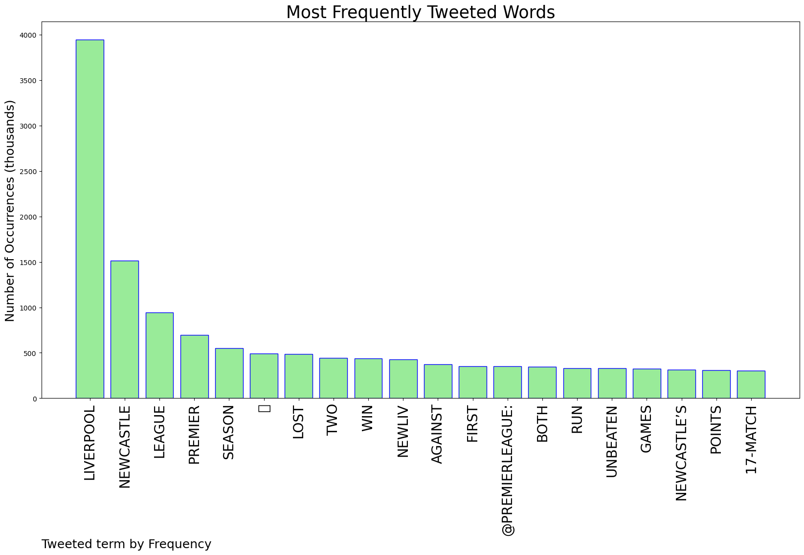
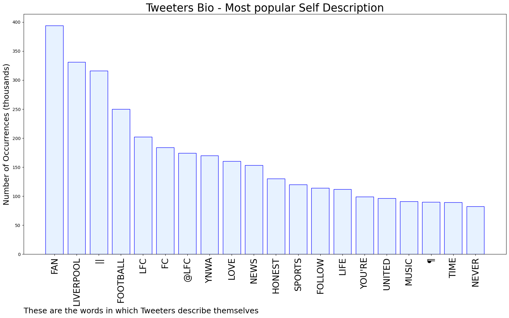

# MURCHIE85 TWITTER PROCESSING 
&#x1F34E; **TOPIC = "Liverpool"**

## AUTOMATED RESEARCH SUMMARY

*note: Image pulled from web automatically, not connected to author.
  
<b> This report is AUTOMATED and not hand crafted, it is designed for pulling metrics on a given keyword or hashtag and performs a series of reporting and analysis.</b>

|                **Sample-Tweets**        |
| :-------------: |
| RT @ESPNFC: Liverpool are the only team to beat Newcastle in the Premier League this season.They've done it twice 💪 https://t.co/cseb98Y6… |
| RT @TheKop_com: Trent vs Newcastle today 💪 https://t.co/K4w9Za2bkt |
| Newcastle United vs. Liverpool – Football Match Report – February 18, 2023 – ESPN https://t.co/MsULOmYqLK |

The most popular user is: **Evuslfc**

 RT @TrentAA: Welcome to Liverpool! @Darwinn99 How may I assist you? 😜 https://t.co/YvuzVJBfvg

## RELATED METRICS 
| Metric | Value |
| ------------- | ------------- |
| #1 Most tweeted to  | **premierleague** |
| #2 Most tweeted to  | **brfootball** |
| #3 Most tweeted to  | **SkySportsPL** |
| NewProfiles (less than 10 days) | 0.18%  |
| Tweeters with < 10 followers  | 3.84%|
| Tweeters with > 1000000 followers  | 0.42%  |

## MOST POPULAR TWEET TERMS 

| Popularity Rank  | Term |
| ------------- | ------------- |
| first  | **LIVERPOOL**  |
| second  | **NEWCASTLE**  |
| third  | **LEAGUE** |
| fourth  | **PREMIER**  |
| fifth  | **SEASON**  |

## Twitter Bio Analysis
### SENTIMENT ANALYSIS

VIEWS WERE : **SUBJECTIVE**  (60.0%) & **NEGATIVELY-SUBJECTIVE** (6.67%) **OBJECTIVE** (33.33%)

### TWEET SAMPLE 
| Random value picked from array |
| ------------- |
|RT @LivEchoLFC: Some interesting shouts #LFChttps://t.co/YNJzCNTWr1 |

### MOST RETWEETED 

| The most retweeted user is: **Evuslfc**  |
| ------------- |
| RT @TrentAA: Welcome to Liverpool! @Darwinn99 How may I assist you? 😜 https://t.co/YvuzVJBfvg |

### CONCLUSION & EXTERNAL ANALYSIS

*This is my [Adam McMurchie`s] opinion on the data from the tweets, it serves as no objective truth.Since the tweets themselves are a mixture of fact & opinion. 
Authors analytical summary on request.
**RECOMMENDATIONS** WILL BE UPDATED IN NEXT  24 HOURS  