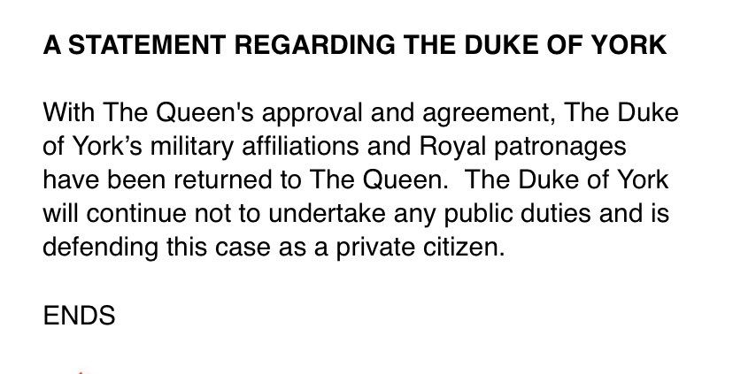
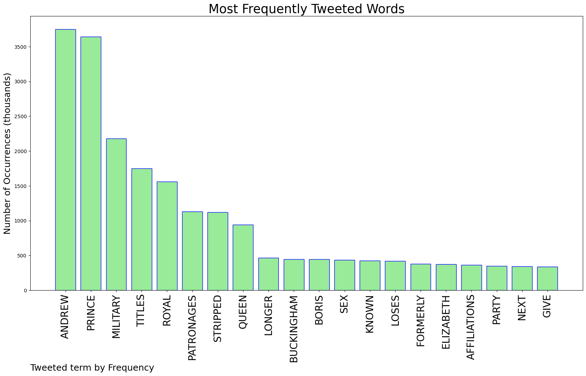
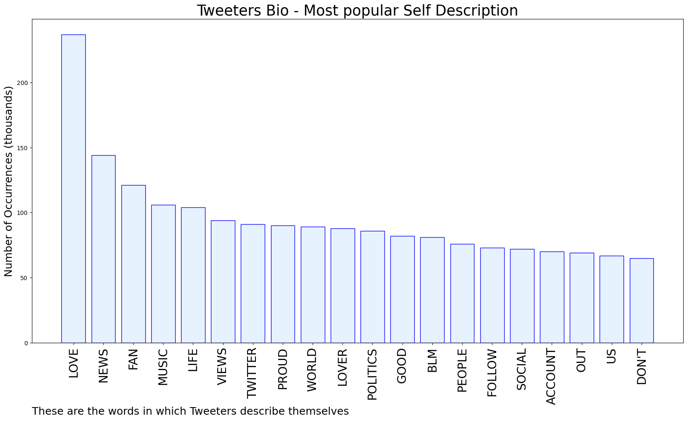
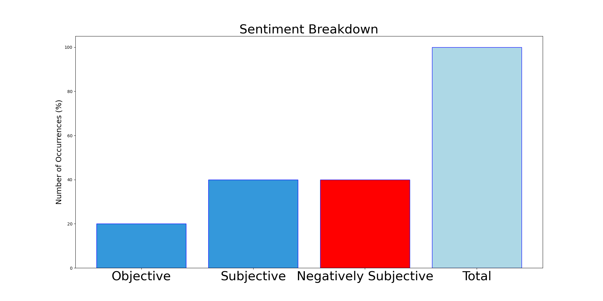

# MURCHIE85 TWITTER PROCESSING 
&#x1F34E; **TOPIC = "Prince Andrew"**

## AUTOMATED RESEARCH SUMMARY

*note: Image pulled from web automatically, not connected to author.
  
<b> This report is AUTOMATED and not hand crafted, it is designed for pulling metrics on a given keyword or hashtag and performs a series of reporting and analysis.</b>

|                **Sample-Tweets**        |
| :-------------: |
| RT @johnkampfner: How proud you feel to be British when Johnson's 'partying' and Prince Andrew's 'partying' are items one and two in much o… |
| RT @CNN: BREAKING: Britain's Prince Andrew is stripped of all his military titles as he faces a civil sex assault trial in the US. https:/… |
| RT @hrkbenowen: BREAKING NEWS:Prince Andrew has been stripped all military titles royal patronages and will face the sex assault lawsuit… |

The most popular user is: **assessedwealth**

 RT @campbellclaret: Boris Johnson and Prince Andrew - what an image the world is getting of Global Britain.

## RELATED METRICS 
| Metric | Value |
| ------------- | ------------- |
| #1 Most tweeted to  | **munyachawawa** |
| #2 Most tweeted to  | **RoyalFamily** |
| #3 Most tweeted to  | **kylegriffin1** |
| NewProfiles (less than 10 days) | 0.72%  |
| Tweeters with < 10 followers  | 2.72%|
| Tweeters with > 1000000 followers  | 0.26%  |

## MOST POPULAR TWEET TERMS 

| Popularity Rank  | Term |
| ------------- | ------------- |
| first  | **ANDREW**  |
| second  | **PRINCE**  |
| third  | **MILITARY** |
| fourth  | **TITLES**  |
| fifth  | **ROYAL**  |

## Twitter Bio Analysis
### SENTIMENT ANALYSIS

VIEWS WERE : **SUBJECTIVE**  (40.0%) & **NEGATIVELY-SUBJECTIVE** (40.0%) **OBJECTIVE** (20.0%)

### TWEET SAMPLE 
| Random value picked from array |
| ------------- |
|"Prince Andrew is facing a possible trial in New York this fall after his lawyers recently failed to halt a suit st… https://t.co/pmseAjDxqe |

### MOST RETWEETED 

| The most retweeted user is: **assessedwealth**  |
| ------------- |
| RT @campbellclaret: Boris Johnson and Prince Andrew - what an image the world is getting of Global Britain. |

### CONCLUSION & EXTERNAL ANALYSIS

*This is my [Adam McMurchie`s] opinion on the data from the tweets, it serves as no objective truth.Since the tweets themselves are a mixture of fact & opinion. 
Authors analytical summary on request.
**RECOMMENDATIONS** WILL BE UPDATED IN NEXT  24 HOURS  