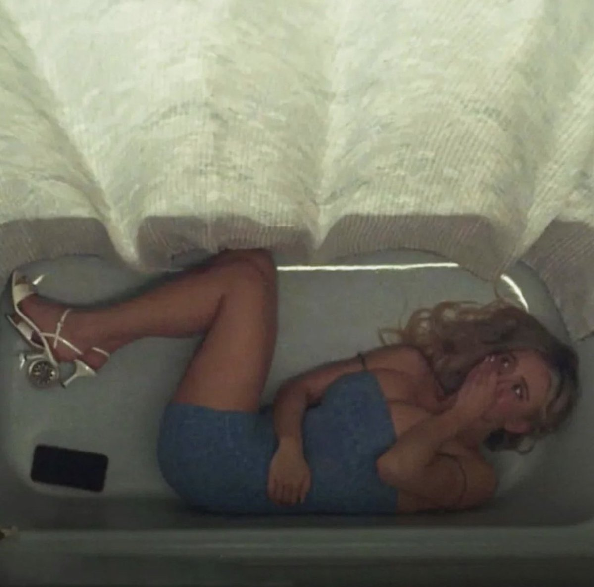
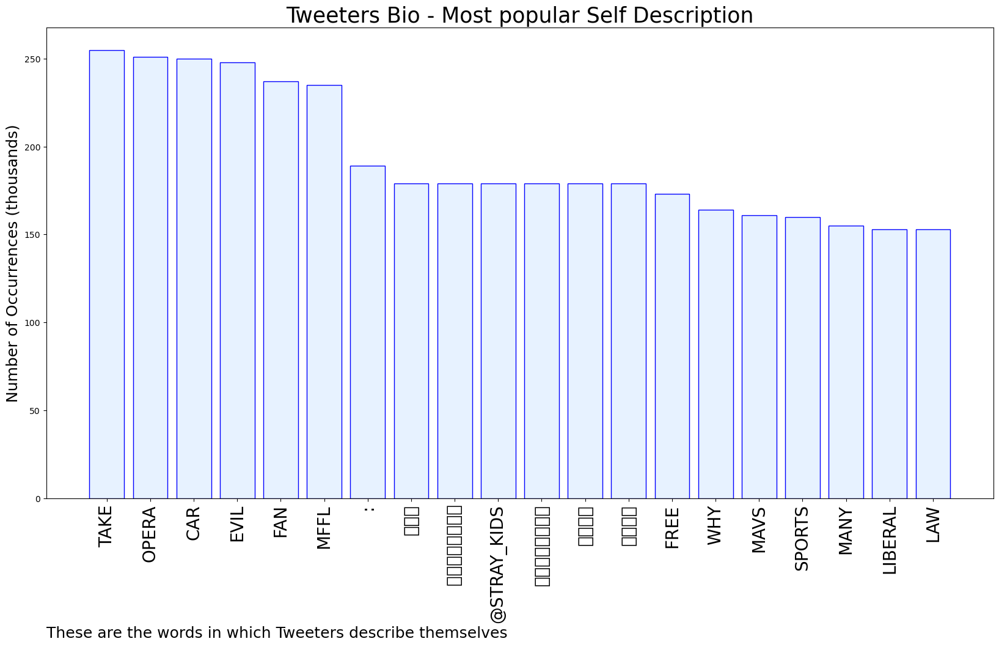

# MURCHIE85 TWITTER PROCESSING 
&#x1F34E; **TOPIC = "Chriss"**

## AUTOMATED RESEARCH SUMMARY

*note: Image pulled from web automatically, not connected to author.
  
<b> This report is AUTOMATED and not hand crafted, it is designed for pulling metrics on a given keyword or hashtag and performs a series of reporting and analysis.</b>

|                **Sample-Tweets**        |
| :-------------: |
| RT @CoachRomoAhs: Final from Eastwood, your Blazers defeat the Troopers 39-38. Leading scorers were @therealjor11 10pts &amp; @Ballin_Chriss wi… |
| @MetawarOfficial Let us all become good warriors with this big project! METAWAR@vahndhee @Mimi03564178 @ahbaydl6030681 |
| @Chriss_Daryl omg yesss i think everyone is gonna show up in cosplay 😂 |

The most popular user is: **Chriss_r07**

 RT @pulte: To celebrate the New Year, I'm giving $5,000 to someone random who retweets this tweet in the next 24 hours (must be following m…

## RELATED METRICS 
| Metric | Value |
| ------------- | ------------- |
| #1 Most tweeted to  | **All_Things_Mavs** |
| #2 Most tweeted to  | **Chriss_Daryl** |
| #3 Most tweeted to  | **LegatoTia** |
| NewProfiles (less than 10 days) | 4.58%  |
| Tweeters with < 10 followers  | 5.94%|
| Tweeters with > 1000000 followers  | 0.06%  |

## MOST POPULAR TWEET TERMS 

| Popularity Rank  | Term |
| ------------- | ------------- |
| first  | **CHRISS**  |
| second  | **MARQUESE**  |
| third  | **10-DAY** |
| fourth  | **POINTS**  |
| fifth  | **MAVS**  |

## Twitter Bio Analysis
### SENTIMENT ANALYSIS

VIEWS WERE : **SUBJECTIVE**  (13.33%) & **NEGATIVELY-SUBJECTIVE** (6.67%) **OBJECTIVE** (80.0%)

### TWEET SAMPLE 
| Random value picked from array |
| ------------- |
|RT @Mavs_FFL: Chriss &gt; Moses &amp; WCS |

### MOST RETWEETED 

| The most retweeted user is: **Chriss_r07**  |
| ------------- |
| RT @pulte: To celebrate the New Year, I'm giving $5,000 to someone random who retweets this tweet in the next 24 hours (must be following m… |

### CONCLUSION & EXTERNAL ANALYSIS

*This is my [Adam McMurchie`s] opinion on the data from the tweets, it serves as no objective truth.Since the tweets themselves are a mixture of fact & opinion. 
Authors analytical summary on request.
**RECOMMENDATIONS** WILL BE UPDATED IN NEXT  24 HOURS  