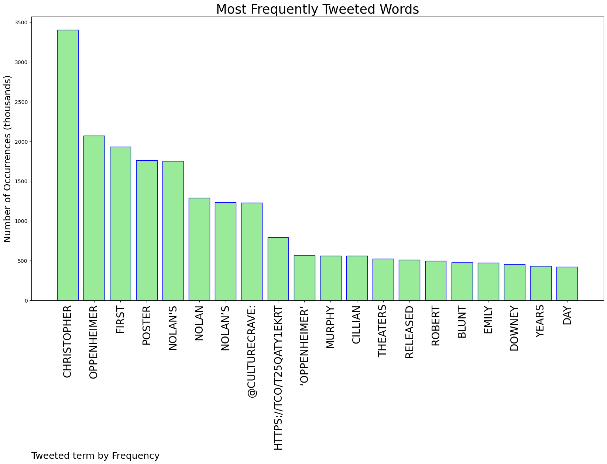
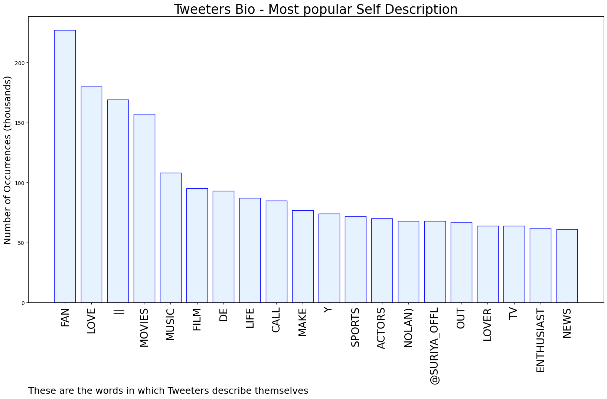

# MURCHIE85 TWITTER PROCESSING 
&#x1F34E; **TOPIC = "Nolan"**

## AUTOMATED RESEARCH SUMMARY

*note: Image pulled from web automatically, not connected to author.
  
<b> This report is AUTOMATED and not hand crafted, it is designed for pulling metrics on a given keyword or hashtag and performs a series of reporting and analysis.</b>

|                **Sample-Tweets**        |
| :-------------: |
| RT @CultureCrave: First poster for Christopher Nolan's #Oppenheimer https://t.co/T25qATY1Ek |
| @dan_florie @billybutlerfan @RustyMcCoy9 @nolan_szn @joshmanning121 With below average talent. So still doing more with less. |
| RT @getFANDOM: Prolific comic book writer Alan Grant has died at 73He was best known for classic runs of Judge Dredd, Batman, and Lobo ht… |

The most popular user is: **nolan_kerwin**

 RT @PAVGOD: when u have nice shoes https://t.co/sxecMfRalZ

## RELATED METRICS 
| Metric | Value |
| ------------- | ------------- |
| #1 Most tweeted to  | **CultureCrave** |
| #2 Most tweeted to  | **FilmUpdates** |
| #3 Most tweeted to  | **DiscussingFilm** |
| NewProfiles (less than 10 days) | 0.44%  |
| Tweeters with < 10 followers  | 5.14%|
| Tweeters with > 1000000 followers  | 0.08%  |

## MOST POPULAR TWEET TERMS 

| Popularity Rank  | Term |
| ------------- | ------------- |
| first  | **CHRISTOPHER**  |
| second  | **OPPENHEIMER**  |
| third  | **FIRST** |
| fourth  | **POSTER**  |
| fifth  | **"NOLANS"**  |

## Twitter Bio Analysis
### SENTIMENT ANALYSIS

VIEWS WERE : **SUBJECTIVE**  (40.0%) & **NEGATIVELY-SUBJECTIVE** (20.0%) **OBJECTIVE** (40.0%)

### TWEET SAMPLE 
| Random value picked from array |
| ------------- |
|RT @FilmUpdates: Christopher Nolan’s ‘DUNKIRK’ released in theaters on this day, 5 years ago. https://t.co/c2Ba1lbSVN |

### MOST RETWEETED 

| The most retweeted user is: **nolan_kerwin**  |
| ------------- |
| RT @PAVGOD: when u have nice shoes https://t.co/sxecMfRalZ |

### CONCLUSION & EXTERNAL ANALYSIS

*This is my [Adam McMurchie`s] opinion on the data from the tweets, it serves as no objective truth.Since the tweets themselves are a mixture of fact & opinion. 
Authors analytical summary on request.
**RECOMMENDATIONS** WILL BE UPDATED IN NEXT  24 HOURS  