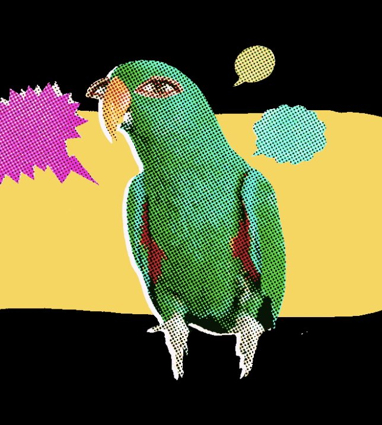
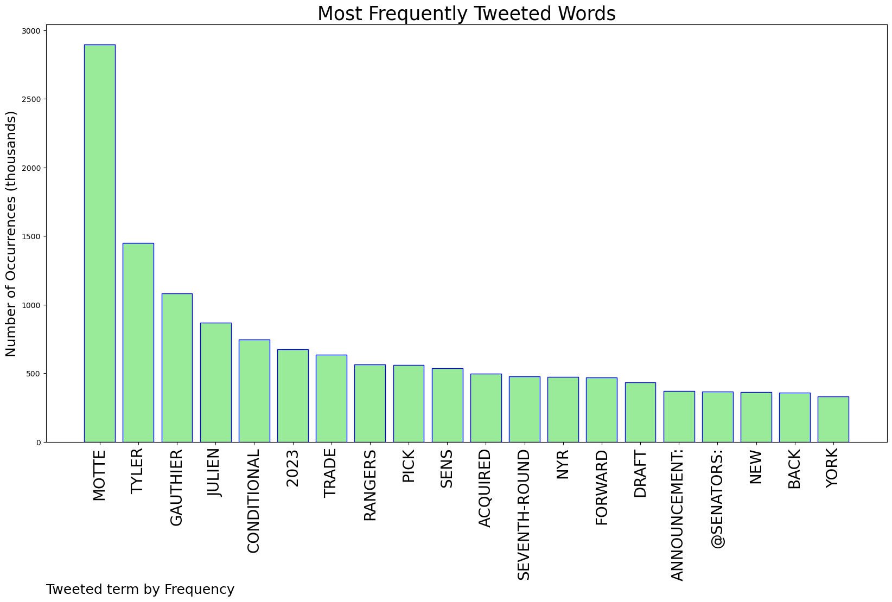
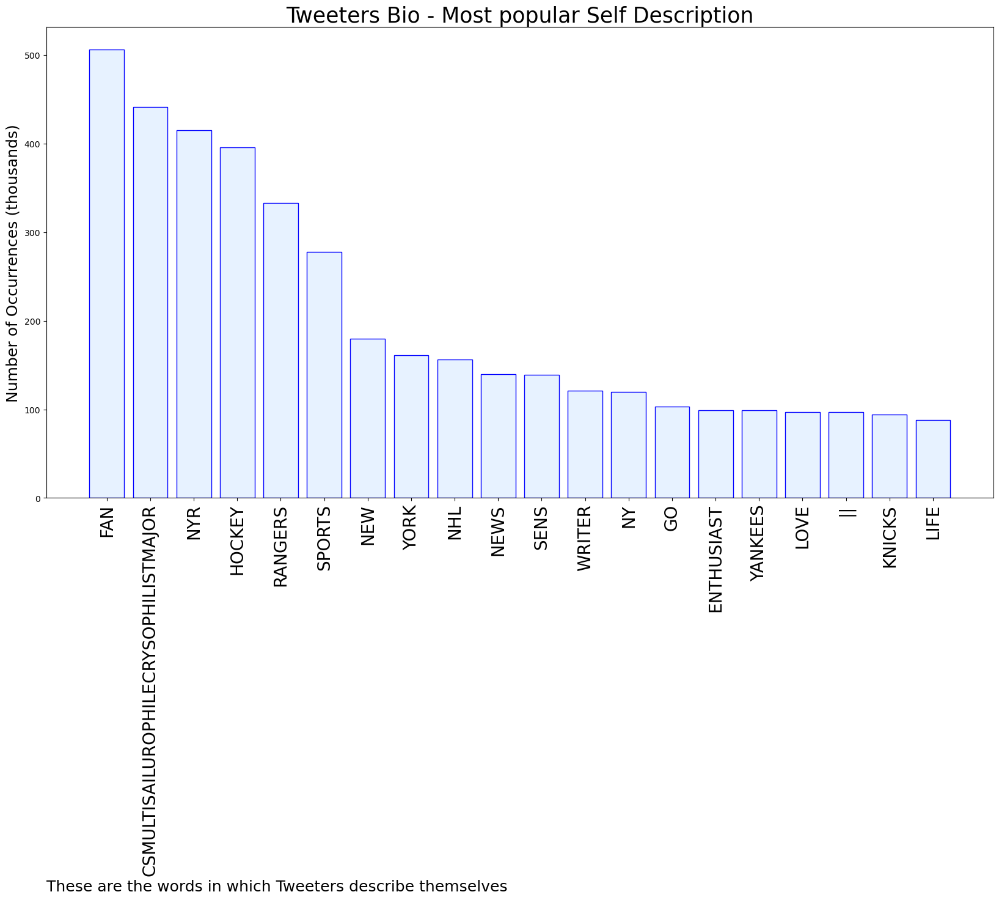
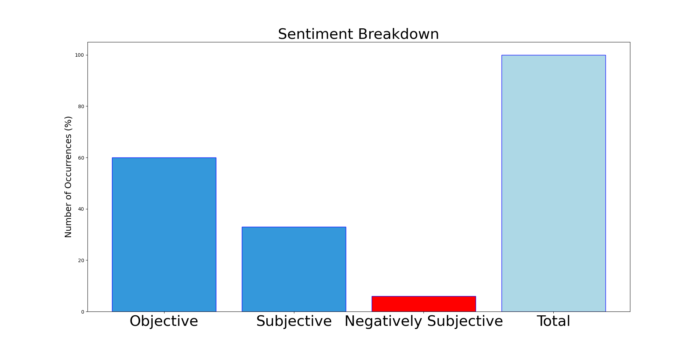

# MURCHIE85 TWITTER PROCESSING 
&#x1F34E; **TOPIC = "Motte"**

## AUTOMATED RESEARCH SUMMARY

*note: Image pulled from web automatically, not connected to author.
  
<b> This report is AUTOMATED and not hand crafted, it is designed for pulling metrics on a given keyword or hashtag and performs a series of reporting and analysis.</b>

|                **Sample-Tweets**        |
| :-------------: |
| RT @MikeyCee24: Chris Drury after the Tarasenko and Motte trades #NYR https://t.co/eGTkrLqwdt |
| RT @BlueshirtMac19: @FriedgeHNIC A 4th line of Motte-Goodrow-vesey would be incredible. |
| RT @shyluffy: i think this is the longest i’ve seen mark speak in english ksjdjdkdkdk |

The most popular user is: **Rodrigo_Motte_**

 RT @elonmusk: The new CEO of Twitter is amazing https://t.co/yBqWFUDIQH

## RELATED METRICS 
| Metric | Value |
| ------------- | ------------- |
| #1 Most tweeted to  | **Senators** |
| #2 Most tweeted to  | **FriedgeHNIC** |
| #3 Most tweeted to  | **SunGarrioch** |
| NewProfiles (less than 10 days) | 0.26%  |
| Tweeters with < 10 followers  | 3.38%|
| Tweeters with > 1000000 followers  | 0.1%  |

## MOST POPULAR TWEET TERMS 

| Popularity Rank  | Term |
| ------------- | ------------- |
| first  | **MOTTE**  |
| second  | **TYLER**  |
| third  | **GAUTHIER** |
| fourth  | **JULIEN**  |
| fifth  | **CONDITIONAL**  |

## Twitter Bio Analysis
### SENTIMENT ANALYSIS

VIEWS WERE : **SUBJECTIVE**  (33.33%) & **NEGATIVELY-SUBJECTIVE** (6.67%) **OBJECTIVE** (60.0%)

### TWEET SAMPLE 
| Random value picked from array |
| ------------- |
|RT @SunGarrioch: Sources say Ottawa winger Tyler Motte will sit today for trade-related reasons. Got to the rink and was told to go home. N… |

### MOST RETWEETED 

| The most retweeted user is: **Rodrigo_Motte_**  |
| ------------- |
| RT @elonmusk: The new CEO of Twitter is amazing https://t.co/yBqWFUDIQH |

### CONCLUSION & EXTERNAL ANALYSIS

*This is my [Adam McMurchie`s] opinion on the data from the tweets, it serves as no objective truth.Since the tweets themselves are a mixture of fact & opinion. 
Authors analytical summary on request.
**RECOMMENDATIONS** WILL BE UPDATED IN NEXT  24 HOURS  