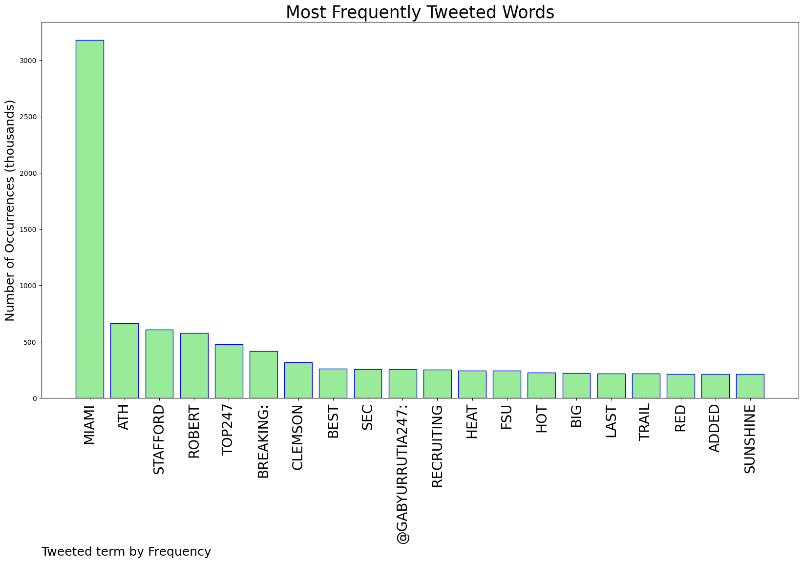
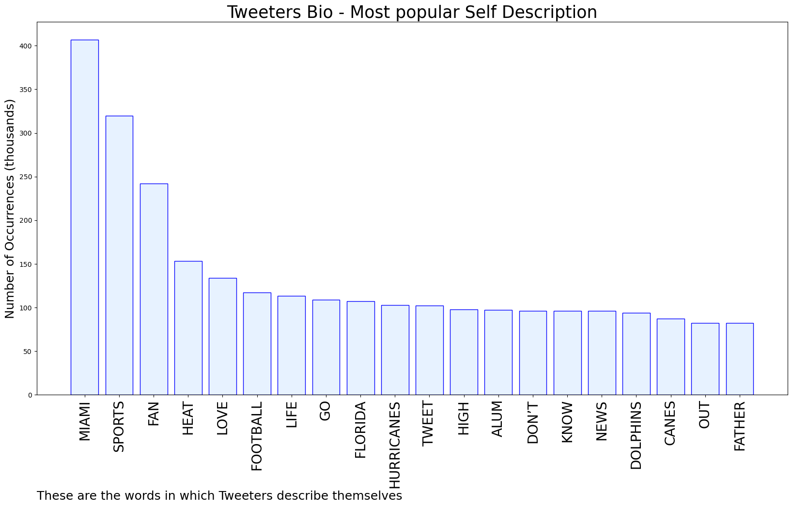

# MURCHIE85 TWITTER PROCESSING 
&#x1F34E; **TOPIC = "Miami"**

## AUTOMATED RESEARCH SUMMARY

*note: Image pulled from web automatically, not connected to author.
  
<b> This report is AUTOMATED and not hand crafted, it is designed for pulling metrics on a given keyword or hashtag and performs a series of reporting and analysis.</b>

|                **Sample-Tweets**        |
| :-------------: |
| Edward Snowden granted permanent residency in Russia, his lawyer confirms&gt;&gt; Click the link to read more;… https://t.co/ZZ4YLJ6gDp |
| @frazmoney93 I wanna be optimistic but at this point I don't feel great. I think it's a lot more likely that school… https://t.co/ClijVMOZ7k |
| @McMattRadio  still don’t think big 10 and sec are equals but you CANNOT let clemson, fla st, nc state, and miami go to the big 10. |

The most popular user is: **jung_vely___**

 RT @NCTsmtown_127: I am so proud and happy that I got to make unforgettable memories with our NCTzens in Miami. Because it was the city I w…

## RELATED METRICS 
| Metric | Value |
| ------------- | ------------- |
| #1 Most tweeted to  | **GabyUrrutia247** |
| #2 Most tweeted to  | **247Sports** |
| #3 Most tweeted to  | **Andrew_Ivins** |
| NewProfiles (less than 10 days) | 1.16%  |
| Tweeters with < 10 followers  | 3.94%|
| Tweeters with > 1000000 followers  | 0.04%  |

## MOST POPULAR TWEET TERMS 

| Popularity Rank  | Term |
| ------------- | ------------- |
| first  | **MIAMI**  |
| second  | **ATH**  |
| third  | **STAFFORD** |
| fourth  | **ROBERT**  |
| fifth  | **TOP247**  |

## Twitter Bio Analysis
### SENTIMENT ANALYSIS

VIEWS WERE : **SUBJECTIVE**  (26.67%) & **NEGATIVELY-SUBJECTIVE** (6.67%) **OBJECTIVE** (66.67%)

### TWEET SAMPLE 
| Random value picked from array |
| ------------- |
|RT @MiamiFloRasta: 4 star Eau Gallie ATH (@1robertstafford) commits to Miami. Coach Addae lands his first corner for the class. Big pickup… |

### MOST RETWEETED 

| The most retweeted user is: **jung_vely___**  |
| ------------- |
| RT @NCTsmtown_127: I am so proud and happy that I got to make unforgettable memories with our NCTzens in Miami. Because it was the city I w… |

### CONCLUSION & EXTERNAL ANALYSIS

*This is my [Adam McMurchie`s] opinion on the data from the tweets, it serves as no objective truth.Since the tweets themselves are a mixture of fact & opinion. 
Authors analytical summary on request.
**RECOMMENDATIONS** WILL BE UPDATED IN NEXT  24 HOURS  