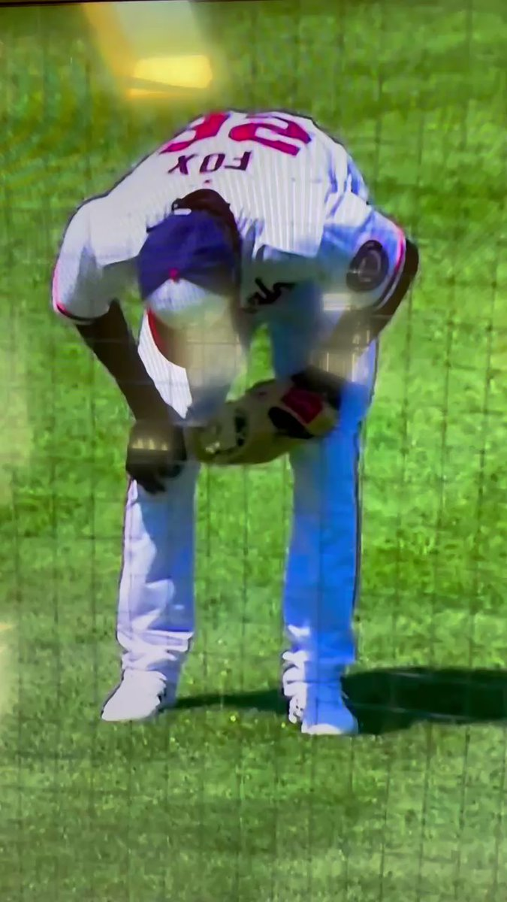
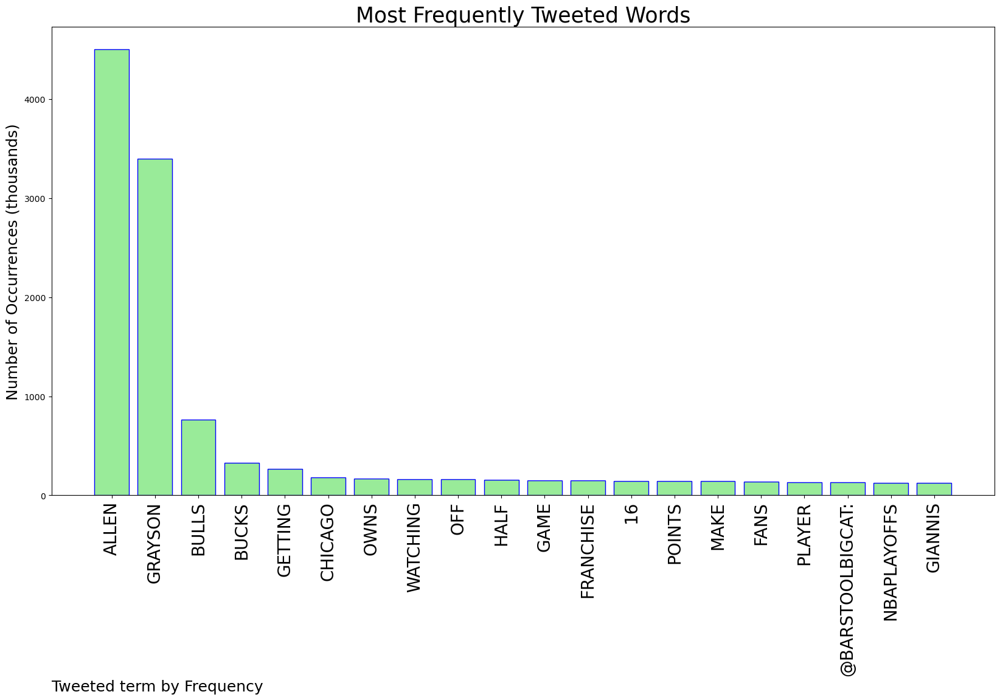
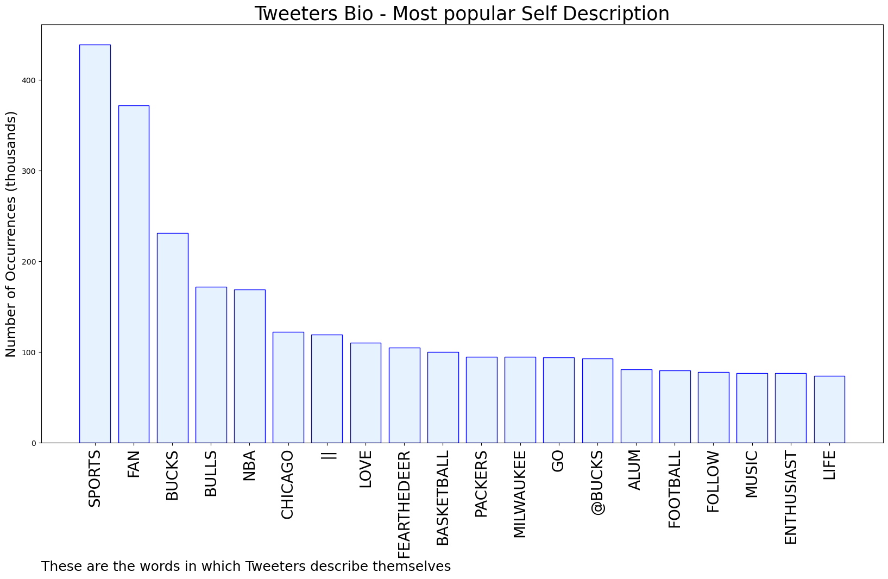

# MURCHIE85 TWITTER PROCESSING 
&#x1F34E; **TOPIC = "Grayson Allen"**

## AUTOMATED RESEARCH SUMMARY

*note: Image pulled from web automatically, not connected to author.
  
<b> This report is AUTOMATED and not hand crafted, it is designed for pulling metrics on a given keyword or hashtag and performs a series of reporting and analysis.</b>

|                **Sample-Tweets**        |
| :-------------: |
| Bulls fans are going to see Grayson Allen in their nightmares lol |
| RT @17EddieEdward: Grayson Allen has stepped up for the Bucks in the absence of Khris Middleton.💚 #NBAPlayoffs |
| grayson allen 🎯 |

The most popular user is: **realskyfreejr**

 RT @itsjwills: This is amazing.
The Bucks bench booing Grayson Allen because they know it brings out the best in him 😂

## RELATED METRICS 
| Metric | Value |
| ------------- | ------------- |
| #1 Most tweeted to  | **chicagobulls** |
| #2 Most tweeted to  | **BarstoolBigCat** |
| #3 Most tweeted to  | **Bucks** |
| NewProfiles (less than 10 days) | 0.72%  |
| Tweeters with < 10 followers  | 3.0%|
| Tweeters with > 1000000 followers  | 0.16%  |

## MOST POPULAR TWEET TERMS 

| Popularity Rank  | Term |
| ------------- | ------------- |
| first  | **ALLEN**  |
| second  | **GRAYSON**  |
| third  | **BULLS** |
| fourth  | **BUCKS**  |
| fifth  | **GETTING**  |

## Twitter Bio Analysis
### SENTIMENT ANALYSIS

VIEWS WERE : **SUBJECTIVE**  (6.67%) & **NEGATIVELY-SUBJECTIVE** (26.67%) **OBJECTIVE** (66.67%)

### TWEET SAMPLE 
| Random value picked from array |
| ------------- |
|@chicagobulls Grayson Allen: 16 points 3 steals 0 PFs |

### MOST RETWEETED 

| The most retweeted user is: **realskyfreejr**  |
| ------------- |
| RT @itsjwills: This is amazing.The Bucks bench booing Grayson Allen because they know it brings out the best in him 😂 |

### CONCLUSION & EXTERNAL ANALYSIS

*This is my [Adam McMurchie`s] opinion on the data from the tweets, it serves as no objective truth.Since the tweets themselves are a mixture of fact & opinion. 
Authors analytical summary on request.
**RECOMMENDATIONS** WILL BE UPDATED IN NEXT  24 HOURS  