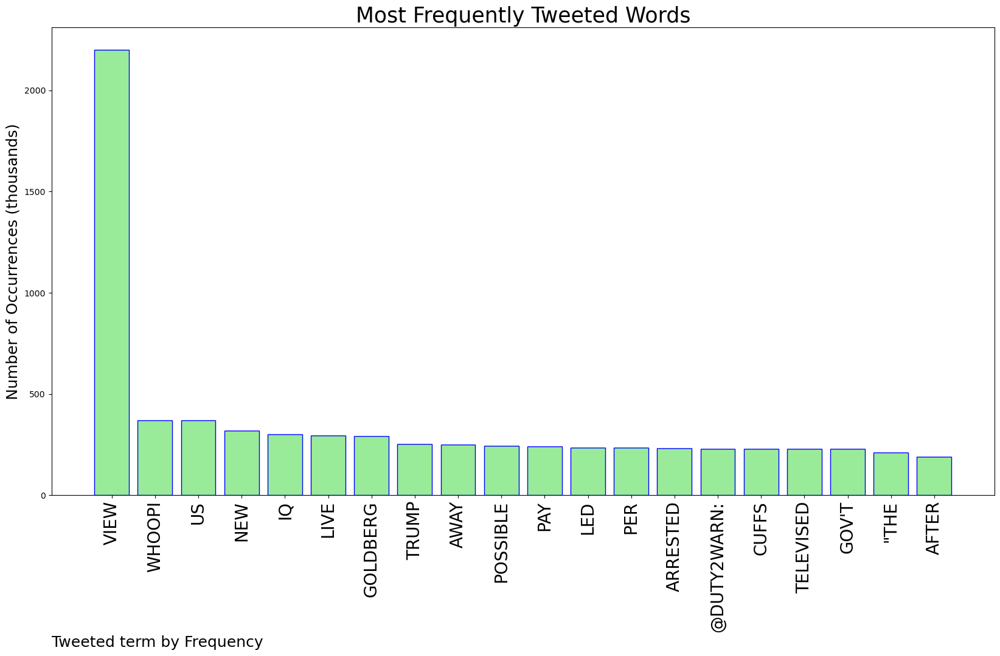
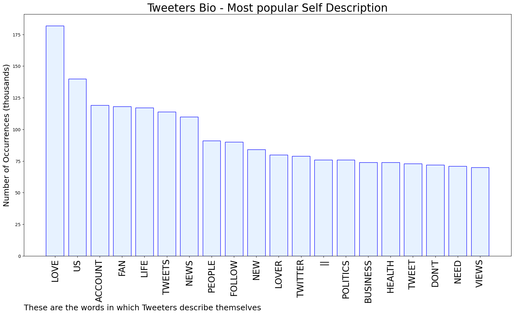

# MURCHIE85 TWITTER PROCESSING 
&#x1F34E; **TOPIC = "The View"**

## AUTOMATED RESEARCH SUMMARY

*note: Image pulled from web automatically, not connected to author.
  
<b> This report is AUTOMATED and not hand crafted, it is designed for pulling metrics on a given keyword or hashtag and performs a series of reporting and analysis.</b>

|                **Sample-Tweets**        |
| :-------------: |
| RT @TerryGalloway: I made a pact with Hazel before she was murdered. That we would improve the care system. She is not here to see us go in… |
| RT @cspan: .@LeaderMcConnell on former President Trump offering pardons to people who attacked U.S Capitol on January 6th: "My view is I wo… |
| @NFtsGrab My first collection dropping tomorrow 2.2.22 on OpenSea. Includes several of my best known art photogra… https://t.co/4Olt7al6Aq |

The most popular user is: **skznote_**

 RT @billboardcharts: .@Stray_Kids land seven songs on this week's #WorldDigitalSongSales chart:

#3, Thunderous
#11, Domino
#14, Cheese
#18…

## RELATED METRICS 
| Metric | Value |
| ------------- | ------------- |
| #1 Most tweeted to  | **duty2warn** |
| #2 Most tweeted to  | **benshapiro** |
| #3 Most tweeted to  | **alanferrier** |
| NewProfiles (less than 10 days) | 1.3%  |
| Tweeters with < 10 followers  | 6.7%|
| Tweeters with > 1000000 followers  | 0.28%  |

## MOST POPULAR TWEET TERMS 

| Popularity Rank  | Term |
| ------------- | ------------- |
| first  | **VIEW**  |
| second  | **WHOOPI**  |
| third  | **US** |
| fourth  | **NEW**  |
| fifth  | **IQ**  |

## Twitter Bio Analysis
### SENTIMENT ANALYSIS

VIEWS WERE : **SUBJECTIVE**  (41.67%) & **NEGATIVELY-SUBJECTIVE** (16.67%) **OBJECTIVE** (41.67%)

### TWEET SAMPLE 
| Random value picked from array |
| ------------- |
|RT @PerfectGameUSA: The MEAC will look different in 2022 with four teams departing the conference, although Norfolk State is back to defend… |

### MOST RETWEETED 

| The most retweeted user is: **skznote_**  |
| ------------- |
| RT @billboardcharts: .@Stray_Kids land seven songs on this week's #WorldDigitalSongSales chart:#3, Thunderous#11, Domino#14, Cheese#18… |

### CONCLUSION & EXTERNAL ANALYSIS

*This is my [Adam McMurchie`s] opinion on the data from the tweets, it serves as no objective truth.Since the tweets themselves are a mixture of fact & opinion. 
Authors analytical summary on request.
**RECOMMENDATIONS** WILL BE UPDATED IN NEXT  24 HOURS  