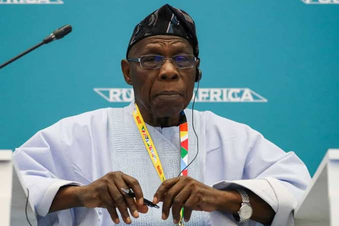
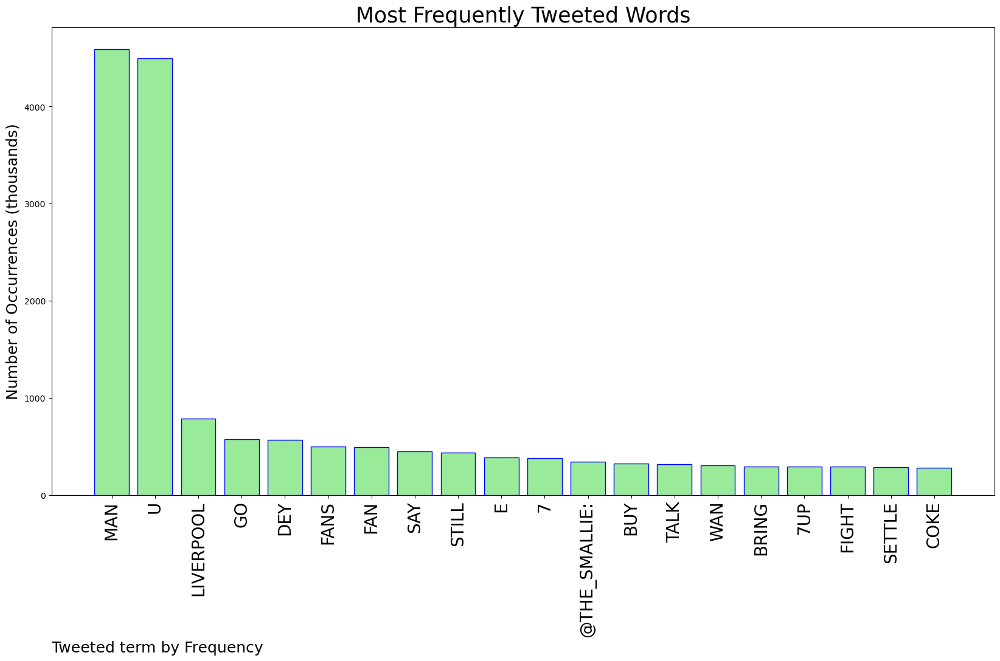
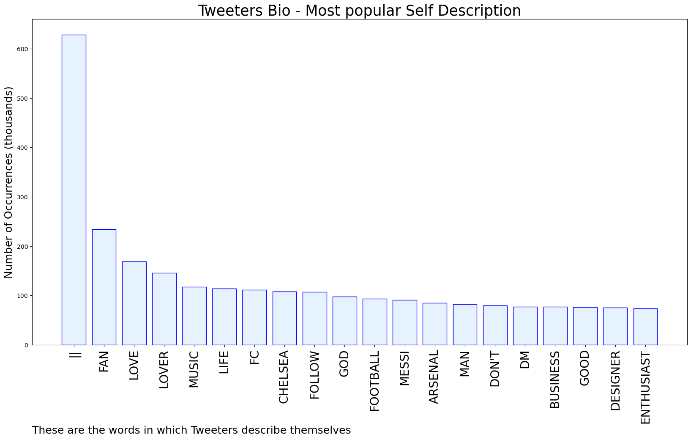
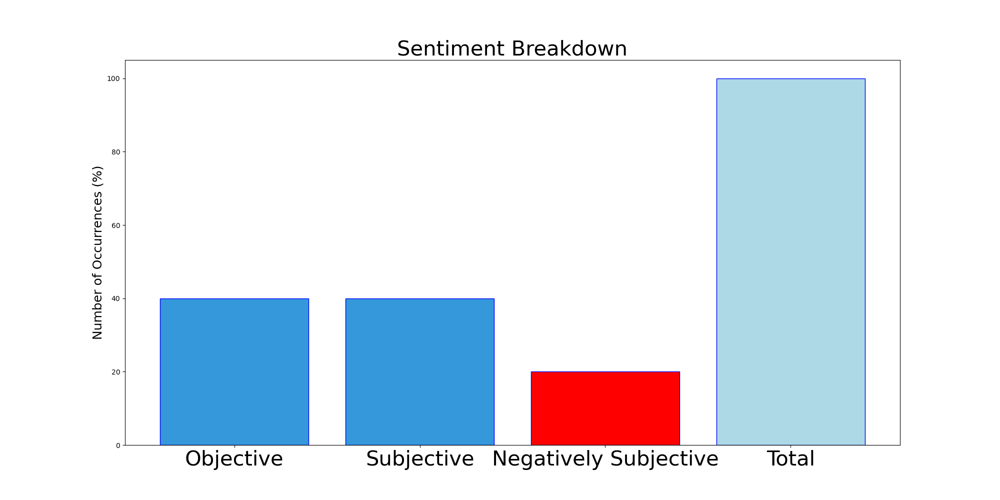

# MURCHIE85 TWITTER PROCESSING 
&#x1F34E; **TOPIC = "Man U"**

## AUTOMATED RESEARCH SUMMARY

*note: Image pulled from web automatically, not connected to author.
  
<b> This report is AUTOMATED and not hand crafted, it is designed for pulling metrics on a given keyword or hashtag and performs a series of reporting and analysis.</b>

|                **Sample-Tweets**        |
| :-------------: |
| RT @MumfordAndPlums: shame at least Man U got drilled today. sbwl. |
| @bukolaorenaiya @IkukuomaC @urchilla01 @chude__ @_weyimi @Spotlight_Abby @AfamDeluxo @EmodiMba @FS_Yusuf_… https://t.co/bSBIUi7Pwt |
| @mrmacaronii Imagination wan kill Man u fans |

The most popular user is: **lihle_toya**

 RT @Goddess0shun: You know what’s hard to find now a days.. a man that makes more money than u

## RELATED METRICS 
| Metric | Value |
| ------------- | ------------- |
| #1 Most tweeted to  | **the_smallie** |
| #2 Most tweeted to  | **AnitahAmong** |
| #3 Most tweeted to  | **AreaFada1** |
| NewProfiles (less than 10 days) | 0.64%  |
| Tweeters with < 10 followers  | 6.24%|
| Tweeters with > 1000000 followers  | 0.06%  |

## MOST POPULAR TWEET TERMS 

| Popularity Rank  | Term |
| ------------- | ------------- |
| first  | **MAN**  |
| second  | **U**  |
| third  | **LIVERPOOL** |
| fourth  | **GO**  |
| fifth  | **DEY**  |

## Twitter Bio Analysis
### SENTIMENT ANALYSIS

VIEWS WERE : **SUBJECTIVE**  (40.0%) & **NEGATIVELY-SUBJECTIVE** (20.0%) **OBJECTIVE** (40.0%)

### TWEET SAMPLE 
| Random value picked from array |
| ------------- |
|RT @killerOdds_: 😂😂 Title contenders how far na? 😂😂😂😂Liverpool Man U De Gea Juicy Sabitzer Weghorst Ajax Comeback Mo Salah Trent The Butc… |

### MOST RETWEETED 

| The most retweeted user is: **lihle_toya**  |
| ------------- |
| RT @Goddess0shun: You know what’s hard to find now a days.. a man that makes more money than u |

### CONCLUSION & EXTERNAL ANALYSIS

*This is my [Adam McMurchie`s] opinion on the data from the tweets, it serves as no objective truth.Since the tweets themselves are a mixture of fact & opinion. 
Authors analytical summary on request.
**RECOMMENDATIONS** WILL BE UPDATED IN NEXT  24 HOURS  