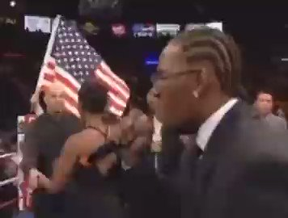
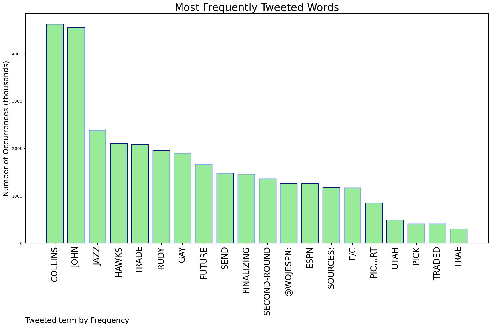
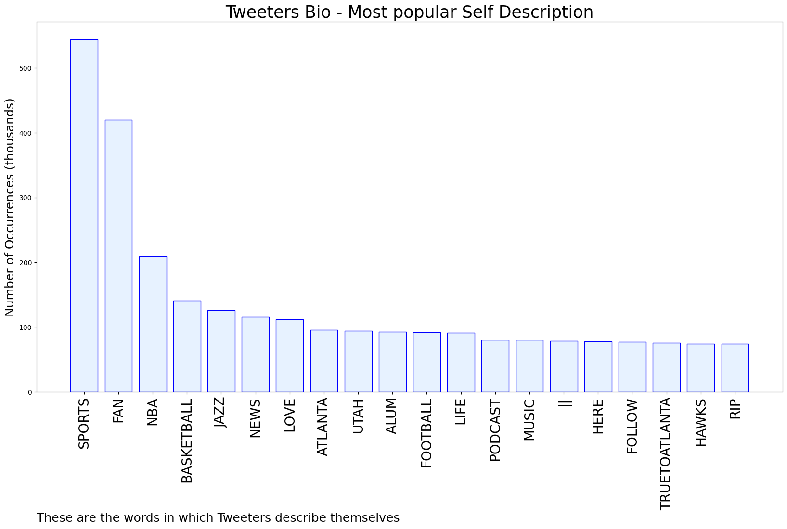

# MURCHIE85 TWITTER PROCESSING 
&#x1F34E; **TOPIC = "John Collins"**

## AUTOMATED RESEARCH SUMMARY

*note: Image pulled from web automatically, not connected to author.
  
<b> This report is AUTOMATED and not hand crafted, it is designed for pulling metrics on a given keyword or hashtag and performs a series of reporting and analysis.</b>

|                **Sample-Tweets**        |
| :-------------: |
| RT @szn_holiday: The Pacers got more for moving back 1 spot in the draft than the Hawks did for John Collins https://t.co/TrOrxwmXZh |
| Suns fans… WE’RE FINALLY FREE OF THE JOHN COLLINS TRADE RUMORS |
| RT @wojespn: ESPN Sources: The Hawks are finalizing a trade to send F/C John Collins to the Jazz for Rudy Gay and a future second-round pic… |

The most popular user is: **og_LT14**

 RT @wojespn: ESPN Sources: The Hawks are finalizing a trade to send F/C John Collins to the Jazz for Rudy Gay and a future second-round pic…

## RELATED METRICS 
| Metric | Value |
| ------------- | ------------- |
| #1 Most tweeted to  | **wojespn** |
| #2 Most tweeted to  | **big_business_** |
| #3 Most tweeted to  | **KevinOConnorNBA** |
| NewProfiles (less than 10 days) | 0.2%  |
| Tweeters with < 10 followers  | 2.76%|
| Tweeters with > 1000000 followers  | 0.12%  |

## MOST POPULAR TWEET TERMS 

| Popularity Rank  | Term |
| ------------- | ------------- |
| first  | **COLLINS**  |
| second  | **JOHN**  |
| third  | **JAZZ** |
| fourth  | **HAWKS**  |
| fifth  | **TRADE**  |

## Twitter Bio Analysis
### SENTIMENT ANALYSIS

VIEWS WERE : **SUBJECTIVE**  (33.33%) & **NEGATIVELY-SUBJECTIVE** (13.33%) **OBJECTIVE** (53.33%)

### TWEET SAMPLE 
| Random value picked from array |
| ------------- |
|RT @esidery: After the Jazz acquired John Collins, only six teams currently project to have $30+ million in cap space for free agency:Roc… |

### MOST RETWEETED 

| The most retweeted user is: **og_LT14**  |
| ------------- |
| RT @wojespn: ESPN Sources: The Hawks are finalizing a trade to send F/C John Collins to the Jazz for Rudy Gay and a future second-round pic… |

### CONCLUSION & EXTERNAL ANALYSIS

*This is my [Adam McMurchie`s] opinion on the data from the tweets, it serves as no objective truth.Since the tweets themselves are a mixture of fact & opinion. 
Authors analytical summary on request.
**RECOMMENDATIONS** WILL BE UPDATED IN NEXT  24 HOURS  