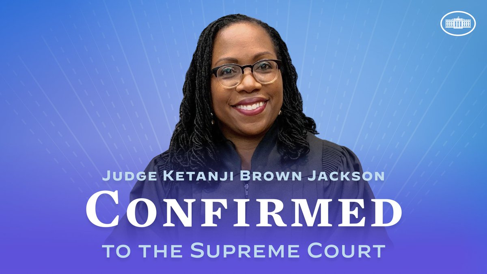
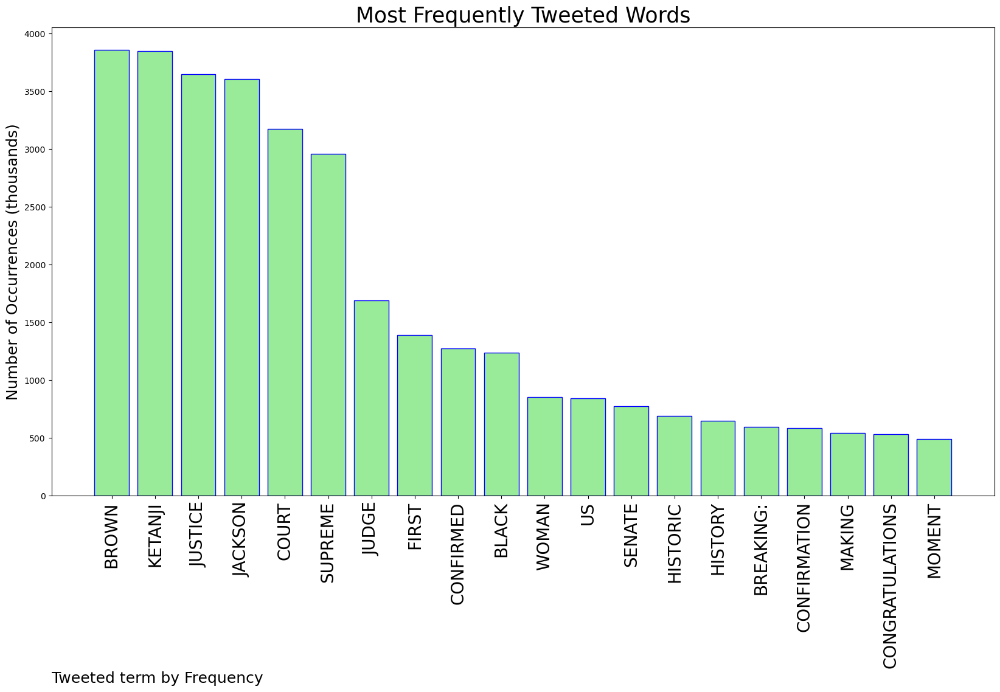
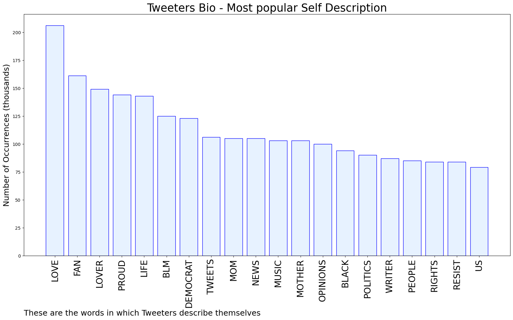

# MURCHIE85 TWITTER PROCESSING 
&#x1F34E; **TOPIC = "Justice Jackson"**

## AUTOMATED RESEARCH SUMMARY

*note: Image pulled from web automatically, not connected to author.
  
<b> This report is AUTOMATED and not hand crafted, it is designed for pulling metrics on a given keyword or hashtag and performs a series of reporting and analysis.</b>

|                **Sample-Tweets**        |
| :-------------: |
| RT @937thebeat: Thoughts on Ketanji Brown Jackson heading to the Supreme Court? She was confirmed by the Senate.  Jackson will be the first… |
| RT @POTUS: Judge Jackson’s confirmation was a historic moment for our nation. We’ve taken another step toward making our highest court refl… |
| RT @LandseerNewfie: "You can do it."~ SC Justice Jackson to her daughtersWatching Justice Jackson move through the nomination process w… |

The most popular user is: **marsdostal**

 RT @SenatorRomney: I intend to vote in support of Judge Ketanji Brown Jackson’s confirmation to be an associate justice of the U.S. Supreme…

## RELATED METRICS 
| Metric | Value |
| ------------- | ------------- |
| #1 Most tweeted to  | **POTUS** |
| #2 Most tweeted to  | **WhiteHouse** |
| #3 Most tweeted to  | **CNET** |
| NewProfiles (less than 10 days) | 0.3%  |
| Tweeters with < 10 followers  | 2.5%|
| Tweeters with > 1000000 followers  | 0.1%  |

## MOST POPULAR TWEET TERMS 

| Popularity Rank  | Term |
| ------------- | ------------- |
| first  | **BROWN**  |
| second  | **KETANJI**  |
| third  | **JUSTICE** |
| fourth  | **JACKSON**  |
| fifth  | **COURT**  |

## Twitter Bio Analysis
### SENTIMENT ANALYSIS

VIEWS WERE : **SUBJECTIVE**  (26.67%) & **NEGATIVELY-SUBJECTIVE** (0.0%) **OBJECTIVE** (73.33%)

### TWEET SAMPLE 
| Random value picked from array |
| ------------- |
|RT @MayoIsSpicyy: Justice Ketanji Brown Jackson.That’s the tweet of the week. |

### MOST RETWEETED 

| The most retweeted user is: **marsdostal**  |
| ------------- |
| RT @SenatorRomney: I intend to vote in support of Judge Ketanji Brown Jackson’s confirmation to be an associate justice of the U.S. Supreme… |

### CONCLUSION & EXTERNAL ANALYSIS

*This is my [Adam McMurchie`s] opinion on the data from the tweets, it serves as no objective truth.Since the tweets themselves are a mixture of fact & opinion. 
Authors analytical summary on request.
**RECOMMENDATIONS** WILL BE UPDATED IN NEXT  24 HOURS  