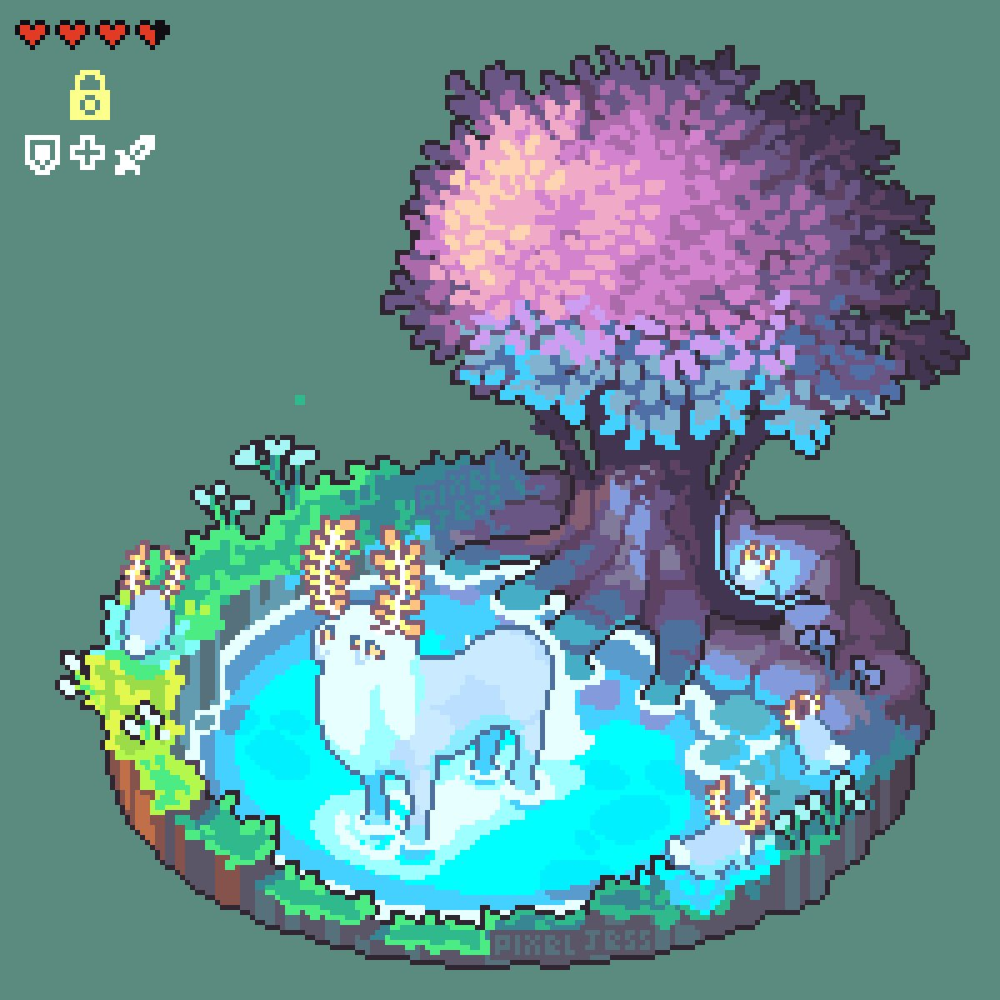
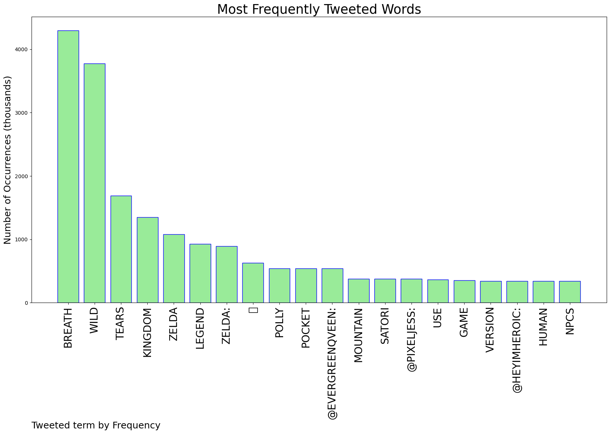
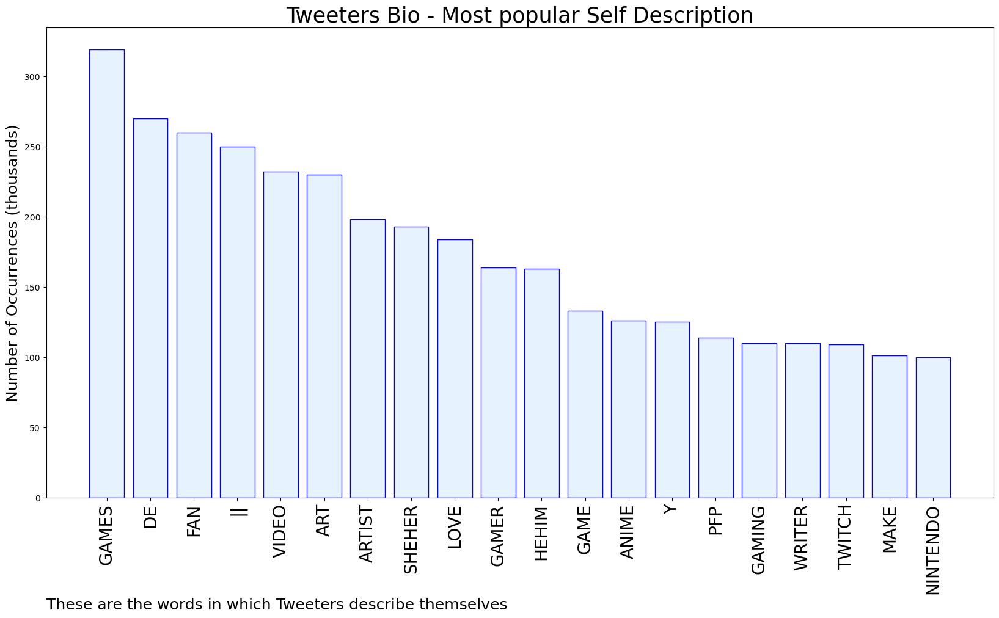
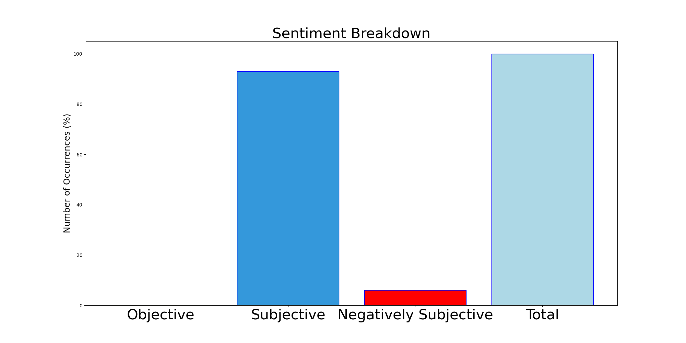

# MURCHIE85 TWITTER PROCESSING 
&#x1F34E; **TOPIC = "Breath of the Wild"**

## AUTOMATED RESEARCH SUMMARY

*note: Image pulled from web automatically, not connected to author.
  
<b> This report is AUTOMATED and not hand crafted, it is designed for pulling metrics on a given keyword or hashtag and performs a series of reporting and analysis.</b>

|                **Sample-Tweets**        |
| :-------------: |
| RT @HEYimHeroic: Just like in Breath of the Wild, the human NPCs in The Legend of Zelda: Tears of the Kingdom use an advanced version of Mi… |
| RT @evergreenqveen: Breath of the Wild Polly Pocket ✨ https://t.co/hFOwHN24kP |
| @HagenDerek Breath of the wild have a price increase in the last couple of years.a SALE for tears? I'm interested to see that now! |

The most popular user is: **joelper20131274**

 RT @EtikaMemories: The last reaction Etika had was the reveal for the sequel to Zelda Breath of the Wild.

The Legend of Zelda Tears of the…

## RELATED METRICS 
| Metric | Value |
| ------------- | ------------- |
| #1 Most tweeted to  | **evergreenqveen** |
| #2 Most tweeted to  | **pixeljess** |
| #3 Most tweeted to  | **HEYimHeroic** |
| NewProfiles (less than 10 days) | 0.3%  |
| Tweeters with < 10 followers  | 5.0%|
| Tweeters with > 1000000 followers  | 0.18%  |

## MOST POPULAR TWEET TERMS 

| Popularity Rank  | Term |
| ------------- | ------------- |
| first  | **BREATH**  |
| second  | **WILD**  |
| third  | **TEARS** |
| fourth  | **KINGDOM**  |
| fifth  | **ZELDA**  |

## Twitter Bio Analysis
### SENTIMENT ANALYSIS

VIEWS WERE : **SUBJECTIVE**  (93.33%) & **NEGATIVELY-SUBJECTIVE** (6.67%) **OBJECTIVE** (0.0%)

### TWEET SAMPLE 
| Random value picked from array |
| ------------- |
|RT @pixeljess: Satori Mountain - Zelda Breath of the Wild https://t.co/Y2GvGZ254k |

### MOST RETWEETED 

| The most retweeted user is: **joelper20131274**  |
| ------------- |
| RT @EtikaMemories: The last reaction Etika had was the reveal for the sequel to Zelda Breath of the Wild.The Legend of Zelda Tears of the… |

### CONCLUSION & EXTERNAL ANALYSIS

*This is my [Adam McMurchie`s] opinion on the data from the tweets, it serves as no objective truth.Since the tweets themselves are a mixture of fact & opinion. 
Authors analytical summary on request.
**RECOMMENDATIONS** WILL BE UPDATED IN NEXT  24 HOURS  