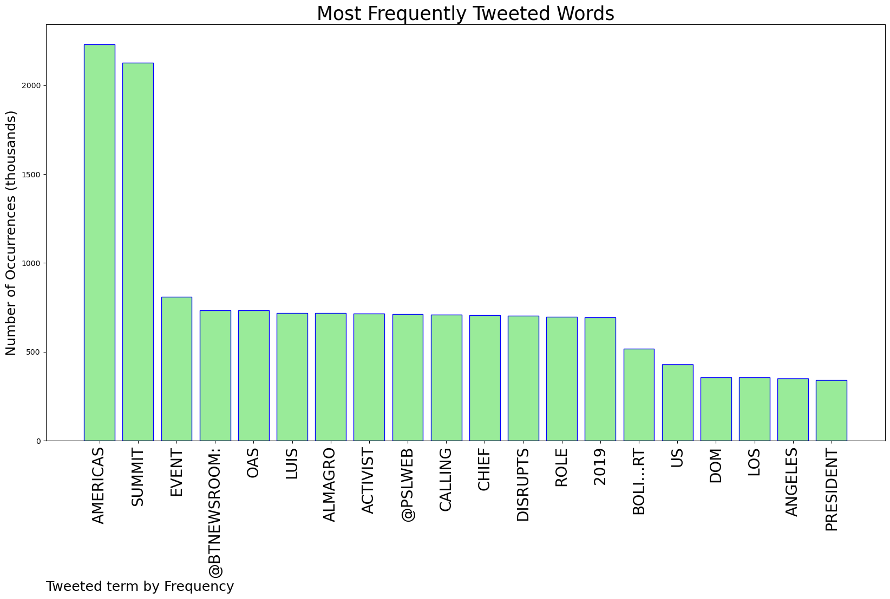
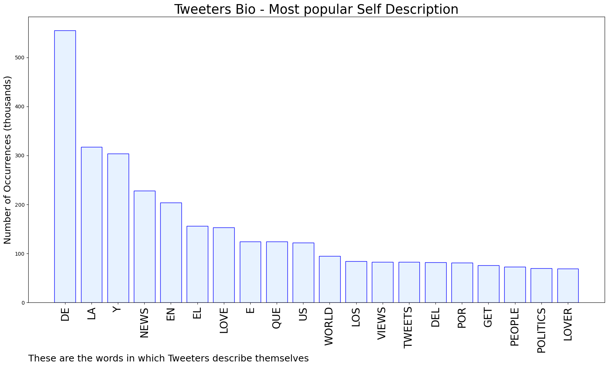
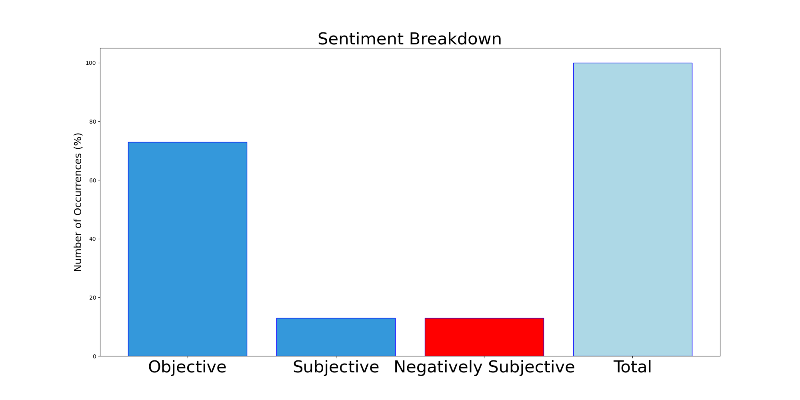

# MURCHIE85 TWITTER PROCESSING 
&#x1F34E; **TOPIC = "Americas"**

## AUTOMATED RESEARCH SUMMARY

*note: Image pulled from web automatically, not connected to author.
  
<b> This report is AUTOMATED and not hand crafted, it is designed for pulling metrics on a given keyword or hashtag and performs a series of reporting and analysis.</b>

|                **Sample-Tweets**        |
| :-------------: |
| RT @CITClassroom: From @TND: Elementary school used COVID funds to teach about preferred pronouns and BLM, per reporthttps://t.co/AmS3ZowG… |
| 👉👓 Analysis: L.A. Summit offers Canada a Chance to Boost its Global InfluenceBy David Akin  Global Newshttps://t.co/N05TyMw73U |
| RT @thehill: "Failures in Tennessee and Oklahoma offer new evidence of America’s execution problems" (@TheHillOpinion) https://t.co/1Z9EqqG… |

The most popular user is: **marclesi1**

 RT @BTnewsroom: A @pslweb activist disrupts OAS chief Luis Almagro at a Summit of the Americas event, calling out his role in the 2019 Boli…

## RELATED METRICS 
| Metric | Value |
| ------------- | ------------- |
| #1 Most tweeted to  | **BTnewsroom** |
| #2 Most tweeted to  | **pslweb** |
| #3 Most tweeted to  | **POTUS** |
| NewProfiles (less than 10 days) | 0.58%  |
| Tweeters with < 10 followers  | 3.06%|
| Tweeters with > 1000000 followers  | 0.86%  |

## MOST POPULAR TWEET TERMS 

| Popularity Rank  | Term |
| ------------- | ------------- |
| first  | **AMERICAS**  |
| second  | **SUMMIT**  |
| third  | **EVENT** |
| fourth  | **@BTNEWSROOM:**  |
| fifth  | **OAS**  |

## Twitter Bio Analysis
### SENTIMENT ANALYSIS

VIEWS WERE : **SUBJECTIVE**  (13.33%) & **NEGATIVELY-SUBJECTIVE** (13.33%) **OBJECTIVE** (73.33%)

### TWEET SAMPLE 
| Random value picked from array |
| ------------- |
|Spo(Sao paulo)ABOARD AIR FORCE ONE (Reuters)Climate will be an "important topic of discussion" between the United S… https://t.co/0lIGF15JtA |

### MOST RETWEETED 

| The most retweeted user is: **marclesi1**  |
| ------------- |
| RT @BTnewsroom: A @pslweb activist disrupts OAS chief Luis Almagro at a Summit of the Americas event, calling out his role in the 2019 Boli… |

### CONCLUSION & EXTERNAL ANALYSIS

*This is my [Adam McMurchie`s] opinion on the data from the tweets, it serves as no objective truth.Since the tweets themselves are a mixture of fact & opinion. 
Authors analytical summary on request.
**RECOMMENDATIONS** WILL BE UPDATED IN NEXT  24 HOURS  