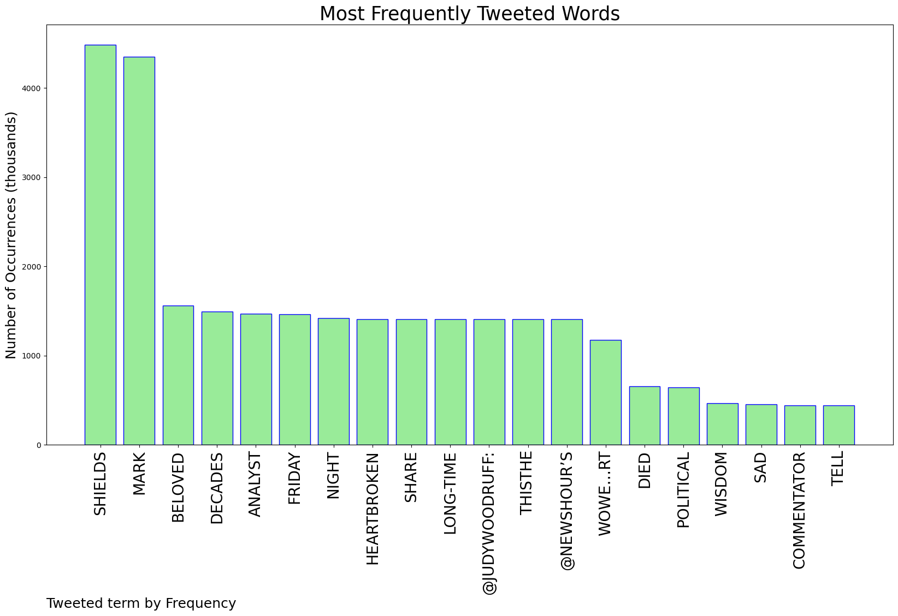
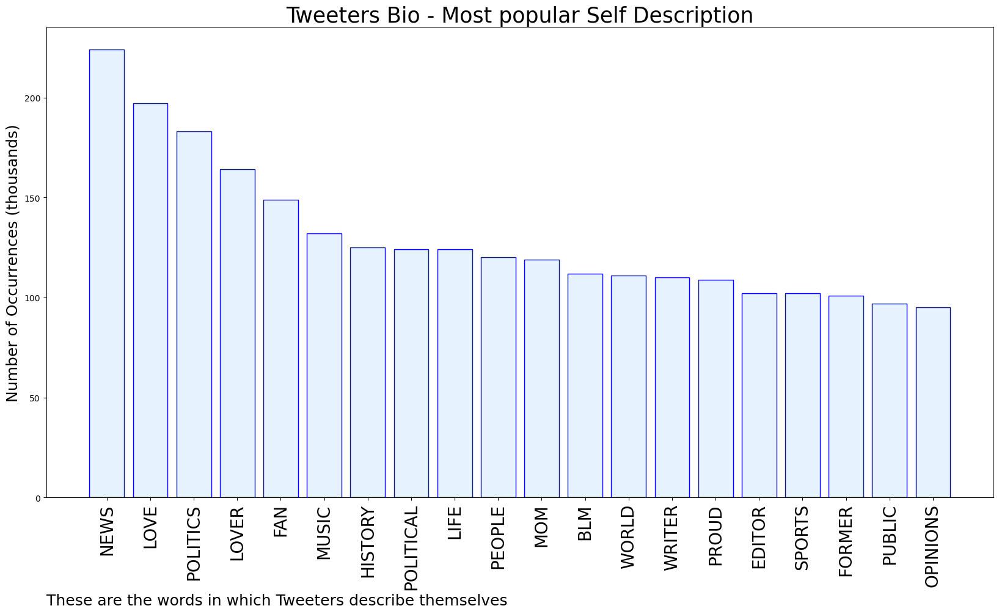

# MURCHIE85 TWITTER PROCESSING 
&#x1F34E; **TOPIC = "Mark Shields"**

## AUTOMATED RESEARCH SUMMARY

*note: Image pulled from web automatically, not connected to author.
  
<b> This report is AUTOMATED and not hand crafted, it is designed for pulling metrics on a given keyword or hashtag and performs a series of reporting and analysis.</b>

|                **Sample-Tweets**        |
| :-------------: |
| RT @BeschlossDC: The brilliant, kindly, original, hilarious and shrewd Mark Shields (1937-2022): https://t.co/6WFSNp4L0Z |
| RT @JudyWoodruff: I am heartbroken to share this..the @NewsHour’s beloved long-time Friday night analyst Mark Shields, who for decades wowe… |
| RT @BeschlossDC: The brilliant, kindly, original, hilarious and shrewd Mark Shields (1937-2022): https://t.co/6WFSNp4L0Z |

The most popular user is: **sclayton97**

 RT @JudyWoodruff: I am heartbroken to share this..the @NewsHour’s beloved long-time Friday night analyst Mark Shields, who for decades wowe…

## RELATED METRICS 
| Metric | Value |
| ------------- | ------------- |
| #1 Most tweeted to  | **NewsHour** |
| #2 Most tweeted to  | **JudyWoodruff** |
| #3 Most tweeted to  | **BeschlossDC** |
| NewProfiles (less than 10 days) | 0.16%  |
| Tweeters with < 10 followers  | 2.04%|
| Tweeters with > 1000000 followers  | 0.32%  |

## MOST POPULAR TWEET TERMS 

| Popularity Rank  | Term |
| ------------- | ------------- |
| first  | **SHIELDS**  |
| second  | **MARK**  |
| third  | **BELOVED** |
| fourth  | **DECADES**  |
| fifth  | **ANALYST**  |

## Twitter Bio Analysis
### SENTIMENT ANALYSIS

VIEWS WERE : **SUBJECTIVE**  (66.67%) & **NEGATIVELY-SUBJECTIVE** (6.67%) **OBJECTIVE** (26.67%)

### TWEET SAMPLE 
| Random value picked from array |
| ------------- |
|Great read. RIP &gt;&gt;&gt;Mark Shields, TV Pundit Known for His Sharp Wit, Dies at 85 - The New York Times https://t.co/83WyVYJvEr |

### MOST RETWEETED 

| The most retweeted user is: **sclayton97**  |
| ------------- |
| RT @JudyWoodruff: I am heartbroken to share this..the @NewsHour’s beloved long-time Friday night analyst Mark Shields, who for decades wowe… |

### CONCLUSION & EXTERNAL ANALYSIS

*This is my [Adam McMurchie`s] opinion on the data from the tweets, it serves as no objective truth.Since the tweets themselves are a mixture of fact & opinion. 
Authors analytical summary on request.
**RECOMMENDATIONS** WILL BE UPDATED IN NEXT  24 HOURS  