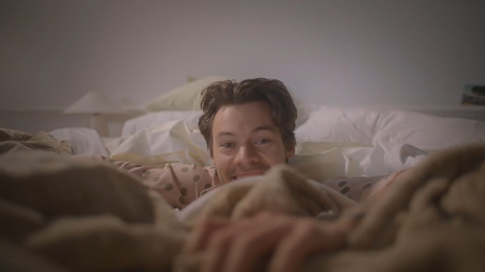
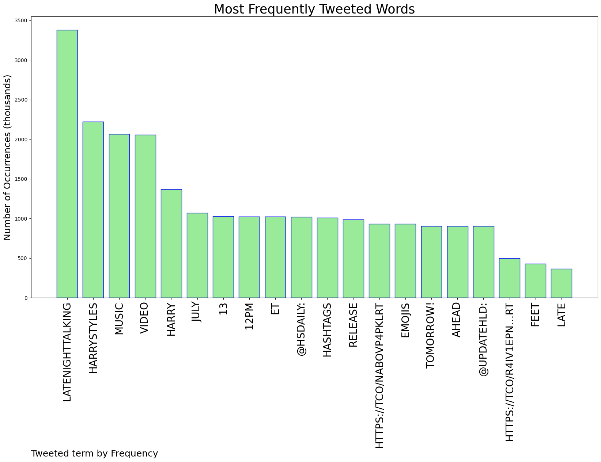
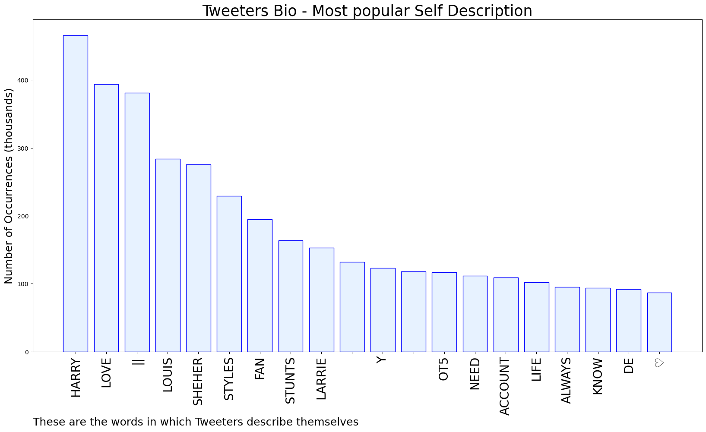

# MURCHIE85 TWITTER PROCESSING 
&#x1F34E; **TOPIC = "#LateNightTalking"**

## AUTOMATED RESEARCH SUMMARY

*note: Image pulled from web automatically, not connected to author.
  
<b> This report is AUTOMATED and not hand crafted, it is designed for pulling metrics on a given keyword or hashtag and performs a series of reporting and analysis.</b>

|                **Sample-Tweets**        |
| :-------------: |
| RT @UpdateHLD: The hashtags #HarryStyles and #LateNightTalking have emojis ahead of the music video release tomorrow! https://t.co/r4iV1epn… |
| The socks! I hadn't noticed them! #LateNightTalking #HarryStyles |
| RT @hsdaily: Harry in the #LateNightTalking Music Video. July 13. 12pm ET. https://t.co/nabovp4pkl |

The most popular user is: **bradismytype**

 RT @hsdaily: Harry in the #LateNightTalking Music Video. July 13. 12pm ET. https://t.co/nabovp4pkl

## RELATED METRICS 
| Metric | Value |
| ------------- | ------------- |
| #1 Most tweeted to  | **hsdaily** |
| #2 Most tweeted to  | **UpdateHLD** |
| #3 Most tweeted to  | **nikkimarieJPG** |
| NewProfiles (less than 10 days) | 1.34%  |
| Tweeters with < 10 followers  | 5.88%|
| Tweeters with > 1000000 followers  | 0.02%  |

## MOST POPULAR TWEET TERMS 

| Popularity Rank  | Term |
| ------------- | ------------- |
| first  | **LATENIGHTTALKING**  |
| second  | **HARRYSTYLES**  |
| third  | **MUSIC** |
| fourth  | **VIDEO**  |
| fifth  | **HARRY**  |

## Twitter Bio Analysis
### SENTIMENT ANALYSIS

VIEWS WERE : **SUBJECTIVE**  (13.33%) & **NEGATIVELY-SUBJECTIVE** (6.67%) **OBJECTIVE** (80.0%)

### TWEET SAMPLE 
| Random value picked from array |
| ------------- |
|RT @UpdateHLD: The hashtags #HarryStyles and #LateNightTalking have emojis ahead of the music video release tomorrow! https://t.co/r4iV1epn… |

### MOST RETWEETED 

| The most retweeted user is: **bradismytype**  |
| ------------- |
| RT @hsdaily: Harry in the #LateNightTalking Music Video. July 13. 12pm ET. https://t.co/nabovp4pkl |

### CONCLUSION & EXTERNAL ANALYSIS

*This is my [Adam McMurchie`s] opinion on the data from the tweets, it serves as no objective truth.Since the tweets themselves are a mixture of fact & opinion. 
Authors analytical summary on request.
**RECOMMENDATIONS** WILL BE UPDATED IN NEXT  24 HOURS  