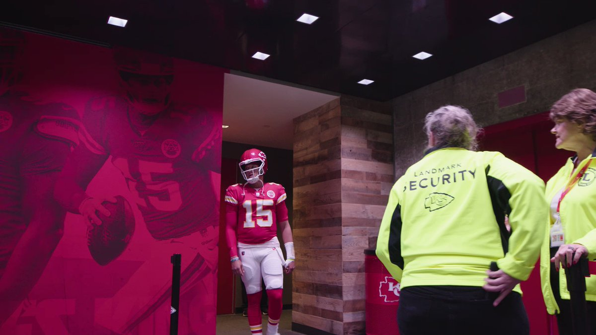
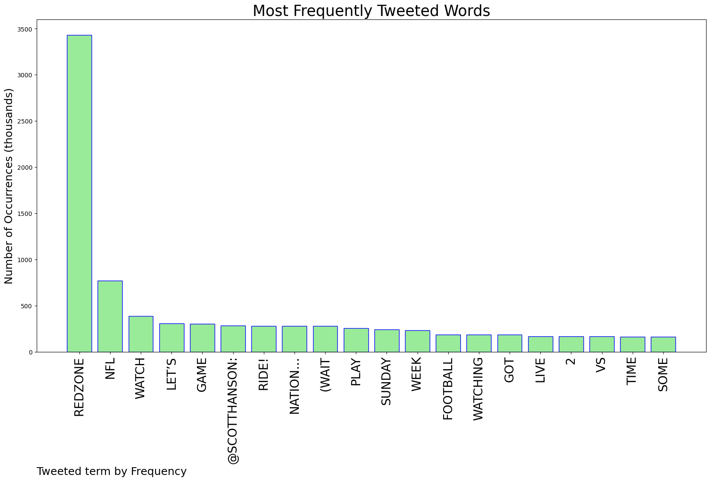

# MURCHIE85 TWITTER PROCESSING 
&#x1F34E; **TOPIC = "Redzone"**

## AUTOMATED RESEARCH SUMMARY

*note: Image pulled from web automatically, not connected to author.
  
<b> This report is AUTOMATED and not hand crafted, it is designed for pulling metrics on a given keyword or hashtag and performs a series of reporting and analysis.</b>

|                **Sample-Tweets**        |
| :-------------: |
| 🔴👉Watch HERE: @nflstreames Watch Every NFL Football Games Live Stream Online For FreeNFL Sunday Night Streaming… https://t.co/XNmAo2qkfc |
| REDZONE DAY👏🏼 |
| RT @7thflocru: We shouldn’t even have to be kicking field goals. Our playcaling in the redzone is an absolute joke. We run down the entire… |

The most popular user is: **redzone_87**

 RT @_SyedHuq: Canva has over 75M users worldwide.

But most people don't know how to unlock its full potential.

Here's 10 Canva tricks you…

## RELATED METRICS 
| Metric | Value |
| ------------- | ------------- |
| #1 Most tweeted to  | **ScottHanson** |
| #2 Most tweeted to  | **DIRECTV** |
| #3 Most tweeted to  | **Sling** |
| NewProfiles (less than 10 days) | 1.12%  |
| Tweeters with < 10 followers  | 5.2%|
| Tweeters with > 1000000 followers  | 0.08%  |

## MOST POPULAR TWEET TERMS 

| Popularity Rank  | Term |
| ------------- | ------------- |
| first  | **REDZONE**  |
| second  | **NFL**  |
| third  | **WATCH** |
| fourth  | **LET’S**  |
| fifth  | **GAME**  |

## Twitter Bio Analysis
### SENTIMENT ANALYSIS

VIEWS WERE : **SUBJECTIVE**  (26.67%) & **NEGATIVELY-SUBJECTIVE** (13.33%) **OBJECTIVE** (60.0%)

### TWEET SAMPLE 
| Random value picked from array |
| ------------- |
|Sunday Therapy Time #redzone 🤝 https://t.co/1ctpuMDOy3 |

### MOST RETWEETED 

| The most retweeted user is: **redzone_87**  |
| ------------- |
| RT @_SyedHuq: Canva has over 75M users worldwide.But most people don't know how to unlock its full potential.Here's 10 Canva tricks you… |

### CONCLUSION & EXTERNAL ANALYSIS

*This is my [Adam McMurchie`s] opinion on the data from the tweets, it serves as no objective truth.Since the tweets themselves are a mixture of fact & opinion. 
Authors analytical summary on request.
**RECOMMENDATIONS** WILL BE UPDATED IN NEXT  24 HOURS  