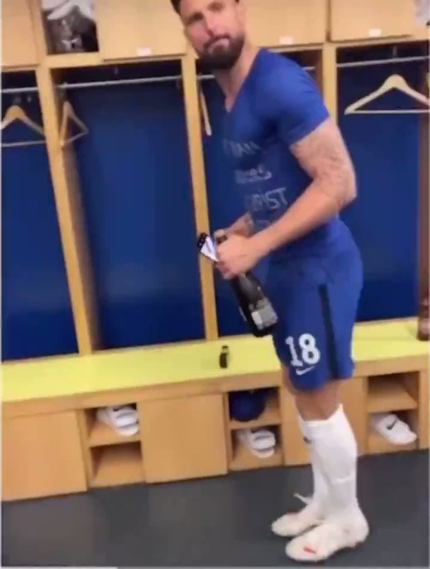
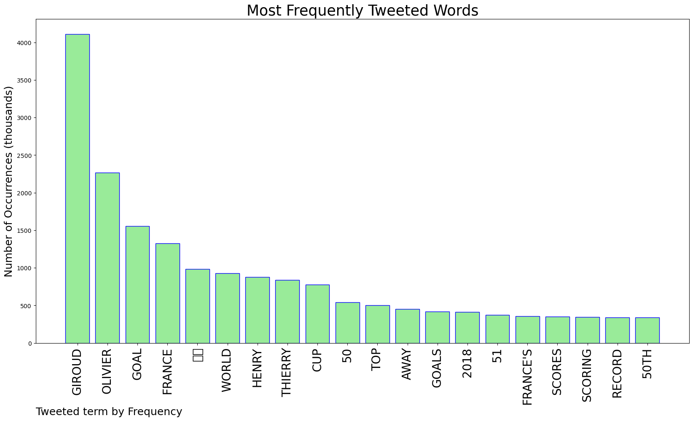
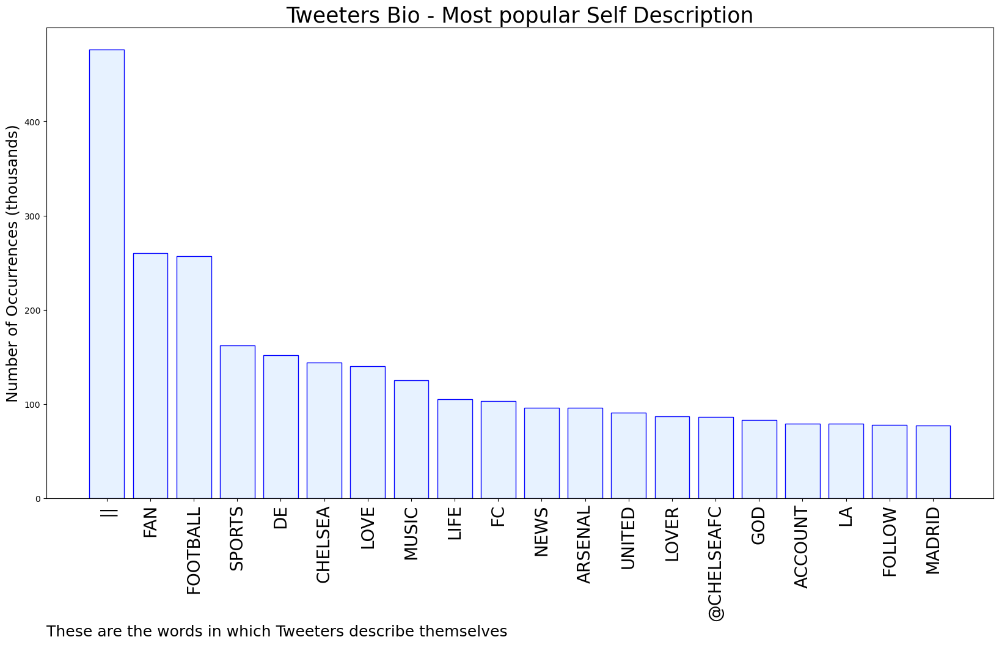

# MURCHIE85 TWITTER PROCESSING 
&#x1F34E; **TOPIC = "Giroud"**

## AUTOMATED RESEARCH SUMMARY

*note: Image pulled from web automatically, not connected to author.
  
<b> This report is AUTOMATED and not hand crafted, it is designed for pulling metrics on a given keyword or hashtag and performs a series of reporting and analysis.</b>

|                **Sample-Tweets**        |
| :-------------: |
| Giroud great than Henry |
| Why are Arsenal fans so disingenuous about Giroud and his time at Arsenal ? |
| RT @FIFAWorldCup: Leading Goalscorers for @equipedefrance 51 - Thierry Henry50 - Olivier Giroud Closing in on the top spot 🇫🇷#FIFAWo… |

The most popular user is: **bjustiro**

 RT @FabrizioRomano: What a professional and what a striker, Olivier Giroud. Respect. 🔵 #UCL #CFC #Chelsea

## RELATED METRICS 
| Metric | Value |
| ------------- | ------------- |
| #1 Most tweeted to  | **FIFAWorldCup** |
| #2 Most tweeted to  | **equipedefrance** |
| #3 Most tweeted to  | **brfootball** |
| NewProfiles (less than 10 days) | 1.2%  |
| Tweeters with < 10 followers  | 3.06%|
| Tweeters with > 1000000 followers  | 0.36%  |

## MOST POPULAR TWEET TERMS 

| Popularity Rank  | Term |
| ------------- | ------------- |
| first  | **GIROUD**  |
| second  | **OLIVIER**  |
| third  | **GOAL** |
| fourth  | **FRANCE**  |
| fifth  | **🇫🇷**  |

## Twitter Bio Analysis
### SENTIMENT ANALYSIS

VIEWS WERE : **SUBJECTIVE**  (20.0%) & **NEGATIVELY-SUBJECTIVE** (6.67%) **OBJECTIVE** (73.33%)

### TWEET SAMPLE 
| Random value picked from array |
| ------------- |
|Giroud is so underatted man. I want him to score two more goals and become France all time scorer. |

### MOST RETWEETED 

| The most retweeted user is: **bjustiro**  |
| ------------- |
| RT @FabrizioRomano: What a professional and what a striker, Olivier Giroud. Respect. 🔵 #UCL #CFC #Chelsea |

### CONCLUSION & EXTERNAL ANALYSIS

*This is my [Adam McMurchie`s] opinion on the data from the tweets, it serves as no objective truth.Since the tweets themselves are a mixture of fact & opinion. 
Authors analytical summary on request.
**RECOMMENDATIONS** WILL BE UPDATED IN NEXT  24 HOURS  