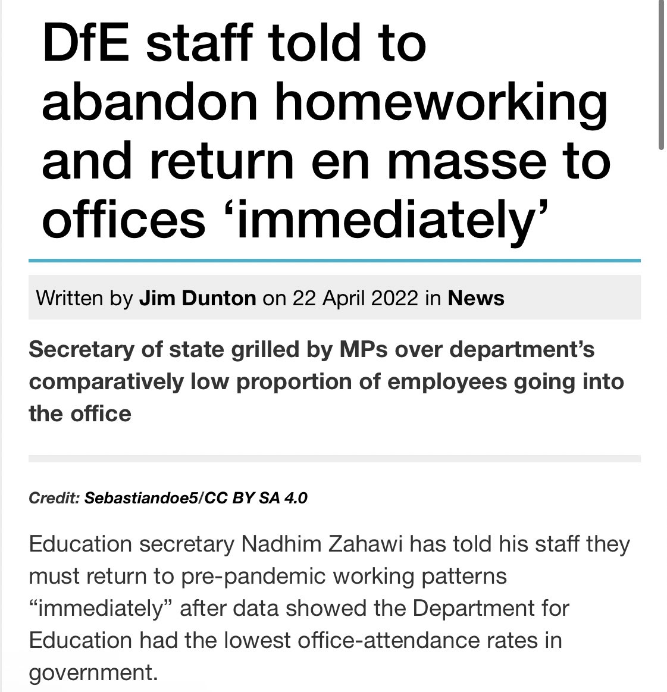
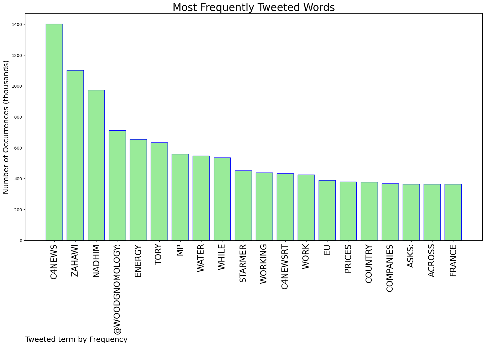
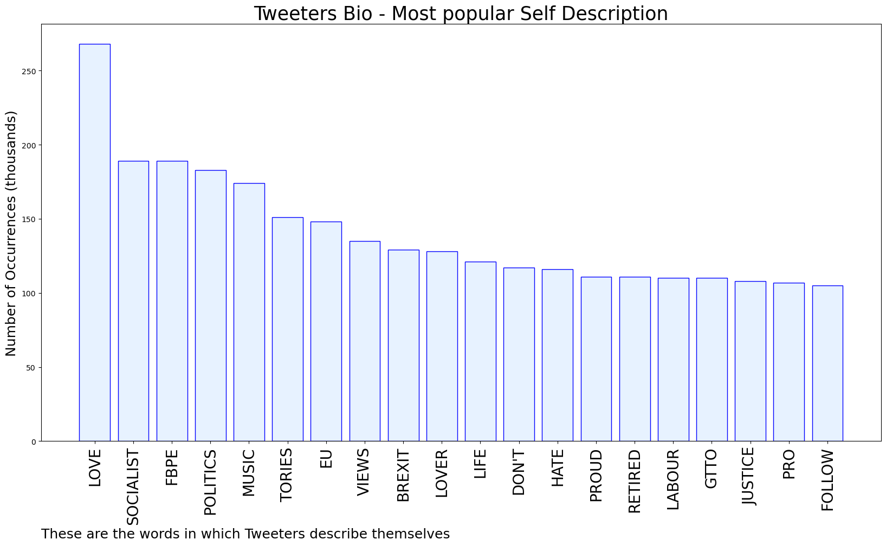

# MURCHIE85 TWITTER PROCESSING 
&#x1F34E; **TOPIC = "#C4News"**

## AUTOMATED RESEARCH SUMMARY

*note: Image pulled from web automatically, not connected to author.
  
<b> This report is AUTOMATED and not hand crafted, it is designed for pulling metrics on a given keyword or hashtag and performs a series of reporting and analysis.</b>

|                **Sample-Tweets**        |
| :-------------: |
| RT @woodgnomology: 'England’s water CEOs have banked £58m in pay &amp; benefits over the last 5 years. Since privatisation, shareholders have b… |
| RT @SmithTonyD: 25 years ago Labour was elected partly to reduce ridiculous waiting times and succeeded after a struggle and lots of invest… |
| RT @Zero_4: Tory MP Nadhim Zahawi: “I can work remotely. People can work remotely”Also Nadhim Zahawi…#C4News https://t.co/HAsTAfy203 |

The most popular user is: **darwent_charles**

 RT @GHNeale: Jacob Rees-Mogg on #C4News  
"I shall not serve under another Prime Minister"

Possibly the most honest thing this joke of a m…

## RELATED METRICS 
| Metric | Value |
| ------------- | ------------- |
| #1 Most tweeted to  | **woodgnomology** |
| #2 Most tweeted to  | **JillGore8** |
| #3 Most tweeted to  | **yipmann82** |
| NewProfiles (less than 10 days) | 0.18%  |
| Tweeters with < 10 followers  | 0.96%|
| Tweeters with > 1000000 followers  | 0.0%  |

## MOST POPULAR TWEET TERMS 

| Popularity Rank  | Term |
| ------------- | ------------- |
| first  | **C4NEWS**  |
| second  | **ZAHAWI**  |
| third  | **NADHIM** |
| fourth  | **@WOODGNOMOLOGY:**  |
| fifth  | **ENERGY**  |

## Twitter Bio Analysis
### SENTIMENT ANALYSIS

VIEWS WERE : **SUBJECTIVE**  (46.67%) & **NEGATIVELY-SUBJECTIVE** (6.67%) **OBJECTIVE** (46.67%)

### TWEET SAMPLE 
| Random value picked from array |
| ------------- |
|RT @JillGore8: "Matt Frei asks: In this country, energy prices have gone up by 215%. Across the EU it's 44%. Germany it's 23%. France it's… |

### MOST RETWEETED 

| The most retweeted user is: **darwent_charles**  |
| ------------- |
| RT @GHNeale: Jacob Rees-Mogg on #C4News  "I shall not serve under another Prime Minister"Possibly the most honest thing this joke of a m… |

### CONCLUSION & EXTERNAL ANALYSIS

*This is my [Adam McMurchie`s] opinion on the data from the tweets, it serves as no objective truth.Since the tweets themselves are a mixture of fact & opinion. 
Authors analytical summary on request.
**RECOMMENDATIONS** WILL BE UPDATED IN NEXT  24 HOURS  