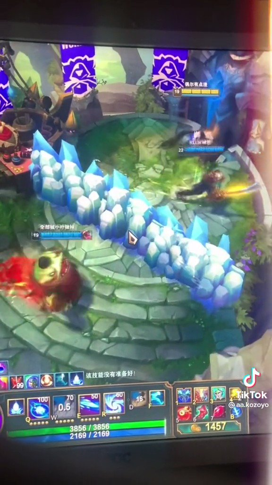
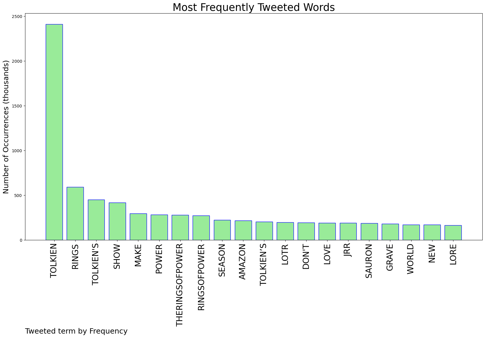
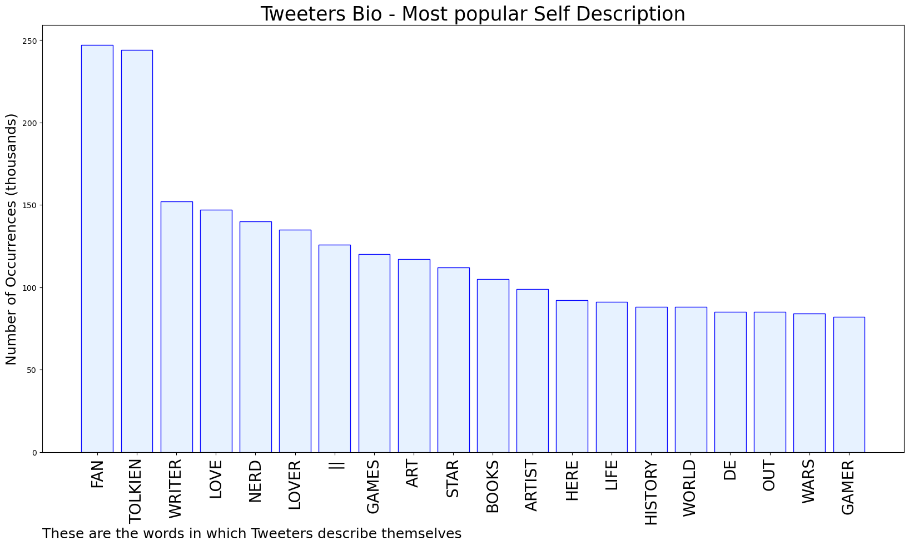

# MURCHIE85 TWITTER PROCESSING 
&#x1F34E; **TOPIC = "Tolkien"**

## AUTOMATED RESEARCH SUMMARY

*note: Image pulled from web automatically, not connected to author.
  
<b> This report is AUTOMATED and not hand crafted, it is designed for pulling metrics on a given keyword or hashtag and performs a series of reporting and analysis.</b>

|                **Sample-Tweets**        |
| :-------------: |
| RT @BurnettRM: I suppose the three years I spent immersed as part of the team creating documentaries for the Extended Editions of the LOTR… |
| RT @TotoroVSBatman: As a fan of #Tolkien, a fan of #goodwriting, and a fan of not wasting my time I’m so happy I didn’t waste a second on t… |
| The white sun on black banners…suddenly the white tree and stars on sable has a whole other meaning now. As if the… https://t.co/mRwdkQQ798 |

The most popular user is: **NaderehShe**

 RT @GuerillaMemoir: Toni Morrison: 40
Mark Twain: 41
Marcel Proust: 43
Henry Miller: 44
JRR Tolkien: 45
Raymond Chandler: 51
Richard Adams:…

## RELATED METRICS 
| Metric | Value |
| ------------- | ------------- |
| #1 Most tweeted to  | **Nerdrotics** |
| #2 Most tweeted to  | **Yoystan** |
| #3 Most tweeted to  | **LOTRonPrime** |
| NewProfiles (less than 10 days) | 1.02%  |
| Tweeters with < 10 followers  | 7.5%|
| Tweeters with > 1000000 followers  | 0.16%  |

## MOST POPULAR TWEET TERMS 

| Popularity Rank  | Term |
| ------------- | ------------- |
| first  | **TOLKIEN**  |
| second  | **RINGS**  |
| third  | **"TOLKIENS"** |
| fourth  | **SHOW**  |
| fifth  | **MAKE**  |

## Twitter Bio Analysis
### SENTIMENT ANALYSIS

VIEWS WERE : **SUBJECTIVE**  (40.0%) & **NEGATIVELY-SUBJECTIVE** (6.67%) **OBJECTIVE** (53.33%)

### TWEET SAMPLE 
| Random value picked from array |
| ------------- |
|@thatstarwarsgrl @JeffBezos And it absolutely doesn't do anything to Tolkien's legacy. It's one thing, and the books are another. |

### MOST RETWEETED 

| The most retweeted user is: **NaderehShe**  |
| ------------- |
| RT @GuerillaMemoir: Toni Morrison: 40Mark Twain: 41Marcel Proust: 43Henry Miller: 44JRR Tolkien: 45Raymond Chandler: 51Richard Adams:… |

### CONCLUSION & EXTERNAL ANALYSIS

*This is my [Adam McMurchie`s] opinion on the data from the tweets, it serves as no objective truth.Since the tweets themselves are a mixture of fact & opinion. 
Authors analytical summary on request.
**RECOMMENDATIONS** WILL BE UPDATED IN NEXT  24 HOURS  