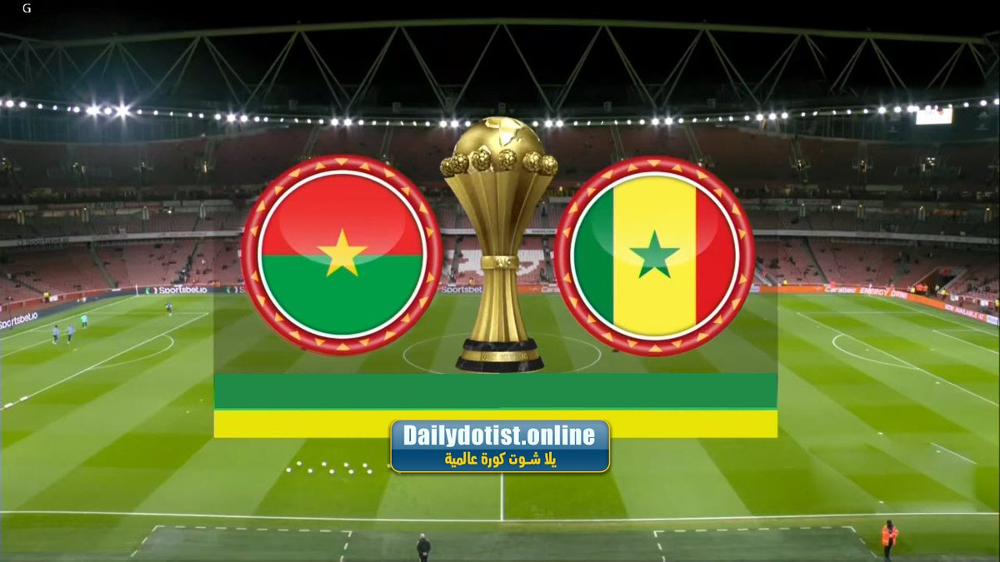
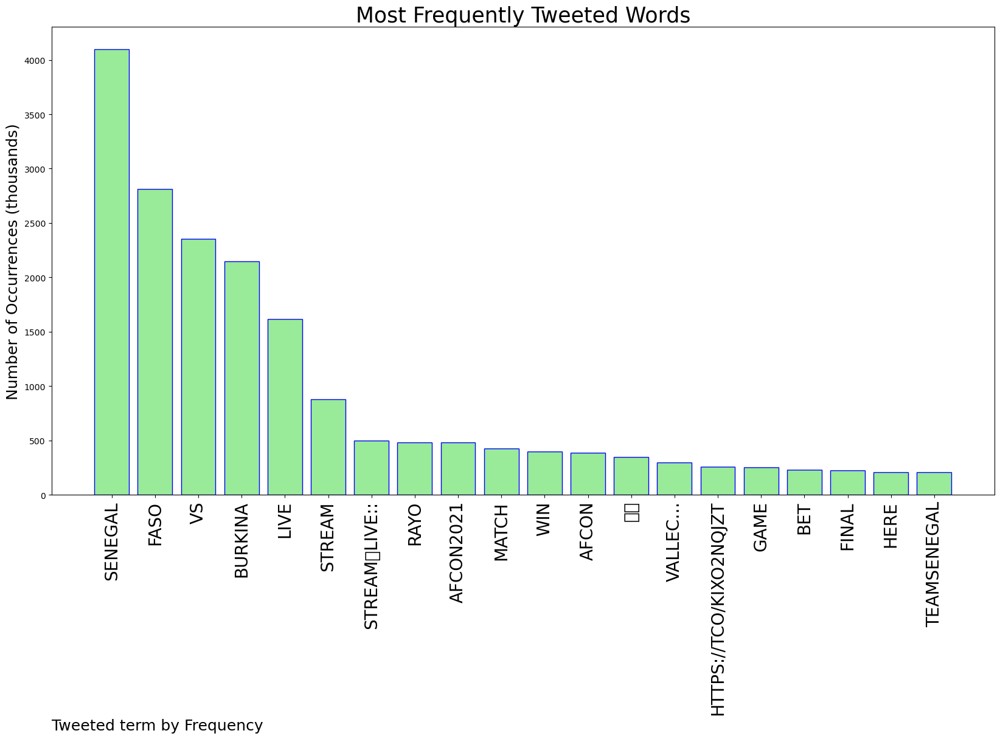
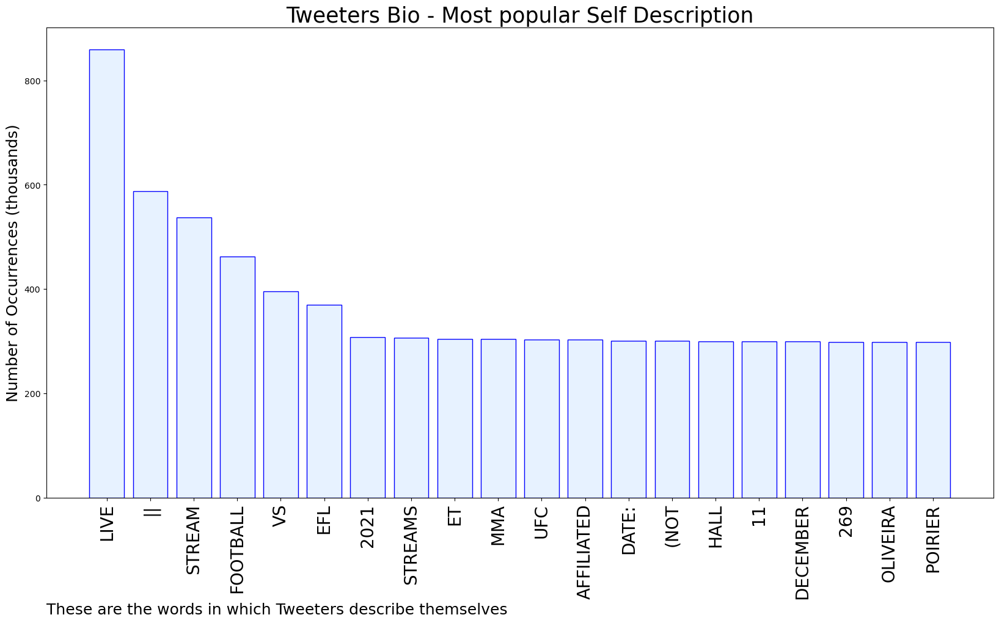

# MURCHIE85 TWITTER PROCESSING 
&#x1F34E; **TOPIC = "Senegal"**

## AUTOMATED RESEARCH SUMMARY

*note: Image pulled from web automatically, not connected to author.
  
<b> This report is AUTOMATED and not hand crafted, it is designed for pulling metrics on a given keyword or hashtag and performs a series of reporting and analysis.</b>

|                **Sample-Tweets**        |
| :-------------: |
| Penalty to Senegal. |
| RT @Etwepaa: Burkina Faso 1:1 SenegalFirst half - over 0.5 |
| 🇧🇫 Burkina Faso🇸🇳 SenegalWho will be the first country to book their place in the #AFCON2021 final?Follow LIVE updates ⬇️ |

The most popular user is: **SeremiNgwato**

 RT @AbelNegasi4: France has been holding the national reserves of fourteen african countries since 1961: Benin, Burkina Faso, Guinea-Bissau…

## RELATED METRICS 
| Metric | Value |
| ------------- | ------------- |
| #1 Most tweeted to  | **virginHoffice** |
| #2 Most tweeted to  | **Sportsbetio** |
| #3 Most tweeted to  | **thatguydenna** |
| NewProfiles (less than 10 days) | 2.42%  |
| Tweeters with < 10 followers  | 7.4%|
| Tweeters with > 1000000 followers  | 0.38%  |

## MOST POPULAR TWEET TERMS 

| Popularity Rank  | Term |
| ------------- | ------------- |
| first  | **SENEGAL**  |
| second  | **FASO**  |
| third  | **VS** |
| fourth  | **BURKINA**  |
| fifth  | **LIVE**  |

## Twitter Bio Analysis
### SENTIMENT ANALYSIS

VIEWS WERE : **SUBJECTIVE**  (20.0%) & **NEGATIVELY-SUBJECTIVE** (0.0%) **OBJECTIVE** (80.0%)

### TWEET SAMPLE 
| Random value picked from array |
| ------------- |
|Burkina Faso vs Senegal LiveStream🛑Live:: https://t.co/kixo2NqjZtBurkina Faso vs Senegal Live StreamRayo Vallec… https://t.co/tZgeE6wjOD |

### MOST RETWEETED 

| The most retweeted user is: **SeremiNgwato**  |
| ------------- |
| RT @AbelNegasi4: France has been holding the national reserves of fourteen african countries since 1961: Benin, Burkina Faso, Guinea-Bissau… |

### CONCLUSION & EXTERNAL ANALYSIS

*This is my [Adam McMurchie`s] opinion on the data from the tweets, it serves as no objective truth.Since the tweets themselves are a mixture of fact & opinion. 
Authors analytical summary on request.
**RECOMMENDATIONS** WILL BE UPDATED IN NEXT  24 HOURS  