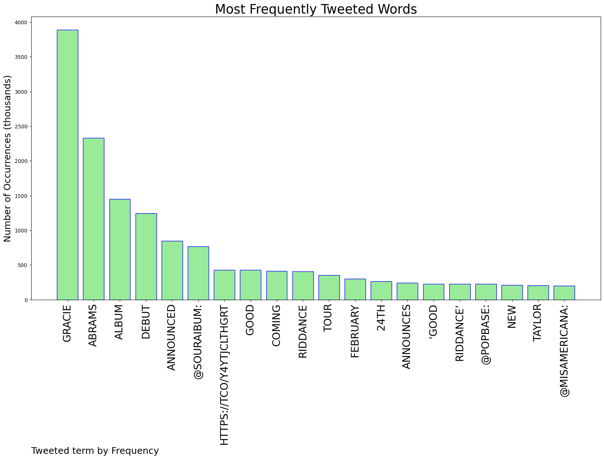
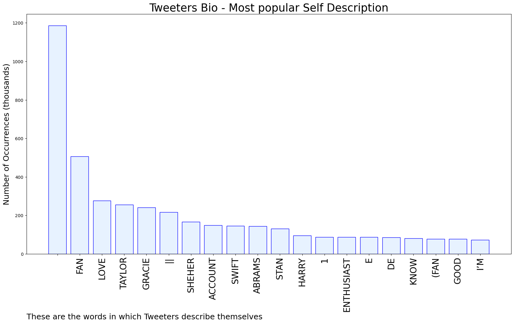

# MURCHIE85 TWITTER PROCESSING 
&#x1F34E; **TOPIC = "gracie"**

## AUTOMATED RESEARCH SUMMARY

*note: Image pulled from web automatically, not connected to author.
  
<b> This report is AUTOMATED and not hand crafted, it is designed for pulling metrics on a given keyword or hashtag and performs a series of reporting and analysis.</b>

|                **Sample-Tweets**        |
| :-------------: |
| i haven’t been able to scream about gracie bc i’ve been at work but KAJSKSJSJSJSJSJDJDHD |
| I WILL BE HUGGING GRACIE THIS YR TRUST |
| Gracie Tour in Toronto!! OMFG! 🫢🥹 https://t.co/BqnmV8UIHY |

The most popular user is: **gracie_heifner**

 RT @23luvr: “fuck it we ball” (malnourished, heavy eye bags, dehydrated, and on the verge of insanity)

## RELATED METRICS 
| Metric | Value |
| ------------- | ------------- |
| #1 Most tweeted to  | **souraIbum** |
| #2 Most tweeted to  | **gracieabrams** |
| #3 Most tweeted to  | **PopBase** |
| NewProfiles (less than 10 days) | 0.8%  |
| Tweeters with < 10 followers  | 4.22%|
| Tweeters with > 1000000 followers  | 0.04%  |

## MOST POPULAR TWEET TERMS 

| Popularity Rank  | Term |
| ------------- | ------------- |
| first  | **GRACIE**  |
| second  | **ABRAMS**  |
| third  | **ALBUM** |
| fourth  | **DEBUT**  |
| fifth  | **ANNOUNCED**  |

## Twitter Bio Analysis
### SENTIMENT ANALYSIS

VIEWS WERE : **SUBJECTIVE**  (33.33%) & **NEGATIVELY-SUBJECTIVE** (6.67%) **OBJECTIVE** (60.0%)

### TWEET SAMPLE 
| Random value picked from array |
| ------------- |
|the way i wasnt able to go to gracie last year bc all my friends didn’t like her music and now this year shes all o… https://t.co/shMRho4657 |

### MOST RETWEETED 

| The most retweeted user is: **gracie_heifner**  |
| ------------- |
| RT @23luvr: “fuck it we ball” (malnourished, heavy eye bags, dehydrated, and on the verge of insanity) |

### CONCLUSION & EXTERNAL ANALYSIS

*This is my [Adam McMurchie`s] opinion on the data from the tweets, it serves as no objective truth.Since the tweets themselves are a mixture of fact & opinion. 
Authors analytical summary on request.
**RECOMMENDATIONS** WILL BE UPDATED IN NEXT  24 HOURS  