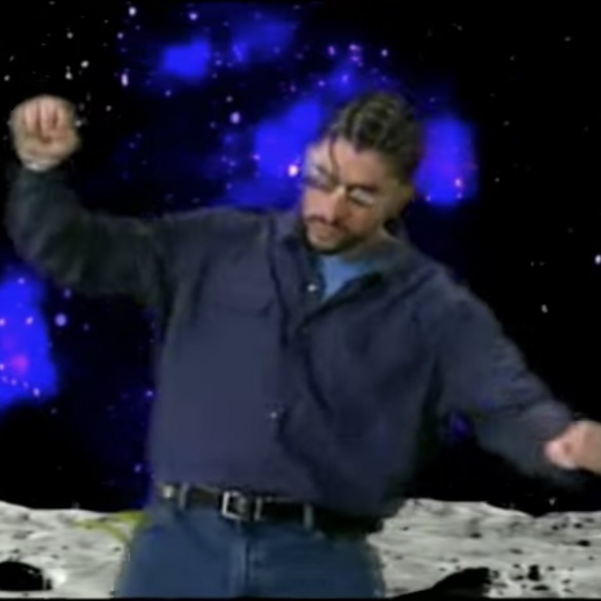
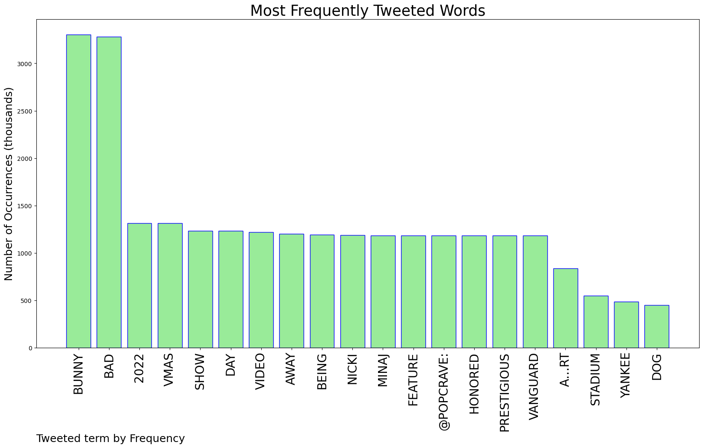
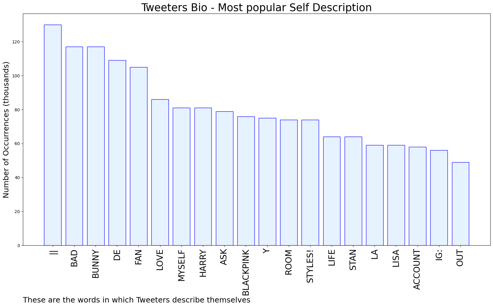
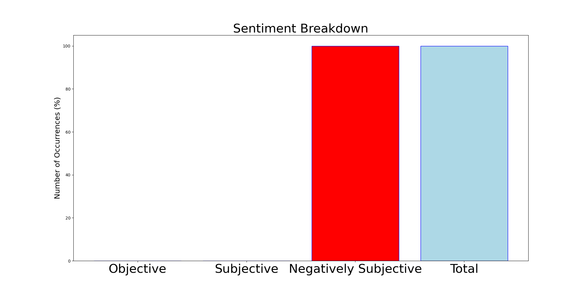

# MURCHIE85 TWITTER PROCESSING 
&#x1F34E; **TOPIC = "Bad Bunny"**

## AUTOMATED RESEARCH SUMMARY

*note: Image pulled from web automatically, not connected to author.
  
<b> This report is AUTOMATED and not hand crafted, it is designed for pulling metrics on a given keyword or hashtag and performs a series of reporting and analysis.</b>

|                **Sample-Tweets**        |
| :-------------: |
| Literally only going to Made In America for Bad Bunny &amp; Jazmine Sullivan |
| RT @itsirisb_: I need to know where the Bad Bunny after party is tonight |
| RT @luigitheplatano: bad bunny performs at yankee stadium today https://t.co/xkvEhVnEKi |

The most popular user is: **Tania_and_Bunny**

 RT @forecastoctopus: stealing art is bad however if a 12 year old puts my art in an amv to cascada or something. i cant be mad

## RELATED METRICS 
| Metric | Value |
| ------------- | ------------- |
| #1 Most tweeted to  | **PopCrave** |
| #2 Most tweeted to  | **xovalerie_** |
| #3 Most tweeted to  | **AccessBadBunny** |
| NewProfiles (less than 10 days) | 0.92%  |
| Tweeters with < 10 followers  | 7.26%|
| Tweeters with > 1000000 followers  | 0.08%  |

## MOST POPULAR TWEET TERMS 

| Popularity Rank  | Term |
| ------------- | ------------- |
| first  | **BUNNY**  |
| second  | **BAD**  |
| third  | **2022** |
| fourth  | **VMAS**  |
| fifth  | **SHOW**  |

## Twitter Bio Analysis
### SENTIMENT ANALYSIS

VIEWS WERE : **SUBJECTIVE**  (0.0%) & **NEGATIVELY-SUBJECTIVE** (100.0%) **OBJECTIVE** (0.0%)

### TWEET SAMPLE 
| Random value picked from array |
| ------------- |
|I know they going all out in the Bronx this weekend for bad bunny with the PR flags 😭 |

### MOST RETWEETED 

| The most retweeted user is: **Tania_and_Bunny**  |
| ------------- |
| RT @forecastoctopus: stealing art is bad however if a 12 year old puts my art in an amv to cascada or something. i cant be mad |

### CONCLUSION & EXTERNAL ANALYSIS

*This is my [Adam McMurchie`s] opinion on the data from the tweets, it serves as no objective truth.Since the tweets themselves are a mixture of fact & opinion. 
Authors analytical summary on request.
**RECOMMENDATIONS** WILL BE UPDATED IN NEXT  24 HOURS  