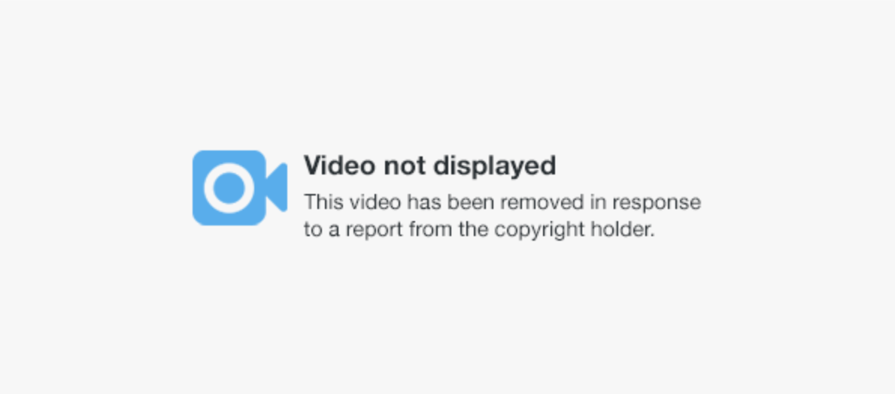
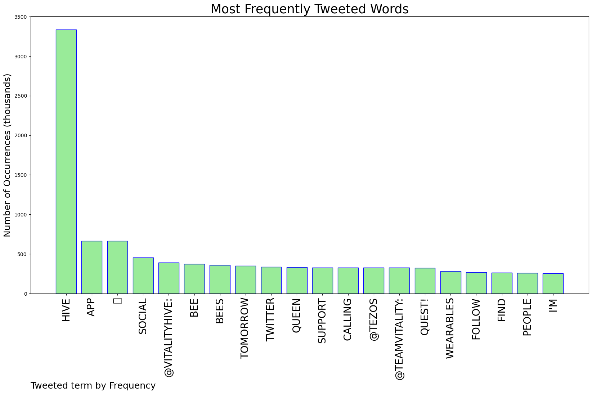
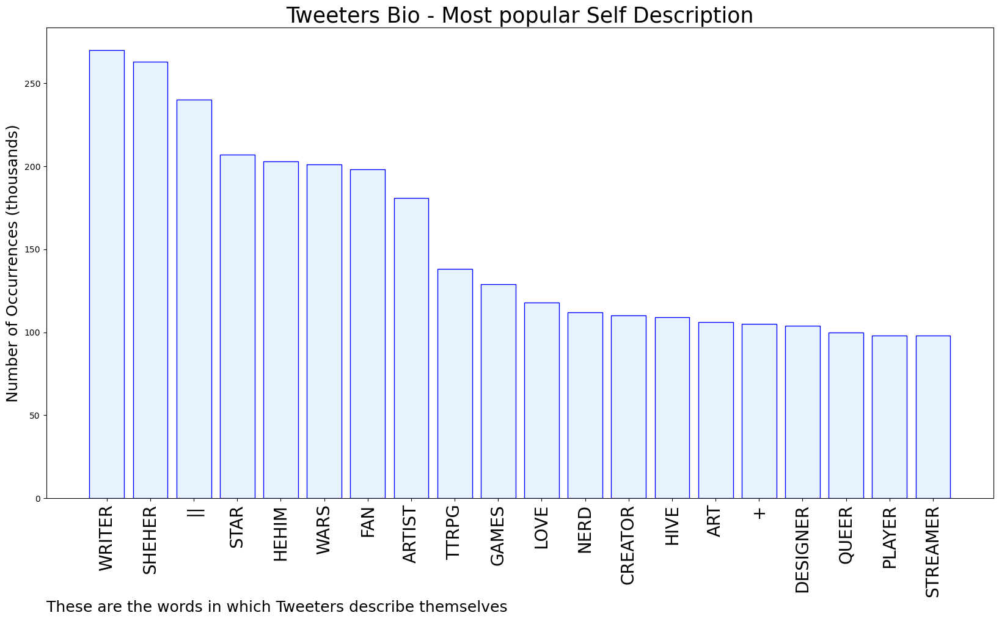

# MURCHIE85 TWITTER PROCESSING 
&#x1F34E; **TOPIC = "Hive"**

## AUTOMATED RESEARCH SUMMARY

*note: Image pulled from web automatically, not connected to author.
  
<b> This report is AUTOMATED and not hand crafted, it is designed for pulling metrics on a given keyword or hashtag and performs a series of reporting and analysis.</b>

|                **Sample-Tweets**        |
| :-------------: |
| RT @VitalityHive: OUR MOBILE APP IS OFFICIALLY LAUNCHED 🐝You can download the app right now and start earning points and wearables for yo… |
| Bythecharles on Hive. |
| repost // helloo these are my other social accs just in case twt is going down!!preferably contact me on dc if it… https://t.co/5qzeQmn1Ci |

The most popular user is: **jk_bighit_hive_**

 RT @FIFAWorldCup: What a performance, Jung Kook! ✨

#Dreamers2022 | @bts_bighit

## RELATED METRICS 
| Metric | Value |
| ------------- | ------------- |
| #1 Most tweeted to  | **VitalityHive** |
| #2 Most tweeted to  | **TeamVitality** |
| #3 Most tweeted to  | **tezos** |
| NewProfiles (less than 10 days) | 0.94%  |
| Tweeters with < 10 followers  | 5.8%|
| Tweeters with > 1000000 followers  | 0.02%  |

## MOST POPULAR TWEET TERMS 

| Popularity Rank  | Term |
| ------------- | ------------- |
| first  | **HIVE**  |
| second  | **APP**  |
| third  | **🐝** |
| fourth  | **SOCIAL**  |
| fifth  | **@VITALITYHIVE:**  |

## Twitter Bio Analysis
### SENTIMENT ANALYSIS

VIEWS WERE : **SUBJECTIVE**  (60.0%) & **NEGATIVELY-SUBJECTIVE** (6.67%) **OBJECTIVE** (33.33%)

### TWEET SAMPLE 
| Random value picked from array |
| ------------- |
|@Technoir Hive Social, new app. ✨ |

### MOST RETWEETED 

| The most retweeted user is: **jk_bighit_hive_**  |
| ------------- |
| RT @FIFAWorldCup: What a performance, Jung Kook! ✨#Dreamers2022 | @bts_bighit |

### CONCLUSION & EXTERNAL ANALYSIS

*This is my [Adam McMurchie`s] opinion on the data from the tweets, it serves as no objective truth.Since the tweets themselves are a mixture of fact & opinion. 
Authors analytical summary on request.
**RECOMMENDATIONS** WILL BE UPDATED IN NEXT  24 HOURS  