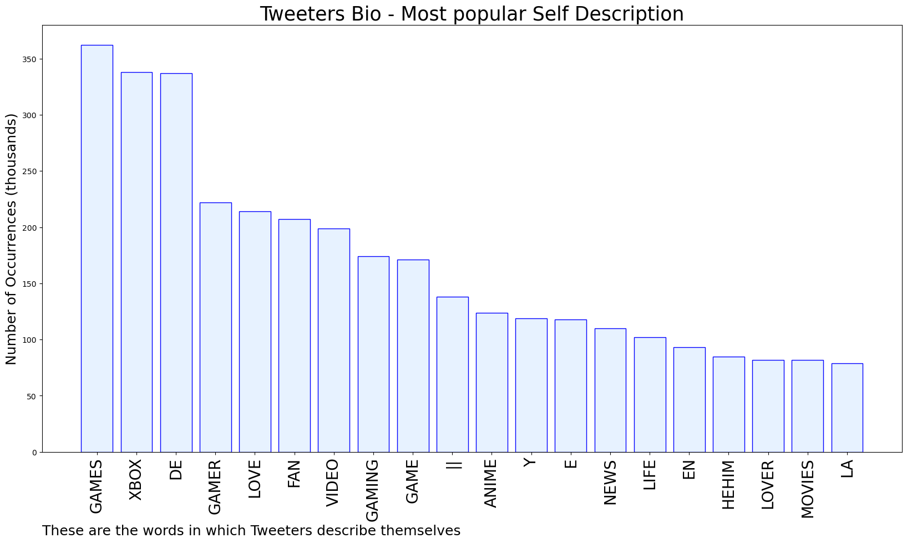

# MURCHIE85 TWITTER PROCESSING 
&#x1F34E; **TOPIC = "Lies of P"**

## AUTOMATED RESEARCH SUMMARY

*note: Image pulled from web automatically, not connected to author.
  
<b> This report is AUTOMATED and not hand crafted, it is designed for pulling metrics on a given keyword or hashtag and performs a series of reporting and analysis.</b>

|                **Sample-Tweets**        |
| :-------------: |
| Lies of P just might be the first soulslike I'll wholeheartedly invest in. #gamescom2022 |
| REMINDER!!! 11 AM PT / 2 PM ET / 8 PM CEST Come hang out as we watch new games announcements and news from- H… https://t.co/bgh9LbgDAa |
| @GrassleyPress @SenJudiciaryGOP @FoxNews @ChuckGrassley @FBI Credibility matters to most of USBUT NOT THE G O PG… https://t.co/NgVjWBjCtA |

The most popular user is: **p_dawg9093**

 RT @CoachD_Speaks: The 87,000 new IRS agents will be phased in over the next 10 years. 50,000 are set to retire over that period. The net a…

## RELATED METRICS 
| Metric | Value |
| ------------- | ------------- |
| #1 Most tweeted to  | **Nibellion** |
| #2 Most tweeted to  | **insider_wtf** |
| #3 Most tweeted to  | **gamescom** |
| NewProfiles (less than 10 days) | 0.39%  |
| Tweeters with < 10 followers  | 4.08%|
| Tweeters with > 1000000 followers  | 0.1%  |

## MOST POPULAR TWEET TERMS 

| Popularity Rank  | Term |
| ------------- | ------------- |
| first  | **LIES**  |
| second  | **P**  |
| third  | **GAME** |
| fourth  | **COMING**  |
| fifth  | **XBOX**  |

## Twitter Bio Analysis
### SENTIMENT ANALYSIS

VIEWS WERE : **SUBJECTIVE**  (33.33%) & **NEGATIVELY-SUBJECTIVE** (13.33%) **OBJECTIVE** (53.33%)

### TWEET SAMPLE 
| Random value picked from array |
| ------------- |
|@adamjohnsonNYC I think we will agree that within those zillion lies almost a zillion words of bullshit. I was aski… https://t.co/bi5oiRNJXs |

### MOST RETWEETED 

| The most retweeted user is: **p_dawg9093**  |
| ------------- |
| RT @CoachD_Speaks: The 87,000 new IRS agents will be phased in over the next 10 years. 50,000 are set to retire over that period. The net a… |

### CONCLUSION & EXTERNAL ANALYSIS

*This is my [Adam McMurchie`s] opinion on the data from the tweets, it serves as no objective truth.Since the tweets themselves are a mixture of fact & opinion. 
Authors analytical summary on request.
**RECOMMENDATIONS** WILL BE UPDATED IN NEXT  24 HOURS  