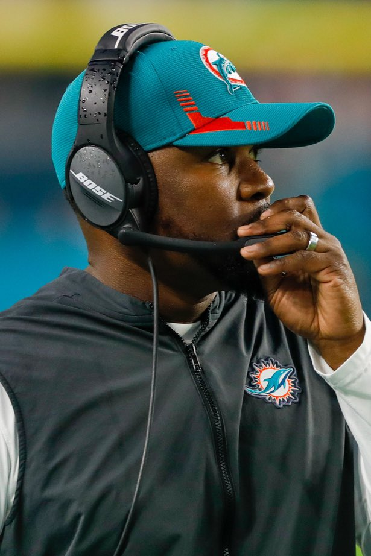
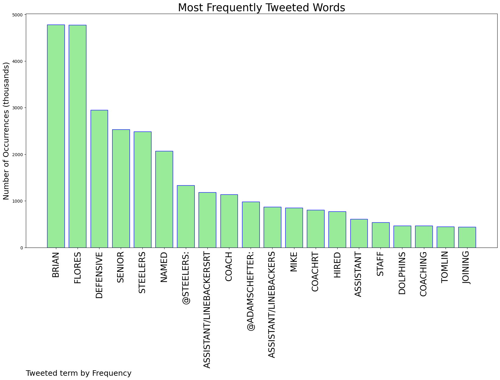
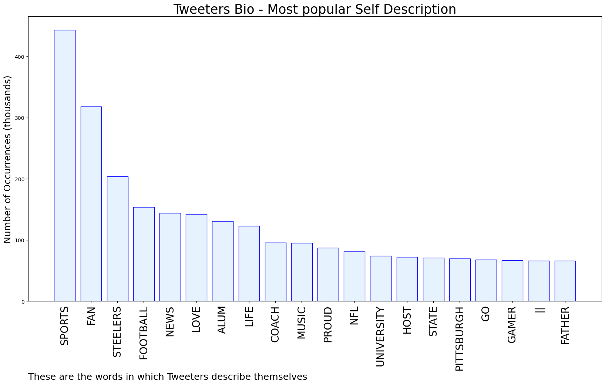

# MURCHIE85 TWITTER PROCESSING 
&#x1F34E; **TOPIC = "Brian Flores"**

## AUTOMATED RESEARCH SUMMARY

*note: Image pulled from web automatically, not connected to author.
  
<b> This report is AUTOMATED and not hand crafted, it is designed for pulling metrics on a given keyword or hashtag and performs a series of reporting and analysis.</b>

|                **Sample-Tweets**        |
| :-------------: |
| RT @AdamSchefter: Steelers named Brian Flores as their senior defensive assistant/linebackers coach. |
| RT @steelers: We have named Brian Flores as our senior defensive assistant/linebackers. |
| RT @steelers: We have named Brian Flores as our senior defensive assistant/linebackers. |

The most popular user is: **mbgelman**

 RT @steelers: We have named Brian Flores as our senior defensive assistant/linebackers.

## RELATED METRICS 
| Metric | Value |
| ------------- | ------------- |
| #1 Most tweeted to  | **steelers** |
| #2 Most tweeted to  | **AdamSchefter** |
| #3 Most tweeted to  | **RapSheet** |
| NewProfiles (less than 10 days) | 0.28%  |
| Tweeters with < 10 followers  | 2.46%|
| Tweeters with > 1000000 followers  | 0.16%  |

## MOST POPULAR TWEET TERMS 

| Popularity Rank  | Term |
| ------------- | ------------- |
| first  | **BRIAN**  |
| second  | **FLORES**  |
| third  | **DEFENSIVE** |
| fourth  | **SENIOR**  |
| fifth  | **STEELERS**  |

## Twitter Bio Analysis
### SENTIMENT ANALYSIS

VIEWS WERE : **SUBJECTIVE**  (33.33%) & **NEGATIVELY-SUBJECTIVE** (0.0%) **OBJECTIVE** (66.67%)

### TWEET SAMPLE 
| Random value picked from array |
| ------------- |
|Steelers⭐️ hire Brian Flores⭐️ former Head Coach of the  Dolphins⭐️ to be Senior Defensive Assistant  https://t.co/Q1Hce3TN11 |

### MOST RETWEETED 

| The most retweeted user is: **mbgelman**  |
| ------------- |
| RT @steelers: We have named Brian Flores as our senior defensive assistant/linebackers. |

### CONCLUSION & EXTERNAL ANALYSIS

*This is my [Adam McMurchie`s] opinion on the data from the tweets, it serves as no objective truth.Since the tweets themselves are a mixture of fact & opinion. 
Authors analytical summary on request.
**RECOMMENDATIONS** WILL BE UPDATED IN NEXT  24 HOURS  