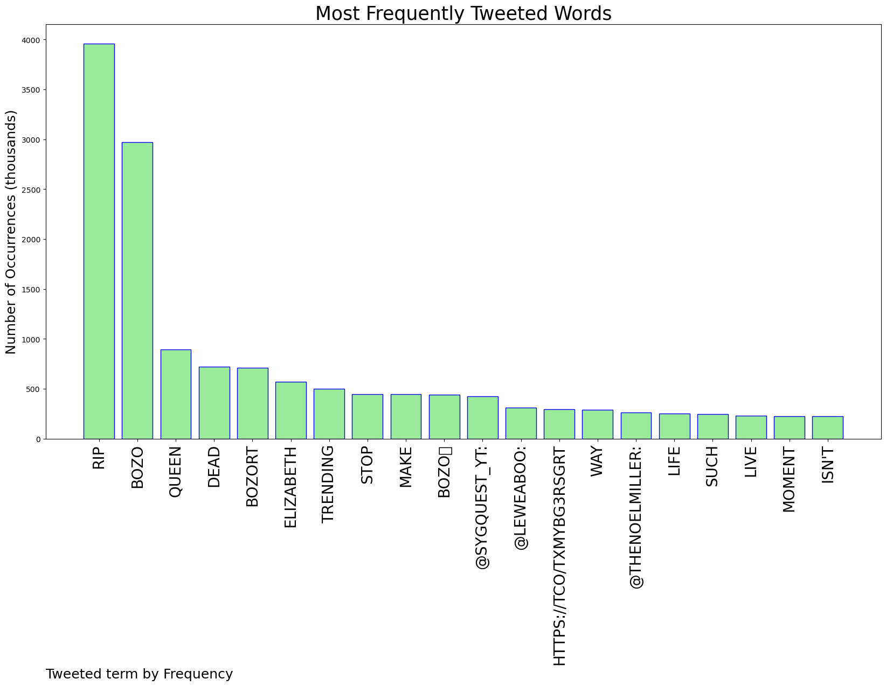
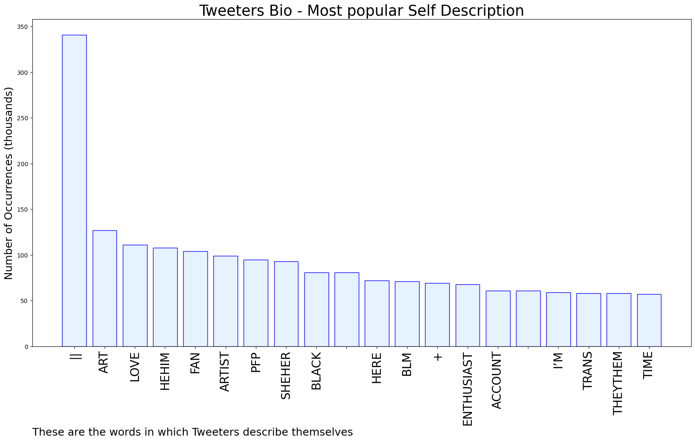
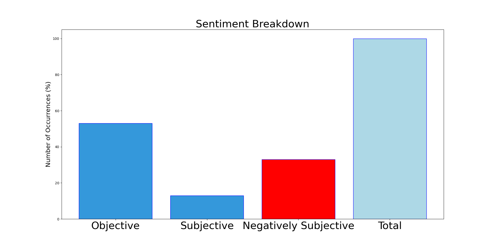

# MURCHIE85 TWITTER PROCESSING 
&#x1F34E; **TOPIC = "RIP BOZO"**

## AUTOMATED RESEARCH SUMMARY

*note: Image pulled from web automatically, not connected to author.
  
<b> This report is AUTOMATED and not hand crafted, it is designed for pulling metrics on a given keyword or hashtag and performs a series of reporting and analysis.</b>

|                **Sample-Tweets**        |
| :-------------: |
| RT @jaubreyYT: Even god said rip bozo https://t.co/FmYtDHxS4b |
| @BBCBreaking rip bozo |
| RT @BRATZULA: RIP BOZO https://t.co/ghK1dzA7Q4 |

The most popular user is: **Noevilpls**

 RT @leweaboo: RIP BOZO https://t.co/S710fXV1lG

## RELATED METRICS 
| Metric | Value |
| ------------- | ------------- |
| #1 Most tweeted to  | **sygquest_yt** |
| #2 Most tweeted to  | **leweaboo** |
| #3 Most tweeted to  | **thenoelmiller** |
| NewProfiles (less than 10 days) | 0.8%  |
| Tweeters with < 10 followers  | 8.04%|
| Tweeters with > 1000000 followers  | 0.0%  |

## MOST POPULAR TWEET TERMS 

| Popularity Rank  | Term |
| ------------- | ------------- |
| first  | **RIP**  |
| second  | **BOZO**  |
| third  | **QUEEN** |
| fourth  | **DEAD**  |
| fifth  | **BOZORT**  |

## Twitter Bio Analysis
### SENTIMENT ANALYSIS

VIEWS WERE : **SUBJECTIVE**  (13.33%) & **NEGATIVELY-SUBJECTIVE** (33.33%) **OBJECTIVE** (53.33%)

### TWEET SAMPLE 
| Random value picked from array |
| ------------- |
|RT @WhattUpJT: I never seen “RIP BOZO” become a worldwide trend before |

### MOST RETWEETED 

| The most retweeted user is: **Noevilpls**  |
| ------------- |
| RT @leweaboo: RIP BOZO https://t.co/S710fXV1lG |

### CONCLUSION & EXTERNAL ANALYSIS

*This is my [Adam McMurchie`s] opinion on the data from the tweets, it serves as no objective truth.Since the tweets themselves are a mixture of fact & opinion. 
Authors analytical summary on request.
**RECOMMENDATIONS** WILL BE UPDATED IN NEXT  24 HOURS  