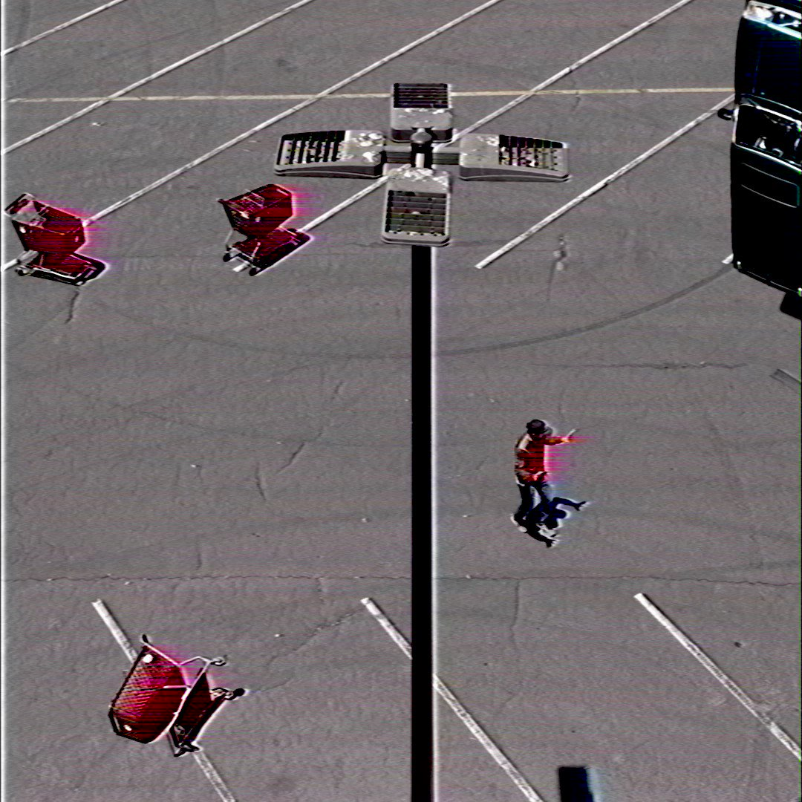
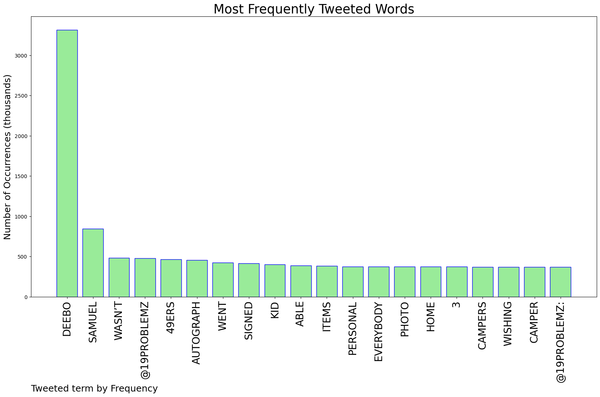
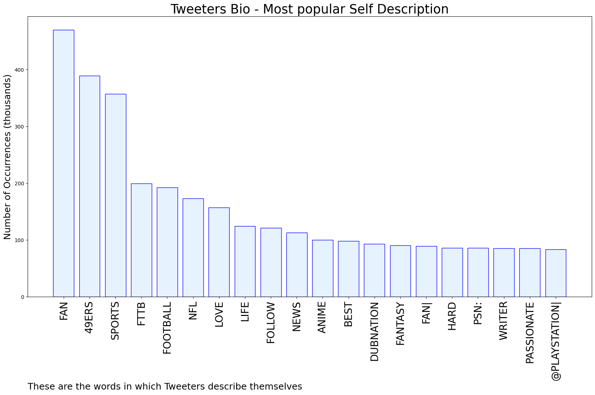
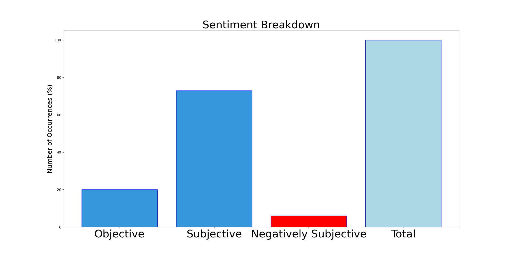

# MURCHIE85 TWITTER PROCESSING 
&#x1F34E; **TOPIC = "Deebo"**

## AUTOMATED RESEARCH SUMMARY

*note: Image pulled from web automatically, not connected to author.
  
<b> This report is AUTOMATED and not hand crafted, it is designed for pulling metrics on a given keyword or hashtag and performs a series of reporting and analysis.</b>

|                **Sample-Tweets**        |
| :-------------: |
| Deebo did this kid wrong 😑 https://t.co/jvRPDvEbXq |
| @Thamannjr Stall em out deebo |
| @NFLonFOX Deebo, DK, and T Mac. |

The most popular user is: **Deebo_Unknwn**

 RT @maryebaldwin_: people NEED to get out of their small, close-minded towns &amp; educate themselves beyond what they were taught growing up……

## RELATED METRICS 
| Metric | Value |
| ------------- | ------------- |
| #1 Most tweeted to  | **19problemz** |
| #2 Most tweeted to  | **NickPaulus** |
| #3 Most tweeted to  | **PFF_Fantasy** |
| NewProfiles (less than 10 days) | 0.78%  |
| Tweeters with < 10 followers  | 7.36%|
| Tweeters with > 1000000 followers  | 0.0%  |

## MOST POPULAR TWEET TERMS 

| Popularity Rank  | Term |
| ------------- | ------------- |
| first  | **DEEBO**  |
| second  | **SAMUEL**  |
| third  | **WASN’T** |
| fourth  | **@19PROBLEMZ**  |
| fifth  | **49ERS**  |

## Twitter Bio Analysis
### SENTIMENT ANALYSIS

VIEWS WERE : **SUBJECTIVE**  (73.33%) & **NEGATIVELY-SUBJECTIVE** (6.67%) **OBJECTIVE** (20.0%)

### TWEET SAMPLE 
| Random value picked from array |
| ------------- |
|@DynastyTripp @SleeperHQ Because whoever decided this change was pissed off that they weren't able to get any share… https://t.co/KdN9QeafLu |

### MOST RETWEETED 

| The most retweeted user is: **Deebo_Unknwn**  |
| ------------- |
| RT @maryebaldwin_: people NEED to get out of their small, close-minded towns &amp; educate themselves beyond what they were taught growing up…… |

### CONCLUSION & EXTERNAL ANALYSIS

*This is my [Adam McMurchie`s] opinion on the data from the tweets, it serves as no objective truth.Since the tweets themselves are a mixture of fact & opinion. 
Authors analytical summary on request.
**RECOMMENDATIONS** WILL BE UPDATED IN NEXT  24 HOURS  