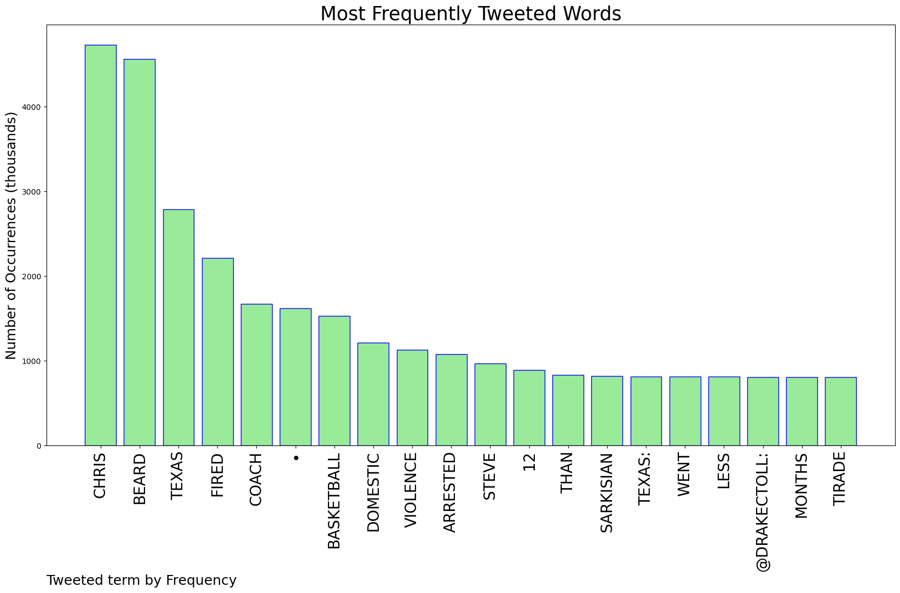
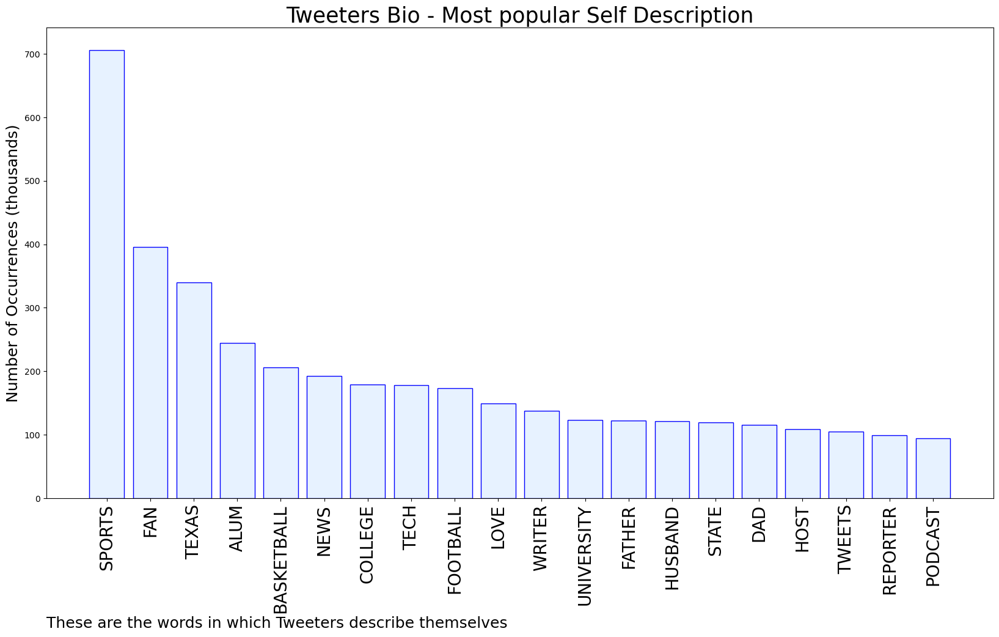

# MURCHIE85 TWITTER PROCESSING 
&#x1F34E; **TOPIC = "Chris Beard"**

## AUTOMATED RESEARCH SUMMARY

*note: Image pulled from web automatically, not connected to author.
  
<b> This report is AUTOMATED and not hand crafted, it is designed for pulling metrics on a given keyword or hashtag and performs a series of reporting and analysis.</b>

|                **Sample-Tweets**        |
| :-------------: |
| RT @AP_Top25: BREAKING: Texas has fired men's basketball coach Chris Beard, who faces a felony domestic family violence charge stemming fro… |
| RT @JonRothstein: Sources: Texas has parted ways with Chris Beard. |
| RT @drakectoll: in less than 12 months at texas:• chris beard was arrested for domestic violence• steve sarkisian went on a tirade of f-… |

The most popular user is: **beard_sports**

 RT @RyanClifford: Chris Pronger suffered commotio cordis after taking a slap shot to the chest in 1998. 

Praying for a similar recovery an…

## RELATED METRICS 
| Metric | Value |
| ------------- | ------------- |
| #1 Most tweeted to  | **kbohls** |
| #2 Most tweeted to  | **drakectoll** |
| #3 Most tweeted to  | **JonRothstein** |
| NewProfiles (less than 10 days) | 0.06%  |
| Tweeters with < 10 followers  | 2.4%|
| Tweeters with > 1000000 followers  | 0.16%  |

## MOST POPULAR TWEET TERMS 

| Popularity Rank  | Term |
| ------------- | ------------- |
| first  | **CHRIS**  |
| second  | **BEARD**  |
| third  | **TEXAS** |
| fourth  | **FIRED**  |
| fifth  | **COACH**  |

## Twitter Bio Analysis
### SENTIMENT ANALYSIS

VIEWS WERE : **SUBJECTIVE**  (20.0%) & **NEGATIVELY-SUBJECTIVE** (6.67%) **OBJECTIVE** (73.33%)

### TWEET SAMPLE 
| Random value picked from array |
| ------------- |
|RT @statesman: Texas fires men's basketball coach Chris Beard; Rodney Terry to continue in his place https://t.co/XlouCqmNOM |

### MOST RETWEETED 

| The most retweeted user is: **beard_sports**  |
| ------------- |
| RT @RyanClifford: Chris Pronger suffered commotio cordis after taking a slap shot to the chest in 1998. Praying for a similar recovery an… |

### CONCLUSION & EXTERNAL ANALYSIS

*This is my [Adam McMurchie`s] opinion on the data from the tweets, it serves as no objective truth.Since the tweets themselves are a mixture of fact & opinion. 
Authors analytical summary on request.
**RECOMMENDATIONS** WILL BE UPDATED IN NEXT  24 HOURS  