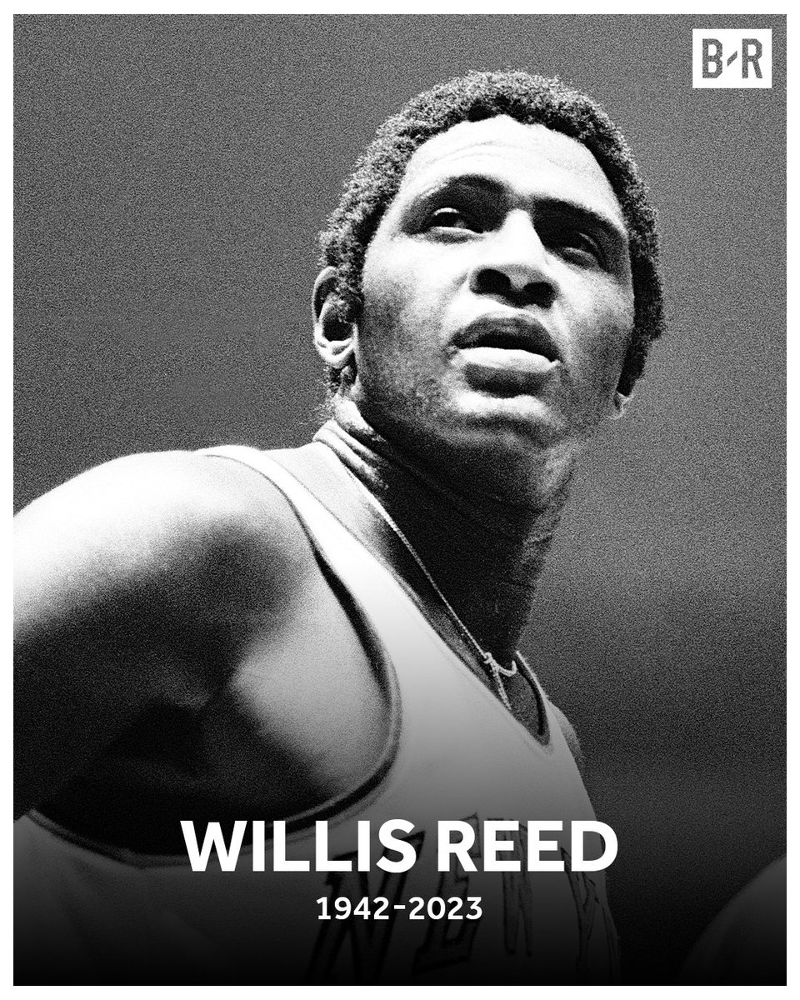
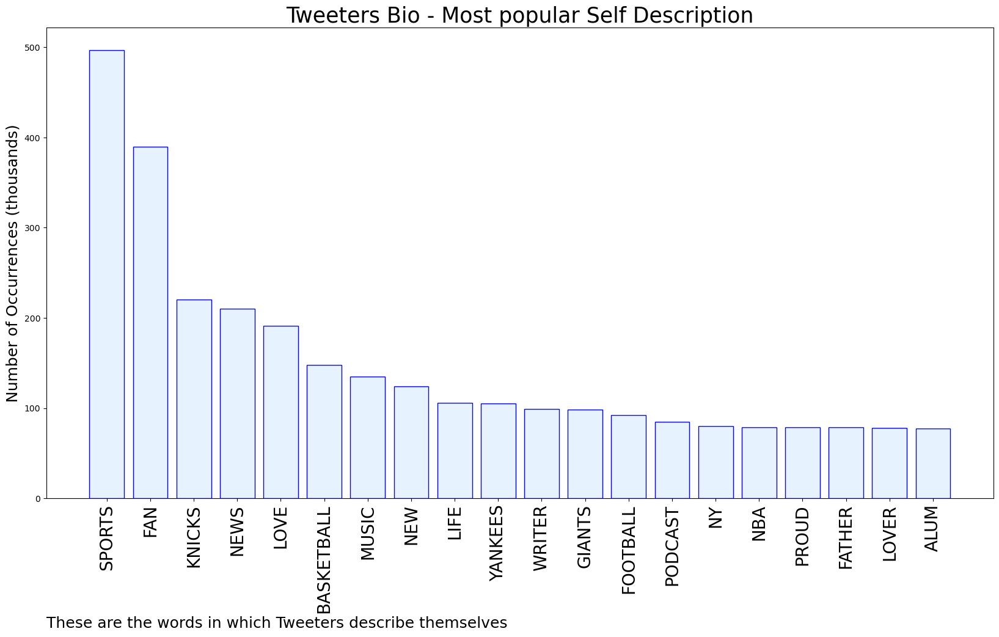
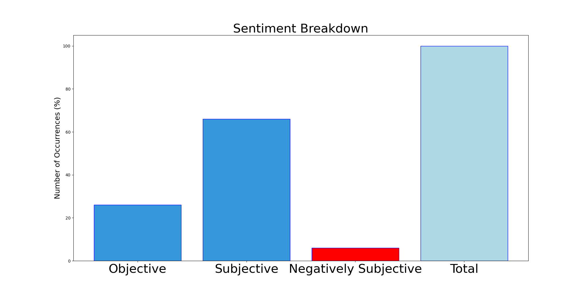

# MURCHIE85 TWITTER PROCESSING 
&#x1F34E; **TOPIC = "Willis Reed"**

## AUTOMATED RESEARCH SUMMARY

*note: Image pulled from web automatically, not connected to author.
  
<b> This report is AUTOMATED and not hand crafted, it is designed for pulling metrics on a given keyword or hashtag and performs a series of reporting and analysis.</b>

|                **Sample-Tweets**        |
| :-------------: |
| RT @McCannSportsLaw: An incredible career for Willis Reed, RIP. He famously played through a ruptured a muscle in his thigh, using an anest… |
| RT @LegionHoops: RIP Willis Reed 🙏 https://t.co/u46dLsZ45N |
| RT @espn: Willis Reed, who won two NBA championships during his legendary career with the Knicks, has died, according to the National Baske… |

The most popular user is: **davidraider88**

 RT @ShamsCharania: Hall of Famer Willis Reed has passed away at 80 years old. A Knicks legend, Reed is a two-time NBA champion, two-time Fi…

## RELATED METRICS 
| Metric | Value |
| ------------- | ------------- |
| #1 Most tweeted to  | **espn** |
| #2 Most tweeted to  | **BleacherReport** |
| #3 Most tweeted to  | **KnicksMuse** |
| NewProfiles (less than 10 days) | 0.1%  |
| Tweeters with < 10 followers  | 2.56%|
| Tweeters with > 1000000 followers  | 0.42%  |

## MOST POPULAR TWEET TERMS 

| Popularity Rank  | Term |
| ------------- | ------------- |
| first  | **REED**  |
| second  | **WILLIS**  |
| third  | **KNICKS** |
| fourth  | **NBA**  |
| fifth  | **DIED**  |

## Twitter Bio Analysis
### SENTIMENT ANALYSIS

VIEWS WERE : **SUBJECTIVE**  (66.67%) & **NEGATIVELY-SUBJECTIVE** (6.67%) **OBJECTIVE** (26.67%)

### TWEET SAMPLE 
| Random value picked from array |
| ------------- |
|RT @TheKnicksWall: RIP TO THE LEGEND WILLIS REED https://t.co/asKoe0d66s |

### MOST RETWEETED 

| The most retweeted user is: **davidraider88**  |
| ------------- |
| RT @ShamsCharania: Hall of Famer Willis Reed has passed away at 80 years old. A Knicks legend, Reed is a two-time NBA champion, two-time Fi… |

### CONCLUSION & EXTERNAL ANALYSIS

*This is my [Adam McMurchie`s] opinion on the data from the tweets, it serves as no objective truth.Since the tweets themselves are a mixture of fact & opinion. 
Authors analytical summary on request.
**RECOMMENDATIONS** WILL BE UPDATED IN NEXT  24 HOURS  