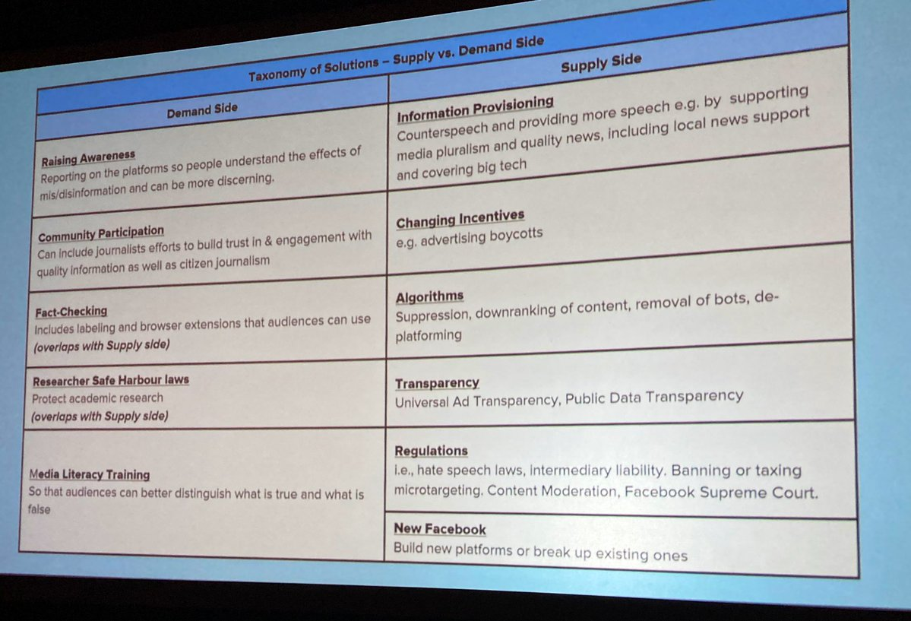
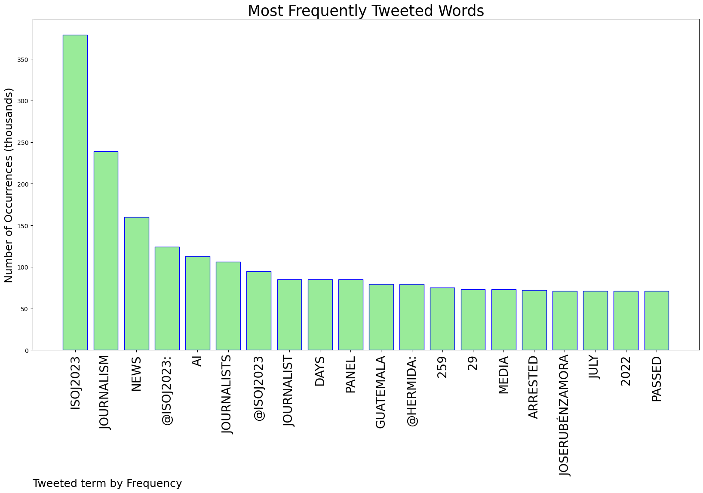
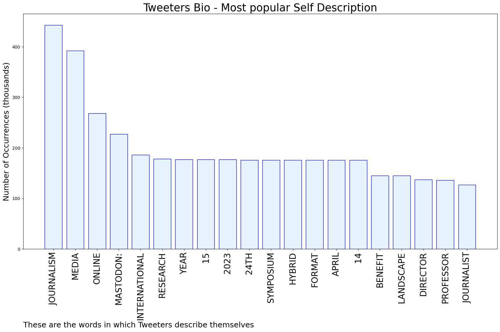

# MURCHIE85 TWITTER PROCESSING 
&#x1F34E; **TOPIC = "#ISOJ2023"**

## AUTOMATED RESEARCH SUMMARY

*note: Image pulled from web automatically, not connected to author.
  
<b> This report is AUTOMATED and not hand crafted, it is designed for pulling metrics on a given keyword or hashtag and performs a series of reporting and analysis.</b>

|                **Sample-Tweets**        |
| :-------------: |
| RT @Luortiz: Adefemi Akinsanya @femmefemi calls it like it is...journalism can die two possible and unavoidable deaths: a sudden or a very… |
| .@milwaukeenns centers community voices in the reporting and looks at the systemic roots of community problems.… https://t.co/ROS1WOiYOd |
| A bank’s message on the jet bridge to Texas and #ISOJ2023. A person on the flight is wearing full-on cowboy gear. I… https://t.co/P3QimfUHlD |

The most popular user is: **jlsiweck**

 RT @jczamora: &gt;&gt; Journalist #JoseRubénZamora was arrested in #Guatemala on July 29, 2022. 259 days have passed since his unjust detention.…

## RELATED METRICS 
| Metric | Value |
| ------------- | ------------- |
| #1 Most tweeted to  | **ISOJ2023** |
| #2 Most tweeted to  | **jczamora** |
| #3 Most tweeted to  | **Hermida** |
| NewProfiles (less than 10 days) | 0.0%  |
| Tweeters with < 10 followers  | 0.73%|
| Tweeters with > 1000000 followers  | 0.0%  |

## MOST POPULAR TWEET TERMS 

| Popularity Rank  | Term |
| ------------- | ------------- |
| first  | **ISOJ2023**  |
| second  | **JOURNALISM**  |
| third  | **NEWS** |
| fourth  | **@ISOJ2023:**  |
| fifth  | **AI**  |

## Twitter Bio Analysis
### SENTIMENT ANALYSIS

VIEWS WERE : **SUBJECTIVE**  (26.67%) & **NEGATIVELY-SUBJECTIVE** (6.67%) **OBJECTIVE** (66.67%)

### TWEET SAMPLE 
| Random value picked from array |
| ------------- |
|RT @Hermida: Interesting point on how @katiekings sees the distinction between news and opinion: News is presenting how the world is. O… |

### MOST RETWEETED 

| The most retweeted user is: **jlsiweck**  |
| ------------- |
| RT @jczamora: &gt;&gt; Journalist #JoseRubénZamora was arrested in #Guatemala on July 29, 2022. 259 days have passed since his unjust detention.… |

### CONCLUSION & EXTERNAL ANALYSIS

*This is my [Adam McMurchie`s] opinion on the data from the tweets, it serves as no objective truth.Since the tweets themselves are a mixture of fact & opinion. 
Authors analytical summary on request.
**RECOMMENDATIONS** WILL BE UPDATED IN NEXT  24 HOURS  