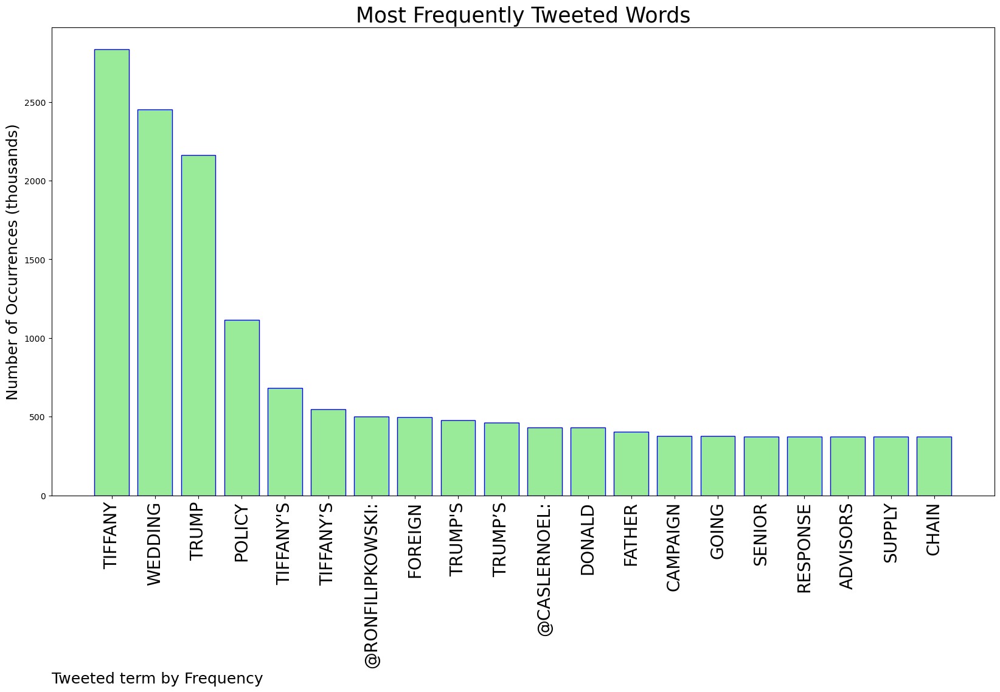
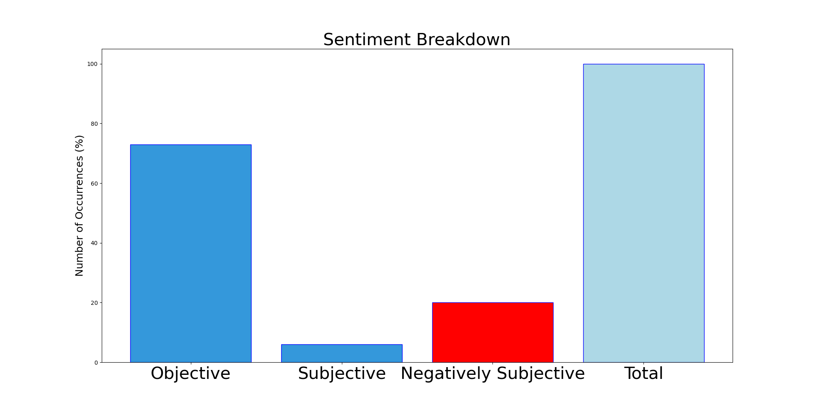

# MURCHIE85 TWITTER PROCESSING 
&#x1F34E; **TOPIC = "Tiffany"**

## AUTOMATED RESEARCH SUMMARY

*note: Image pulled from web automatically, not connected to author.
  
<b> This report is AUTOMATED and not hand crafted, it is designed for pulling metrics on a given keyword or hashtag and performs a series of reporting and analysis.</b>

|                **Sample-Tweets**        |
| :-------------: |
| RT @RonFilipkowski: Trump Senior Advisors for foreign policy, supply chain, pandemic response, trade policy, energy policy, campaign strate… |
| RT @TimHannan: If I were AG, FBI agents would take Trump into custody in front of everyone at his daughter Tiffany’s wedding. It would be a… |
| Tony Symons https://t.co/TFnC0smAAw #重庆 #Tiffany #Pulitzer #西安线下 |

The most popular user is: **here_is_tiffany**

 RT @sybvzk: it’s me and my short patience against the world

## RELATED METRICS 
| Metric | Value |
| ------------- | ------------- |
| #1 Most tweeted to  | **caslernoel** |
| #2 Most tweeted to  | **RonFilipkowski** |
| #3 Most tweeted to  | **MayoIsSpicyy** |
| NewProfiles (less than 10 days) | 0.94%  |
| Tweeters with < 10 followers  | 10.5%|
| Tweeters with > 1000000 followers  | 0.08%  |

## MOST POPULAR TWEET TERMS 

| Popularity Rank  | Term |
| ------------- | ------------- |
| first  | **TIFFANY**  |
| second  | **WEDDING**  |
| third  | **TRUMP** |
| fourth  | **POLICY**  |
| fifth  | **"TIFFANYS"**  |

## Twitter Bio Analysis
### SENTIMENT ANALYSIS

VIEWS WERE : **SUBJECTIVE**  (6.67%) & **NEGATIVELY-SUBJECTIVE** (20.0%) **OBJECTIVE** (73.33%)

### TWEET SAMPLE 
| Random value picked from array |
| ------------- |
|RT @caslernoel: Tiffany Trump's wedding tonight has all the hallmarks of a season finale. |

### MOST RETWEETED 

| The most retweeted user is: **here_is_tiffany**  |
| ------------- |
| RT @sybvzk: it’s me and my short patience against the world |

### CONCLUSION & EXTERNAL ANALYSIS

*This is my [Adam McMurchie`s] opinion on the data from the tweets, it serves as no objective truth.Since the tweets themselves are a mixture of fact & opinion. 
Authors analytical summary on request.
**RECOMMENDATIONS** WILL BE UPDATED IN NEXT  24 HOURS  