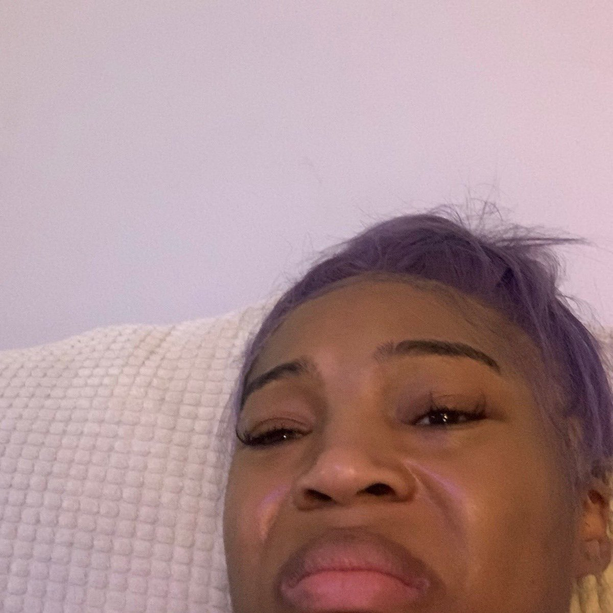
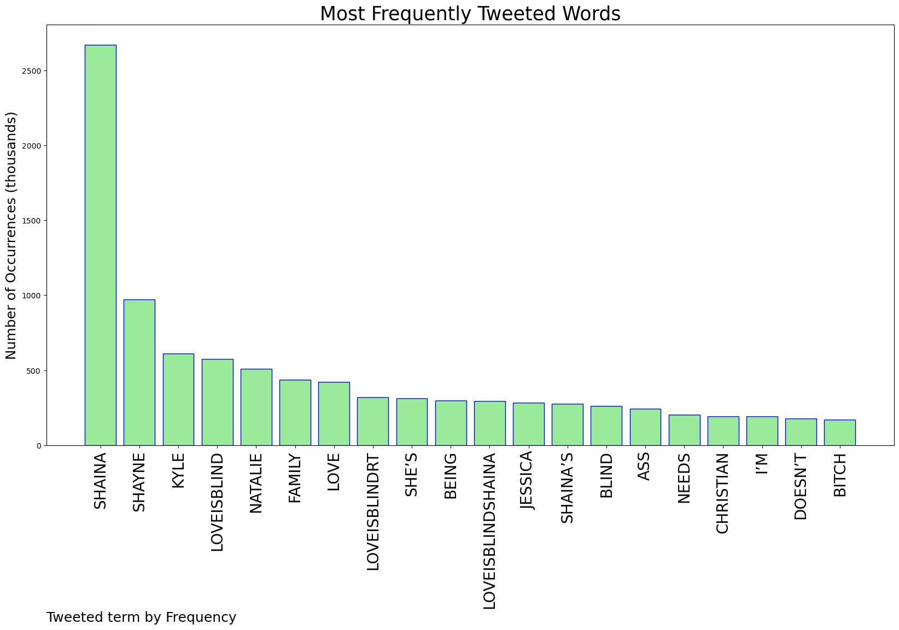
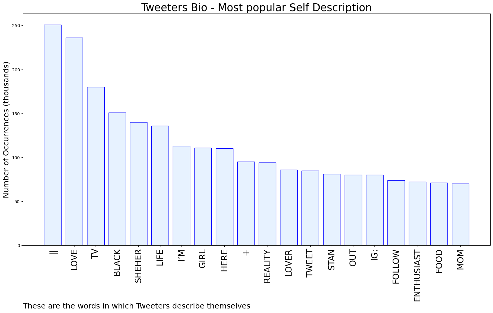

# MURCHIE85 TWITTER PROCESSING 
&#x1F34E; **TOPIC = "Shaina"**

## AUTOMATED RESEARCH SUMMARY

*note: Image pulled from web automatically, not connected to author.
  
<b> This report is AUTOMATED and not hand crafted, it is designed for pulling metrics on a given keyword or hashtag and performs a series of reporting and analysis.</b>

|                **Sample-Tweets**        |
| :-------------: |
| Shaina is the most toxic, manipulative, naive and hypocrite! She’s worse than jessica. She’s not confused, she’s a… https://t.co/rxEtZ4VaDK |
| Shayne and shaina get along SO MUCH BETTER than him and Natalie ???? #loveisblind2 |
| I am sorry, who does Shaina think she is??? I really, strongly dislike her. She is manipulative and actually a home… https://t.co/Wy0K339eLr |

The most popular user is: **taylor_shaina**

 RT @CG__Steven: This is no longer inflation. This is robbery and financial abuse.

## RELATED METRICS 
| Metric | Value |
| ------------- | ------------- |
| #1 Most tweeted to  | **_ErikaaaG_** |
| #2 Most tweeted to  | **chambiemode** |
| #3 Most tweeted to  | **mefe_xo** |
| NewProfiles (less than 10 days) | 0.54%  |
| Tweeters with < 10 followers  | 4.68%|
| Tweeters with > 1000000 followers  | 0.1%  |

## MOST POPULAR TWEET TERMS 

| Popularity Rank  | Term |
| ------------- | ------------- |
| first  | **SHAINA**  |
| second  | **SHAYNE**  |
| third  | **KYLE** |
| fourth  | **LOVEISBLIND**  |
| fifth  | **NATALIE**  |

## Twitter Bio Analysis
### SENTIMENT ANALYSIS

VIEWS WERE : **SUBJECTIVE**  (40.0%) & **NEGATIVELY-SUBJECTIVE** (26.67%) **OBJECTIVE** (33.33%)

### TWEET SAMPLE 
| Random value picked from array |
| ------------- |
|SHAINA IS SO OUTTA POCKET #loveisblind2 |

### MOST RETWEETED 

| The most retweeted user is: **taylor_shaina**  |
| ------------- |
| RT @CG__Steven: This is no longer inflation. This is robbery and financial abuse. |

### CONCLUSION & EXTERNAL ANALYSIS

*This is my [Adam McMurchie`s] opinion on the data from the tweets, it serves as no objective truth.Since the tweets themselves are a mixture of fact & opinion. 
Authors analytical summary on request.
**RECOMMENDATIONS** WILL BE UPDATED IN NEXT  24 HOURS  