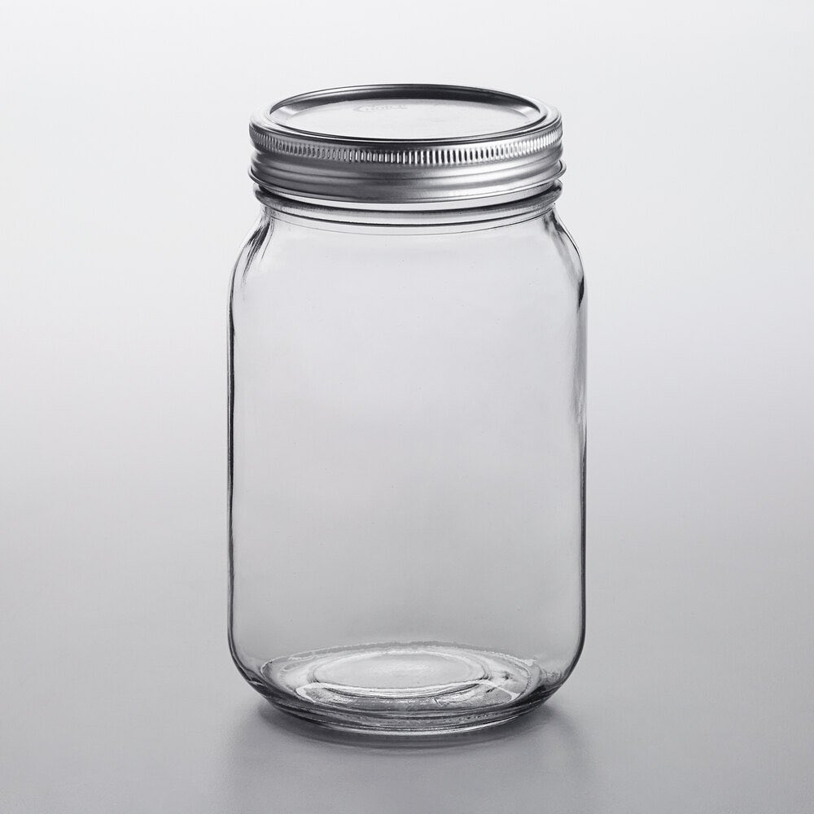
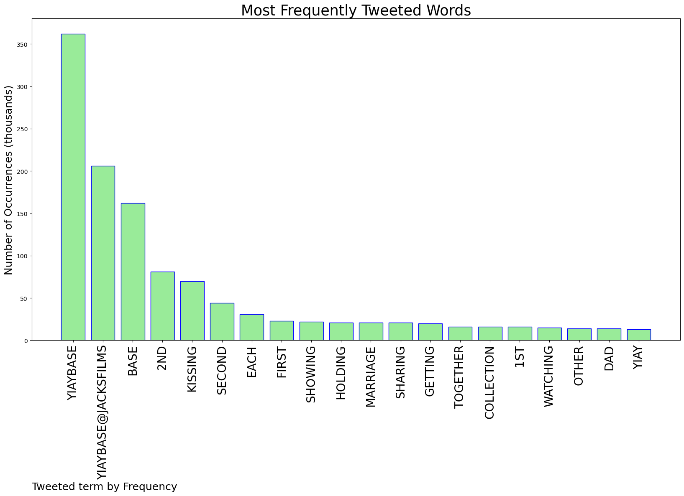
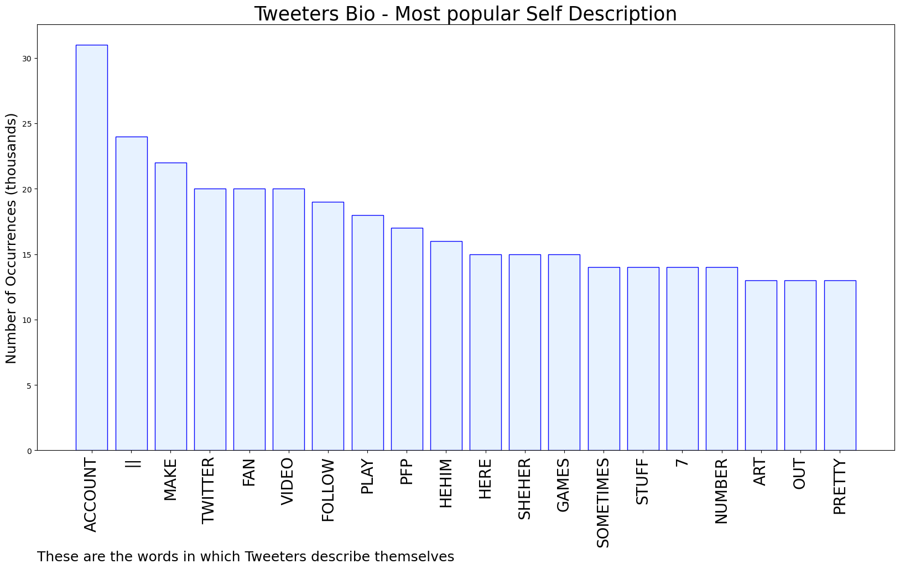

# MURCHIE85 TWITTER PROCESSING 
&#x1F34E; **TOPIC = "#YIAYbase"**

## AUTOMATED RESEARCH SUMMARY

*note: Image pulled from web automatically, not connected to author.
  
<b> This report is AUTOMATED and not hand crafted, it is designed for pulling metrics on a given keyword or hashtag and performs a series of reporting and analysis.</b>

|                **Sample-Tweets**        |
| :-------------: |
| @jacksfilms #YIAYbase getting a fourth dog! |
| @jacksfilms #YIAYbase kissing with eyes closed 👀 |
| @jacksfilms #YIAYbase holding genitals while peeing |

The most popular user is: **PoisonusCandies**

 RT @jacksfilms: YIAY question! If "1st base" is kissing, what's "2nd base"? Use #YIAYbase so we can find ya!

## RELATED METRICS 
| Metric | Value |
| ------------- | ------------- |
| #1 Most tweeted to  | **jacksfilms** |
| #2 Most tweeted to  | **YIAYsubreddit** |
| #3 Most tweeted to  | **indanichul** |
| NewProfiles (less than 10 days) | 3.0%  |
| Tweeters with < 10 followers  | 24.92%|
| Tweeters with > 1000000 followers  | 0.16%  |

## MOST POPULAR TWEET TERMS 

| Popularity Rank  | Term |
| ------------- | ------------- |
| first  | **YIAYBASE**  |
| second  | **YIAYBASE@JACKSFILMS**  |
| third  | **BASE** |
| fourth  | **2ND**  |
| fifth  | **KISSING**  |

## Twitter Bio Analysis
### SENTIMENT ANALYSIS

VIEWS WERE : **SUBJECTIVE**  (0.0%) & **NEGATIVELY-SUBJECTIVE** (0.0%) **OBJECTIVE** (100.0%)

### TWEET SAMPLE 
| Random value picked from array |
| ------------- |
|@jacksfilms #YIAYbase a restraining order |

### MOST RETWEETED 

| The most retweeted user is: **PoisonusCandies**  |
| ------------- |
| RT @jacksfilms: YIAY question! If "1st base" is kissing, what's "2nd base"? Use #YIAYbase so we can find ya! |

### CONCLUSION & EXTERNAL ANALYSIS

*This is my [Adam McMurchie`s] opinion on the data from the tweets, it serves as no objective truth.Since the tweets themselves are a mixture of fact & opinion. 
Authors analytical summary on request.
**RECOMMENDATIONS** WILL BE UPDATED IN NEXT  24 HOURS  