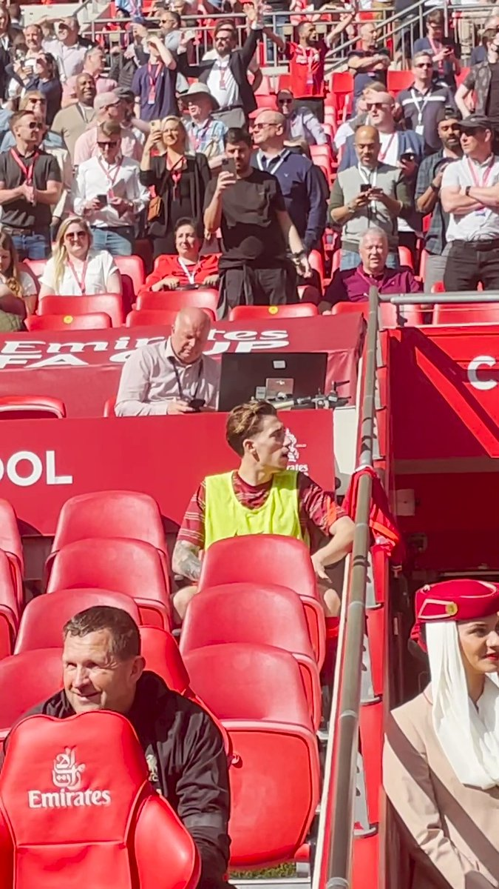
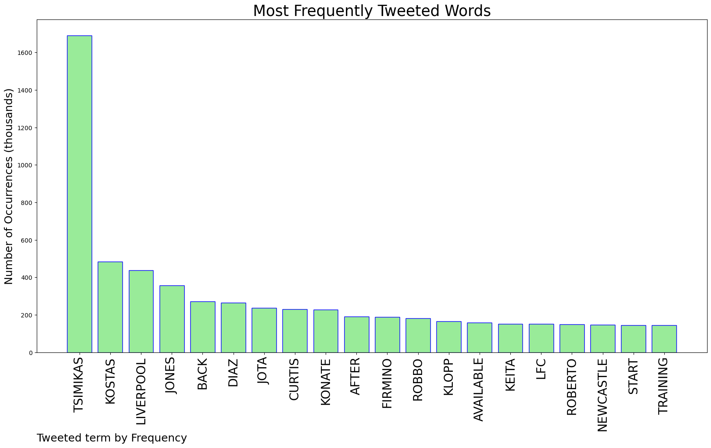
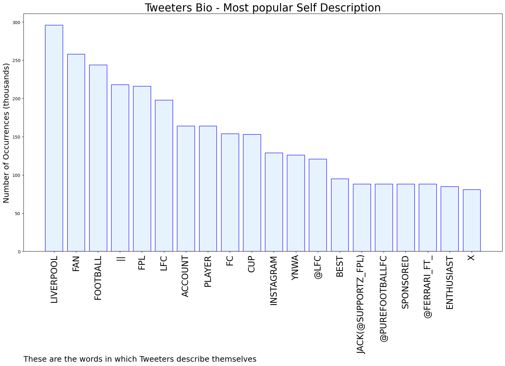
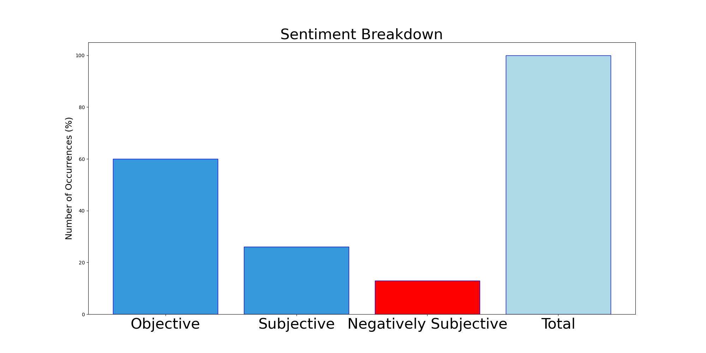

# MURCHIE85 TWITTER PROCESSING 
&#x1F34E; **TOPIC = "Tsimikas"**

## AUTOMATED RESEARCH SUMMARY

*note: Image pulled from web automatically, not connected to author.
  
<b> This report is AUTOMATED and not hand crafted, it is designed for pulling metrics on a given keyword or hashtag and performs a series of reporting and analysis.</b>

|                **Sample-Tweets**        |
| :-------------: |
| @FPLReaction If he is benched, what are your thoughts on straight swap to Tsimikas? Could be viable 🤔 |
| @rfx100 @lfcarif_ @TheAnfieldTalk But he couldn’t take off robbo because tsimikas weren’t on the bench |
| Free tsimikas. Klopp could easily manage Robertson’s minutes better. Don’t get why he doesn’t https://t.co/zIfBn4sLxC |

The most popular user is: **Dorllype**

 RT @WilliamHill: Liverpool's signings since the start of 2020/21

🇬🇷 Kostas Tsimikas - £11.7m
🇪🇸 Thiago Alcantara - £25m
🇵🇹 Diogo Jota - £4…

## RELATED METRICS 
| Metric | Value |
| ------------- | ------------- |
| #1 Most tweeted to  | **AnfieldWatch** |
| #2 Most tweeted to  | **AnfieldEdition** |
| #3 Most tweeted to  | **fc_tsimikas** |
| NewProfiles (less than 10 days) | 0.41%  |
| Tweeters with < 10 followers  | 3.51%|
| Tweeters with > 1000000 followers  | 0.37%  |

## MOST POPULAR TWEET TERMS 

| Popularity Rank  | Term |
| ------------- | ------------- |
| first  | **TSIMIKAS**  |
| second  | **KOSTAS**  |
| third  | **LIVERPOOL** |
| fourth  | **JONES**  |
| fifth  | **BACK**  |

## Twitter Bio Analysis
### SENTIMENT ANALYSIS

VIEWS WERE : **SUBJECTIVE**  (26.67%) & **NEGATIVELY-SUBJECTIVE** (13.33%) **OBJECTIVE** (60.0%)

### TWEET SAMPLE 
| Random value picked from array |
| ------------- |
|NEW:  Liverpool lineups vs. Newcastle – chance for Kostas Tsimikas and Divock Origi?  https://t.co/QRLB5CM6ag |

### MOST RETWEETED 

| The most retweeted user is: **Dorllype**  |
| ------------- |
| RT @WilliamHill: Liverpool's signings since the start of 2020/21🇬🇷 Kostas Tsimikas - £11.7m🇪🇸 Thiago Alcantara - £25m🇵🇹 Diogo Jota - £4… |

### CONCLUSION & EXTERNAL ANALYSIS

*This is my [Adam McMurchie`s] opinion on the data from the tweets, it serves as no objective truth.Since the tweets themselves are a mixture of fact & opinion. 
Authors analytical summary on request.
**RECOMMENDATIONS** WILL BE UPDATED IN NEXT  24 HOURS  