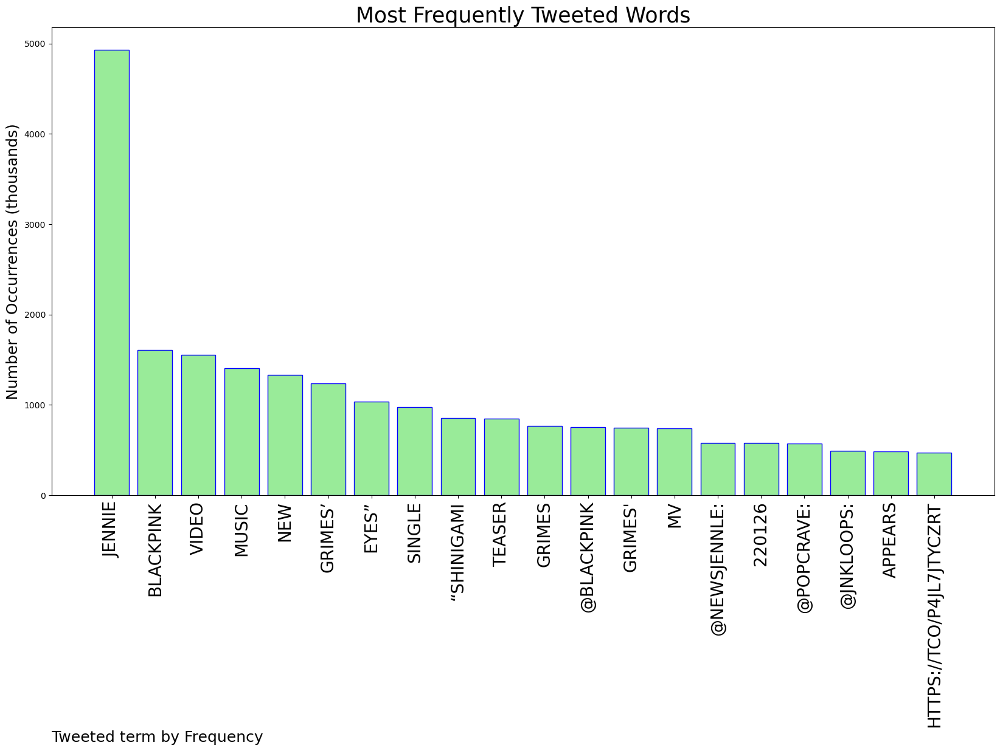
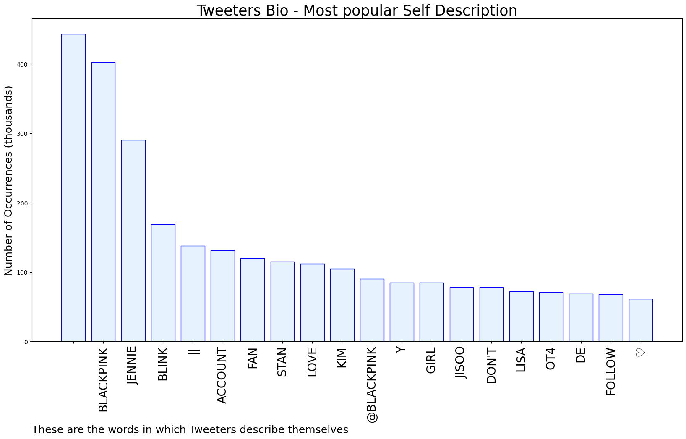

# MURCHIE85 TWITTER PROCESSING 
&#x1F34E; **TOPIC = "jennie"**

## AUTOMATED RESEARCH SUMMARY

*note: Image pulled from web automatically, not connected to author.
  
<b> This report is AUTOMATED and not hand crafted, it is designed for pulling metrics on a given keyword or hashtag and performs a series of reporting and analysis.</b>

|                **Sample-Tweets**        |
| :-------------: |
| JENNIE OMFGGGGG https://t.co/fW2c73b1YY |
| RT @chitaglorya__: giveaway 75$ | 1,050,000 IDR-- rt follow &amp; rt like 2 recent tweets @ivannatavarok ends in 5 hours good luck 🍒 |
| RT @jnkloops: JENNIE IN GRIMES’ MV TEASER https://t.co/Zvl8NejaiG |

The most popular user is: **jennie__dan**

 RT @DaveMcNamee3000: parent teacher conference at Euphoria high https://t.co/e3Qc9OOkh9

## RELATED METRICS 
| Metric | Value |
| ------------- | ------------- |
| #1 Most tweeted to  | **BLACKPINK** |
| #2 Most tweeted to  | **NEWSJENNlE** |
| #3 Most tweeted to  | **PopCrave** |
| NewProfiles (less than 10 days) | 0.86%  |
| Tweeters with < 10 followers  | 6.42%|
| Tweeters with > 1000000 followers  | 0.06%  |

## MOST POPULAR TWEET TERMS 

| Popularity Rank  | Term |
| ------------- | ------------- |
| first  | **JENNIE**  |
| second  | **BLACKPINK**  |
| third  | **VIDEO** |
| fourth  | **MUSIC**  |
| fifth  | **NEW**  |

## Twitter Bio Analysis
### SENTIMENT ANALYSIS

VIEWS WERE : **SUBJECTIVE**  (33.33%) & **NEGATIVELY-SUBJECTIVE** (0.0%) **OBJECTIVE** (66.67%)

### TWEET SAMPLE 
| Random value picked from array |
| ------------- |
|RT @G0THRUBY: low quality but jennie kim is so hot https://t.co/U3JMZagheF |

### MOST RETWEETED 

| The most retweeted user is: **jennie__dan**  |
| ------------- |
| RT @DaveMcNamee3000: parent teacher conference at Euphoria high https://t.co/e3Qc9OOkh9 |

### CONCLUSION & EXTERNAL ANALYSIS

*This is my [Adam McMurchie`s] opinion on the data from the tweets, it serves as no objective truth.Since the tweets themselves are a mixture of fact & opinion. 
Authors analytical summary on request.
**RECOMMENDATIONS** WILL BE UPDATED IN NEXT  24 HOURS  