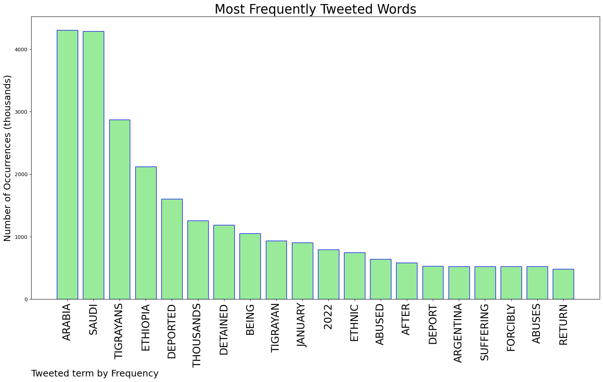
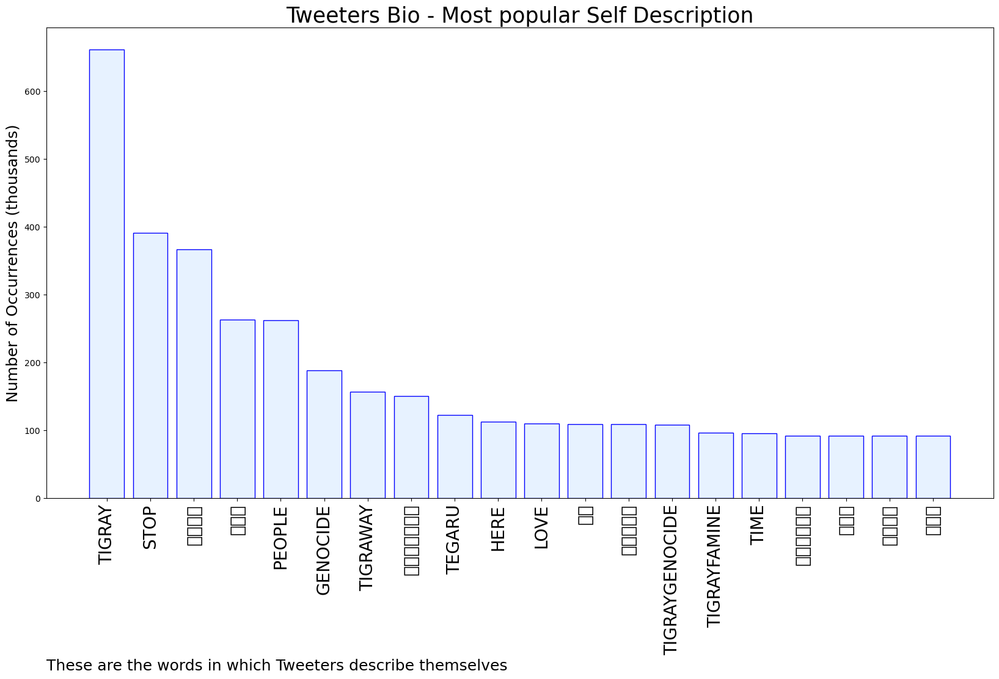
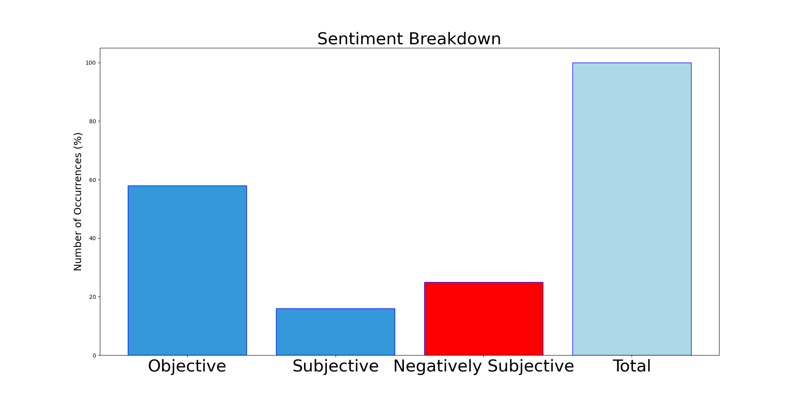

# MURCHIE85 TWITTER PROCESSING 
&#x1F34E; **TOPIC = "Saudi Arabia"**

## AUTOMATED RESEARCH SUMMARY

*note: Image pulled from web automatically, not connected to author.
  
<b> This report is AUTOMATED and not hand crafted, it is designed for pulling metrics on a given keyword or hashtag and performs a series of reporting and analysis.</b>

|                **Sample-Tweets**        |
| :-------------: |
| RT @Alemmez: Saudi Arabia should offer protection to Tigrayans at risk should they return to Ethiopia, not deport them to a country committ… |
| RT @AlArabiya_Eng: The #Ramadan crescent moon has been sighted in #SaudiArabia, meaning the holy month will officially begin on Saturday, A… |
| RT @TDF1515: In Jan 2022, thousands of Tigrayan migrants were abused and deported from Saudi Arabia and forcibly detained in Ethiopia. Saud… |

The most popular user is: **sisoyturca**

 RT @HaramainInfo: NEWS | The Crescent Moon has been sighted in Sudair, Saudi Arabia. #Ramadan 1443 will begin tonight. The first night of T…

## RELATED METRICS 
| Metric | Value |
| ------------- | ------------- |
| #1 Most tweeted to  | **lewy_official** |
| #2 Most tweeted to  | **Mamaye88246948** |
| #3 Most tweeted to  | **ZaydAlemu** |
| NewProfiles (less than 10 days) | 2.32%  |
| Tweeters with < 10 followers  | 1.78%|
| Tweeters with > 1000000 followers  | 0.04%  |

## MOST POPULAR TWEET TERMS 

| Popularity Rank  | Term |
| ------------- | ------------- |
| first  | **ARABIA**  |
| second  | **SAUDI**  |
| third  | **TIGRAYANS** |
| fourth  | **ETHIOPIA**  |
| fifth  | **DEPORTED**  |

## Twitter Bio Analysis
### SENTIMENT ANALYSIS

VIEWS WERE : **SUBJECTIVE**  (16.67%) & **NEGATIVELY-SUBJECTIVE** (25.0%) **OBJECTIVE** (58.33%)

### TWEET SAMPLE 
| Random value picked from array |
| ------------- |
|RT @HaramainInfo: Haramain will shortly commence reporting from observatories in Saudi Arabia, and will announce the outcome of the sightin… |

### MOST RETWEETED 

| The most retweeted user is: **sisoyturca**  |
| ------------- |
| RT @HaramainInfo: NEWS | The Crescent Moon has been sighted in Sudair, Saudi Arabia. #Ramadan 1443 will begin tonight. The first night of T… |

### CONCLUSION & EXTERNAL ANALYSIS

*This is my [Adam McMurchie`s] opinion on the data from the tweets, it serves as no objective truth.Since the tweets themselves are a mixture of fact & opinion. 
Authors analytical summary on request.
**RECOMMENDATIONS** WILL BE UPDATED IN NEXT  24 HOURS  