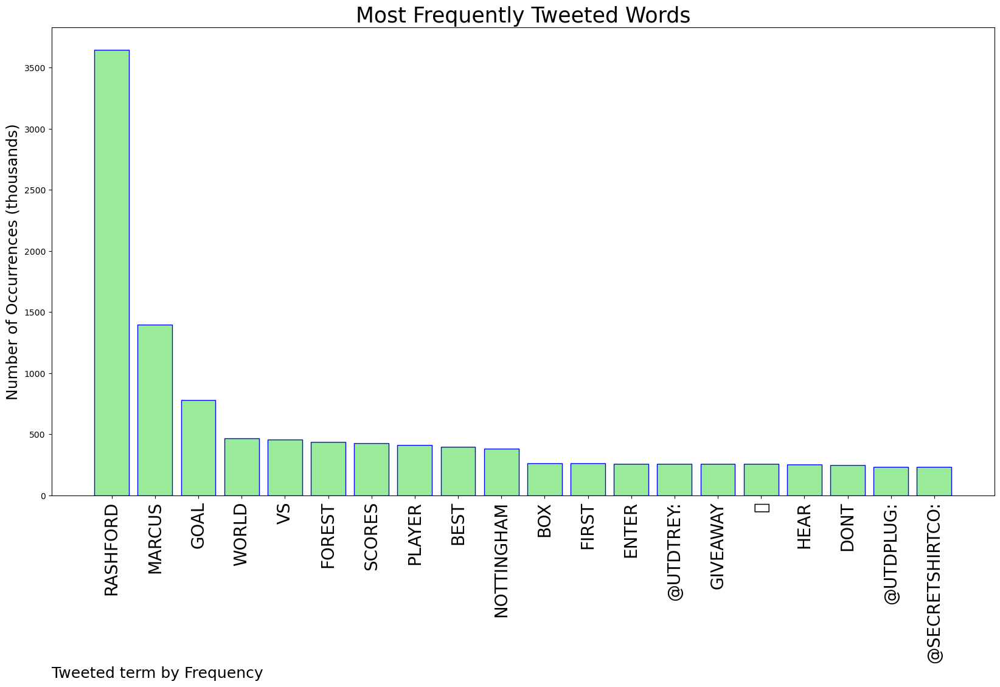
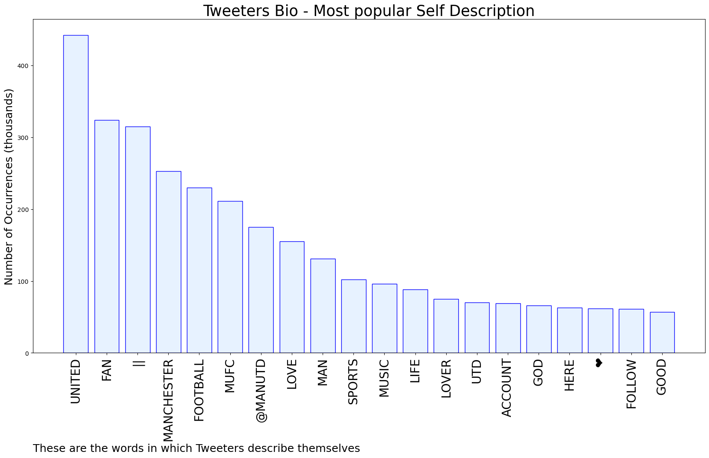

# MURCHIE85 TWITTER PROCESSING 
&#x1F34E; **TOPIC = "Rashford"**

## AUTOMATED RESEARCH SUMMARY

*note: Image pulled from web automatically, not connected to author.
  
<b> This report is AUTOMATED and not hand crafted, it is designed for pulling metrics on a given keyword or hashtag and performs a series of reporting and analysis.</b>

|                **Sample-Tweets**        |
| :-------------: |
| RT @UTDTrey: RASHFORD IS THE BEST PLAYER IN THE WORLD I DONT WANT TO HEAR SHIT |
| That is ridiculous from Rashford. Form of his life. |
| RT @UTDTrey: RASHFORD IS THE BEST PLAYER IN THE WORLD I DONT WANT TO HEAR SHIT |

The most popular user is: **LOUD_shanghaiXL**

 RT @ESPNFC: Rashford taking over 👉🧠 https://t.co/JRzskGoz2c

## RELATED METRICS 
| Metric | Value |
| ------------- | ------------- |
| #1 Most tweeted to  | **UTDTrey** |
| #2 Most tweeted to  | **UtdPlug** |
| #3 Most tweeted to  | **secretshirtco** |
| NewProfiles (less than 10 days) | 0.26%  |
| Tweeters with < 10 followers  | 2.68%|
| Tweeters with > 1000000 followers  | 0.18%  |

## MOST POPULAR TWEET TERMS 

| Popularity Rank  | Term |
| ------------- | ------------- |
| first  | **RASHFORD**  |
| second  | **MARCUS**  |
| third  | **GOAL** |
| fourth  | **WORLD**  |
| fifth  | **VS**  |

## Twitter Bio Analysis
### SENTIMENT ANALYSIS

VIEWS WERE : **SUBJECTIVE**  (26.67%) & **NEGATIVELY-SUBJECTIVE** (20.0%) **OBJECTIVE** (53.33%)

### TWEET SAMPLE 
| Random value picked from array |
| ------------- |
|RT @BreezyUTD: Give Rashford the Ballon d’Or already |

### MOST RETWEETED 

| The most retweeted user is: **LOUD_shanghaiXL**  |
| ------------- |
| RT @ESPNFC: Rashford taking over 👉🧠 https://t.co/JRzskGoz2c |

### CONCLUSION & EXTERNAL ANALYSIS

*This is my [Adam McMurchie`s] opinion on the data from the tweets, it serves as no objective truth.Since the tweets themselves are a mixture of fact & opinion. 
Authors analytical summary on request.
**RECOMMENDATIONS** WILL BE UPDATED IN NEXT  24 HOURS  