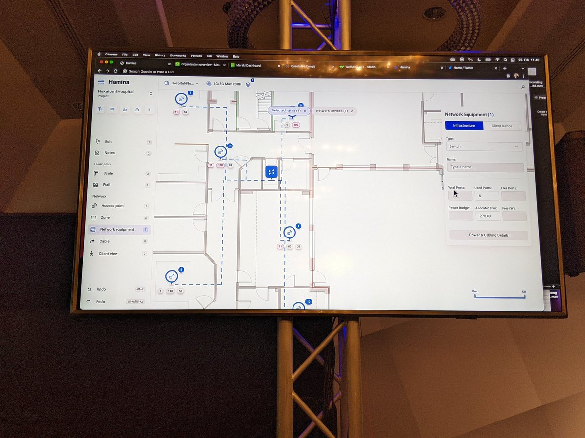
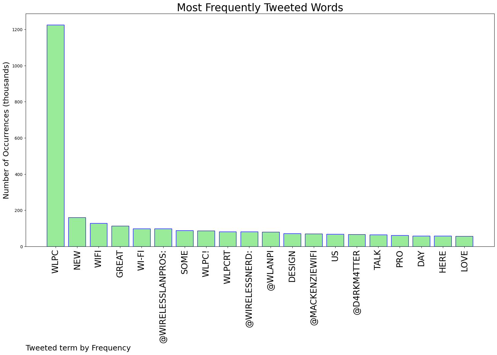
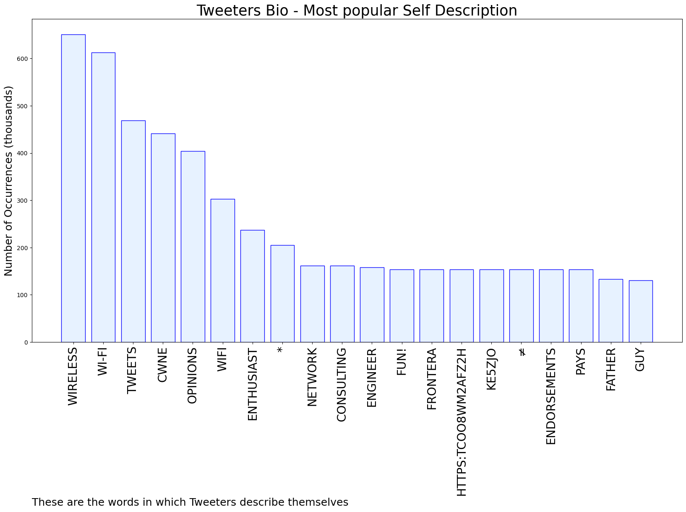
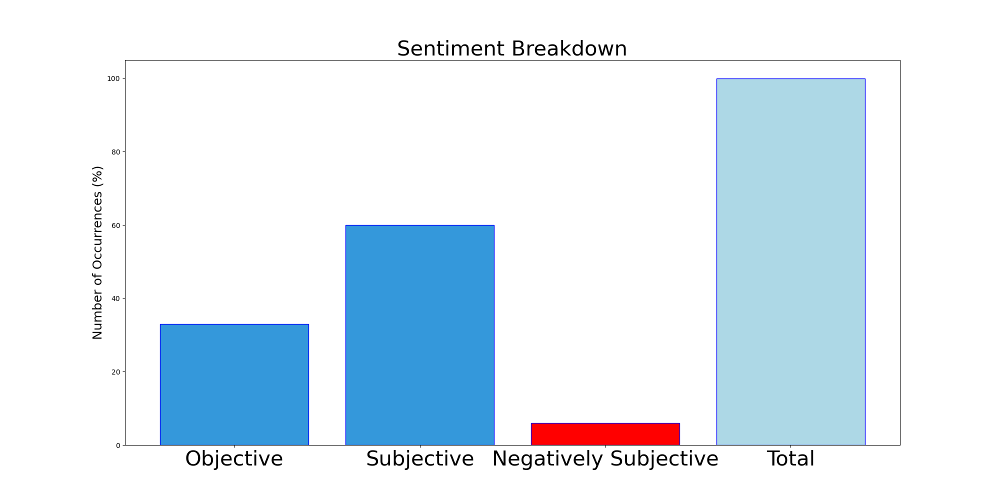

# MURCHIE85 TWITTER PROCESSING 
&#x1F34E; **TOPIC = "#WLPC"**

## AUTOMATED RESEARCH SUMMARY

*note: Image pulled from web automatically, not connected to author.
  
<b> This report is AUTOMATED and not hand crafted, it is designed for pulling metrics on a given keyword or hashtag and performs a series of reporting and analysis.</b>

|                **Sample-Tweets**        |
| :-------------: |
| RT @ITearley: What an amazing use of VR and Wi-Fi surveys #wlpc https://t.co/z0kASKdQ5a |
| RT @wifistand: A bird’s eye view of the pool gets you a new cup to keep your drink cool! Post it when ya find it! #WLPC #WLPCScavengerHunt… |
| RT @jjx: NEW -&gt; "5-Year Outlook: Three Trends Shaping Wireless Security"Check out my guest article for @ExtremeNetworks where I hit on the… |

The most popular user is: **collinbunker**

 RT @samuel_clements: If you’d like an invite to the Wi-Fi Pros slack group, please send myself or @Mae149 a DM/email. All are welcome and w…

## RELATED METRICS 
| Metric | Value |
| ------------- | ------------- |
| #1 Most tweeted to  | **wirelesslanpros** |
| #2 Most tweeted to  | **Wirelessnerd** |
| #3 Most tweeted to  | **MackenzieWiFi** |
| NewProfiles (less than 10 days) | 0.15%  |
| Tweeters with < 10 followers  | 0.1%|
| Tweeters with > 1000000 followers  | 0.0%  |

## MOST POPULAR TWEET TERMS 

| Popularity Rank  | Term |
| ------------- | ------------- |
| first  | **WLPC**  |
| second  | **NEW**  |
| third  | **WIFI** |
| fourth  | **GREAT**  |
| fifth  | **WI-FI**  |

## Twitter Bio Analysis
### SENTIMENT ANALYSIS

VIEWS WERE : **SUBJECTIVE**  (60.0%) & **NEGATIVELY-SUBJECTIVE** (6.67%) **OBJECTIVE** (33.33%)

### TWEET SAMPLE 
| Random value picked from array |
| ------------- |
|@d4rkm4tter presenting his #WiFiKrane Lite project at #WLPC - really enjoying the history behind it. https://t.co/8E2nd0PjRL |

### MOST RETWEETED 

| The most retweeted user is: **collinbunker**  |
| ------------- |
| RT @samuel_clements: If you’d like an invite to the Wi-Fi Pros slack group, please send myself or @Mae149 a DM/email. All are welcome and w… |

### CONCLUSION & EXTERNAL ANALYSIS

*This is my [Adam McMurchie`s] opinion on the data from the tweets, it serves as no objective truth.Since the tweets themselves are a mixture of fact & opinion. 
Authors analytical summary on request.
**RECOMMENDATIONS** WILL BE UPDATED IN NEXT  24 HOURS  