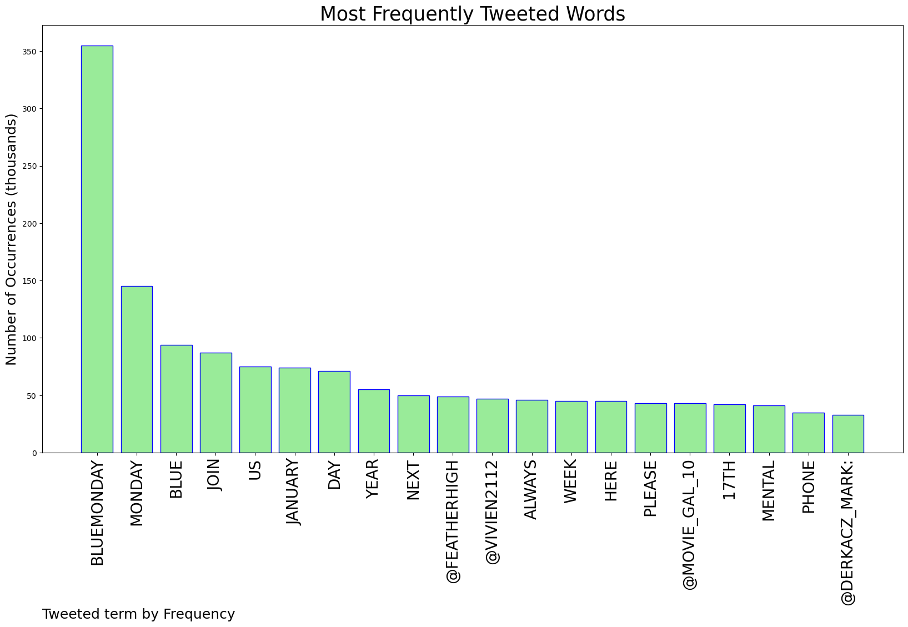

# MURCHIE85 TWITTER PROCESSING 
&#x1F34E; **TOPIC = "#BlueMonday"**

## AUTOMATED RESEARCH SUMMARY

*note: Image pulled from web automatically, not connected to author.
  
<b> This report is AUTOMATED and not hand crafted, it is designed for pulling metrics on a given keyword or hashtag and performs a series of reporting and analysis.</b>

|                **Sample-Tweets**        |
| :-------------: |
| Don't have a #bluemonday join us for tea, toast and chat - Monday 17 January - drop in anytime between 9:30am to 11… https://t.co/ssnLUVIdmj |
| Blue Moonday #Poisonfrog #BlueMonday #BlueMoonday #mariececilethijs #contemporaryphotography https://t.co/Ff7fhvr1lq |
| RT @DiversityQ: #Mentalhealth issues were the number one reason that UK #employees took time off work in 2021. #BlueMonday @goodshapeworks… |

The most popular user is: **AJGsafeandwell**

 RT @MindCharity: You may hear a lot about the myth of #BlueMonday today. But we know that depression doesn’t care what day it is, especiall…

## RELATED METRICS 
| Metric | Value |
| ------------- | ------------- |
| #1 Most tweeted to  | **VodafoneUK** |
| #2 Most tweeted to  | **featherhigh** |
| #3 Most tweeted to  | **vivien2112** |
| NewProfiles (less than 10 days) | 0.29%  |
| Tweeters with < 10 followers  | 2.61%|
| Tweeters with > 1000000 followers  | 0.0%  |

## MOST POPULAR TWEET TERMS 

| Popularity Rank  | Term |
| ------------- | ------------- |
| first  | **BLUEMONDAY**  |
| second  | **MONDAY**  |
| third  | **BLUE** |
| fourth  | **JOIN**  |
| fifth  | **US**  |

## Twitter Bio Analysis
### SENTIMENT ANALYSIS

VIEWS WERE : **SUBJECTIVE**  (53.33%) & **NEGATIVELY-SUBJECTIVE** (13.33%) **OBJECTIVE** (33.33%)

### TWEET SAMPLE 
| Random value picked from array |
| ------------- |
|RT @FLDesignMag: #bluemonday - This Jupiter home delivers spectacular views from the sprawling game room. A custom pool table and poker tab… |

### MOST RETWEETED 

| The most retweeted user is: **AJGsafeandwell**  |
| ------------- |
| RT @MindCharity: You may hear a lot about the myth of #BlueMonday today. But we know that depression doesn’t care what day it is, especiall… |

### CONCLUSION & EXTERNAL ANALYSIS

*This is my [Adam McMurchie`s] opinion on the data from the tweets, it serves as no objective truth.Since the tweets themselves are a mixture of fact & opinion. 
Authors analytical summary on request.
**RECOMMENDATIONS** WILL BE UPDATED IN NEXT  24 HOURS  