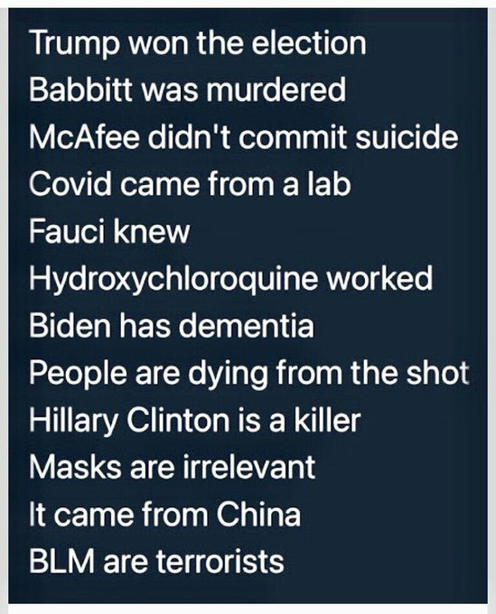
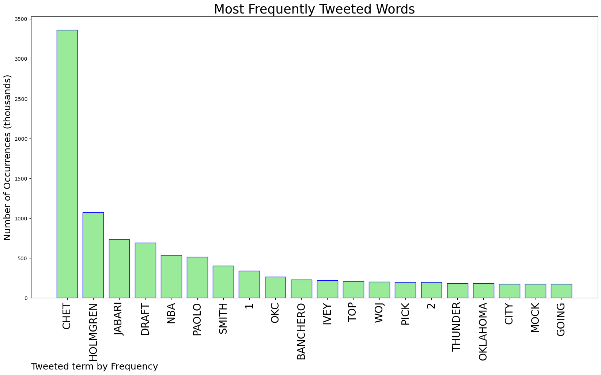
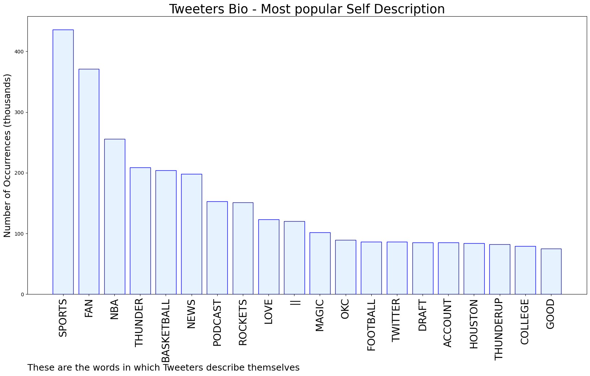
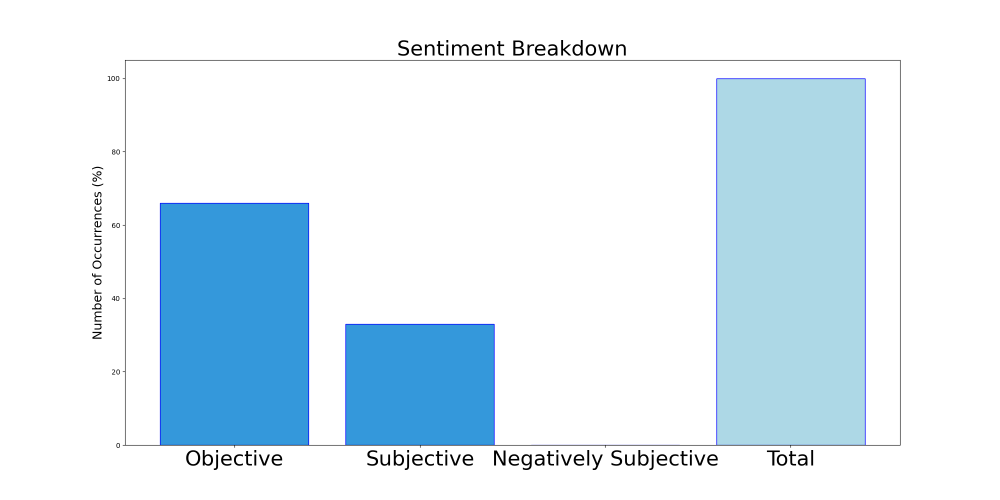

# MURCHIE85 TWITTER PROCESSING 
&#x1F34E; **TOPIC = "Chet"**

## AUTOMATED RESEARCH SUMMARY

*note: Image pulled from web automatically, not connected to author.
  
<b> This report is AUTOMATED and not hand crafted, it is designed for pulling metrics on a given keyword or hashtag and performs a series of reporting and analysis.</b>

|                **Sample-Tweets**        |
| :-------------: |
| RT @ThunderChats: ONE MORE DAY UNTIL CHET HOLMGREN IS AN OKLAHOMA CITY THUNDER 🤠#ThunderUp https://t.co/BaVkctAqgp |
| @DoncicForThree Giannis and embiid are 8 years older than chet |
| Now playing I Feel Fine by Chet Atkins! |

The most popular user is: **holy__chet**

 RT @williedontmiss: no offense to myself but what the fuck am i actually doing

## RELATED METRICS 
| Metric | Value |
| ------------- | ------------- |
| #1 Most tweeted to  | **ThunderFocus** |
| #2 Most tweeted to  | **ThunderChats** |
| #3 Most tweeted to  | **BrandonRahbar** |
| NewProfiles (less than 10 days) | 0.8%  |
| Tweeters with < 10 followers  | 5.36%|
| Tweeters with > 1000000 followers  | 0.16%  |

## MOST POPULAR TWEET TERMS 

| Popularity Rank  | Term |
| ------------- | ------------- |
| first  | **CHET**  |
| second  | **HOLMGREN**  |
| third  | **JABARI** |
| fourth  | **DRAFT**  |
| fifth  | **NBA**  |

## Twitter Bio Analysis
### SENTIMENT ANALYSIS

VIEWS WERE : **SUBJECTIVE**  (33.33%) & **NEGATIVELY-SUBJECTIVE** (0.0%) **OBJECTIVE** (66.67%)

### TWEET SAMPLE 
| Random value picked from array |
| ------------- |
|@Shamara94785766 @not_chet @elonmusk Nah, If your marriage is a rollercoaster you’re better off a Doge |

### MOST RETWEETED 

| The most retweeted user is: **holy__chet**  |
| ------------- |
| RT @williedontmiss: no offense to myself but what the fuck am i actually doing |

### CONCLUSION & EXTERNAL ANALYSIS

*This is my [Adam McMurchie`s] opinion on the data from the tweets, it serves as no objective truth.Since the tweets themselves are a mixture of fact & opinion. 
Authors analytical summary on request.
**RECOMMENDATIONS** WILL BE UPDATED IN NEXT  24 HOURS  