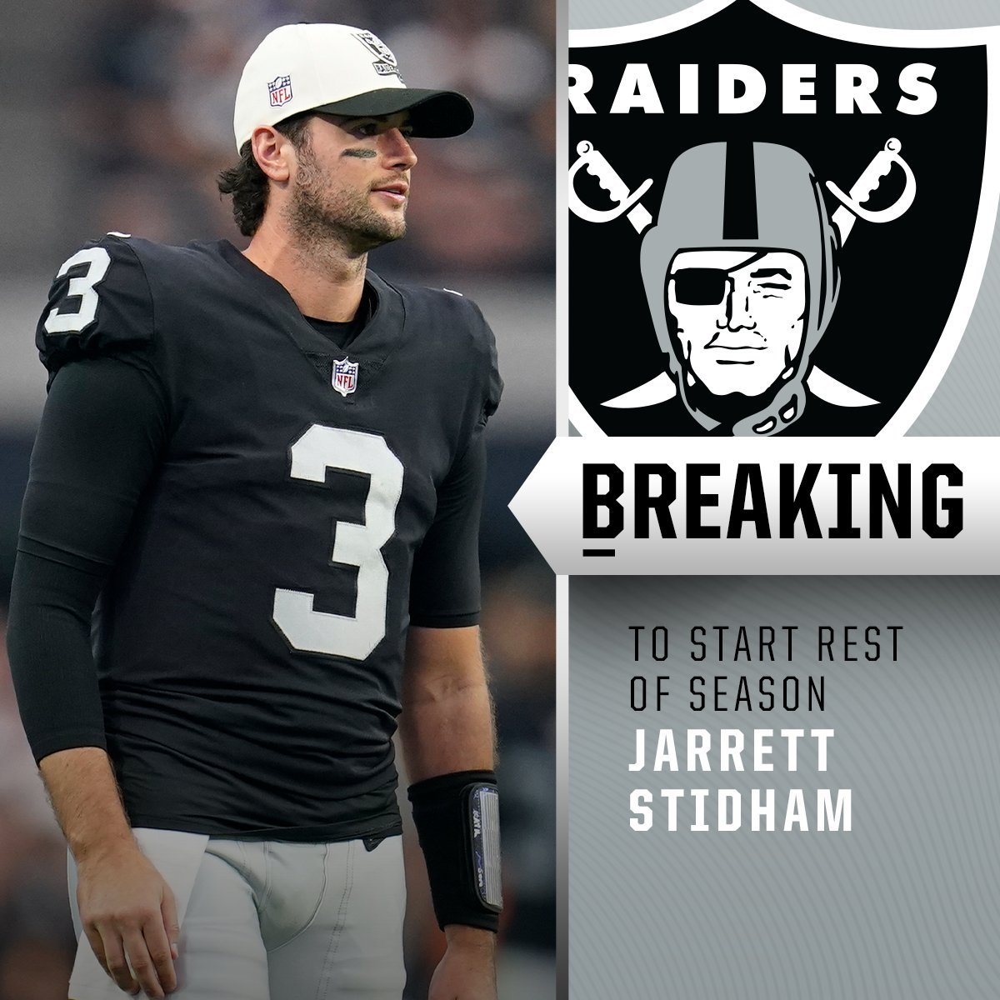
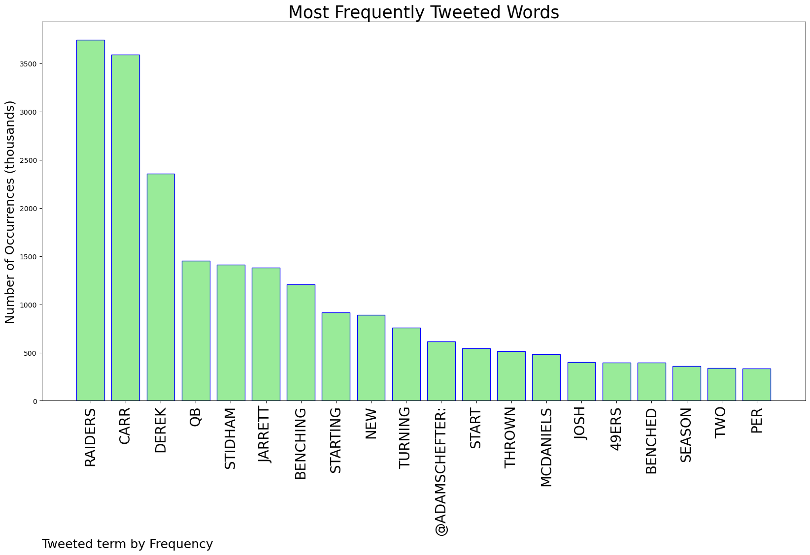
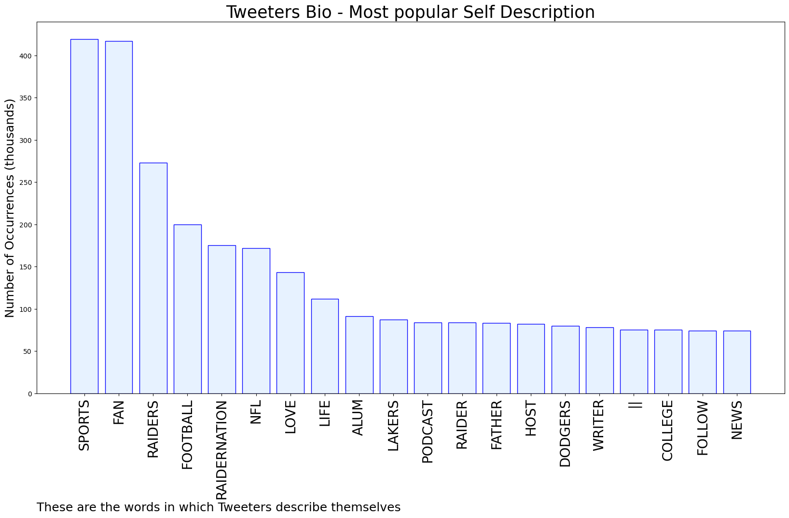

# MURCHIE85 TWITTER PROCESSING 
&#x1F34E; **TOPIC = "The Raiders"**

## AUTOMATED RESEARCH SUMMARY

*note: Image pulled from web automatically, not connected to author.
  
<b> This report is AUTOMATED and not hand crafted, it is designed for pulling metrics on a given keyword or hashtag and performs a series of reporting and analysis.</b>

|                **Sample-Tweets**        |
| :-------------: |
| RT @MySportsUpdate: This is big: The #Raiders are benching Derek Carr and will start Jarrett Stidham vs. the #49ers.Carr has $40.4M that… |
| RT @FieldYates: While the Raiders signed Derek Carr to a 3-year, $121.5M extension this past offseason, the team would incur a dead cap hit… |
| I cant wait until next year when the raiders have no qb and go 2-15 and don’t sniff the playoffs for like 5ish years |

The most popular user is: **ed_hoeg**

 RT @RexChapman: This is the Jerry Edmond. The guy from the Raiders game last week who was being yelled at and berated by the Raiders fan…

## RELATED METRICS 
| Metric | Value |
| ------------- | ------------- |
| #1 Most tweeted to  | **AdamSchefter** |
| #2 Most tweeted to  | **Raiders** |
| #3 Most tweeted to  | **espn** |
| NewProfiles (less than 10 days) | 0.34%  |
| Tweeters with < 10 followers  | 3.6%|
| Tweeters with > 1000000 followers  | 0.14%  |

## MOST POPULAR TWEET TERMS 

| Popularity Rank  | Term |
| ------------- | ------------- |
| first  | **RAIDERS**  |
| second  | **CARR**  |
| third  | **DEREK** |
| fourth  | **QB**  |
| fifth  | **STIDHAM**  |

## Twitter Bio Analysis
### SENTIMENT ANALYSIS

VIEWS WERE : **SUBJECTIVE**  (73.33%) & **NEGATIVELY-SUBJECTIVE** (0.0%) **OBJECTIVE** (26.67%)

### TWEET SAMPLE 
| Random value picked from array |
| ------------- |
|RT @VinnyBonsignore: Jarrett Stidham will be No. 1, Chase Garbers No. 2 for the @Raiders over the last two games. |

### MOST RETWEETED 

| The most retweeted user is: **ed_hoeg**  |
| ------------- |
| RT @RexChapman: This is the Jerry Edmond. The guy from the Raiders game last week who was being yelled at and berated by the Raiders fan… |

### CONCLUSION & EXTERNAL ANALYSIS

*This is my [Adam McMurchie`s] opinion on the data from the tweets, it serves as no objective truth.Since the tweets themselves are a mixture of fact & opinion. 
Authors analytical summary on request.
**RECOMMENDATIONS** WILL BE UPDATED IN NEXT  24 HOURS  