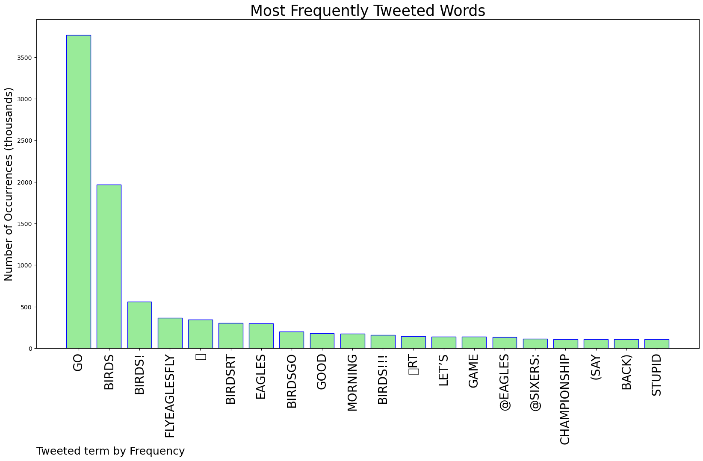
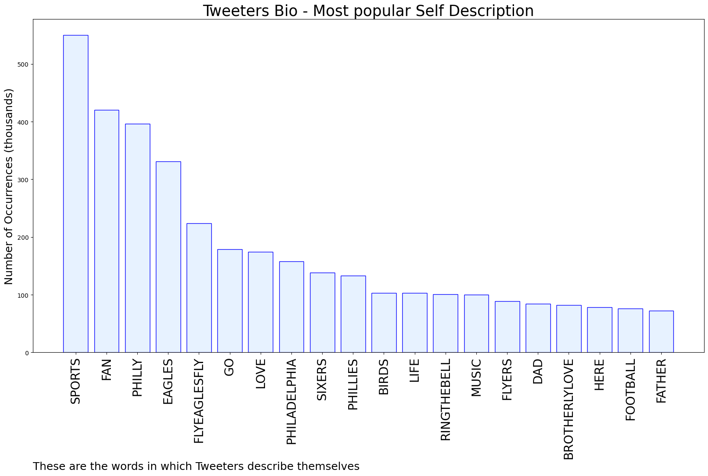

# MURCHIE85 TWITTER PROCESSING 
&#x1F34E; **TOPIC = "Go Birds"**

## AUTOMATED RESEARCH SUMMARY

*note: Image pulled from web automatically, not connected to author.
  
<b> This report is AUTOMATED and not hand crafted, it is designed for pulling metrics on a given keyword or hashtag and performs a series of reporting and analysis.</b>

|                **Sample-Tweets**        |
| :-------------: |
| GO BIRDS BABY |
| @JamesMartinSJ @Eagles Go BIRDS! |
| RT @sixers: GOOD MORNING AND GO BIRDS. 🦅 |

The most popular user is: **jjparker084**

 RT @RussoMichael15: Go birds @tyler_olivieri https://t.co/c2R4vvwoHJ

## RELATED METRICS 
| Metric | Value |
| ------------- | ------------- |
| #1 Most tweeted to  | **mccrystal_alex** |
| #2 Most tweeted to  | **JustinLever3** |
| #3 Most tweeted to  | **Eagles** |
| NewProfiles (less than 10 days) | 0.04%  |
| Tweeters with < 10 followers  | 3.22%|
| Tweeters with > 1000000 followers  | 0.02%  |

## MOST POPULAR TWEET TERMS 

| Popularity Rank  | Term |
| ------------- | ------------- |
| first  | **GO**  |
| second  | **BIRDS**  |
| third  | **BIRDS!** |
| fourth  | **FLYEAGLESFLY**  |
| fifth  | **🦅**  |

## Twitter Bio Analysis
### SENTIMENT ANALYSIS

VIEWS WERE : **SUBJECTIVE**  (13.33%) & **NEGATIVELY-SUBJECTIVE** (26.67%) **OBJECTIVE** (60.0%)

### TWEET SAMPLE 
| Random value picked from array |
| ------------- |
|@Willing2GoHamm @OTR2Victory You have been there since day 1 and appreciate your support. Go Birds! |

### MOST RETWEETED 

| The most retweeted user is: **jjparker084**  |
| ------------- |
| RT @RussoMichael15: Go birds @tyler_olivieri https://t.co/c2R4vvwoHJ |

### CONCLUSION & EXTERNAL ANALYSIS

*This is my [Adam McMurchie`s] opinion on the data from the tweets, it serves as no objective truth.Since the tweets themselves are a mixture of fact & opinion. 
Authors analytical summary on request.
**RECOMMENDATIONS** WILL BE UPDATED IN NEXT  24 HOURS  