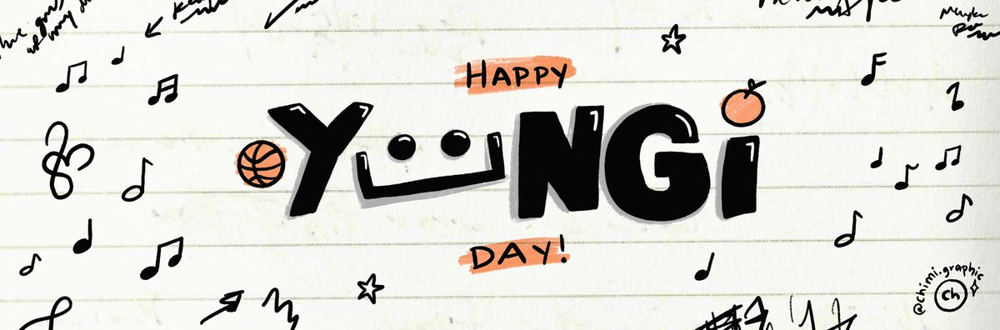
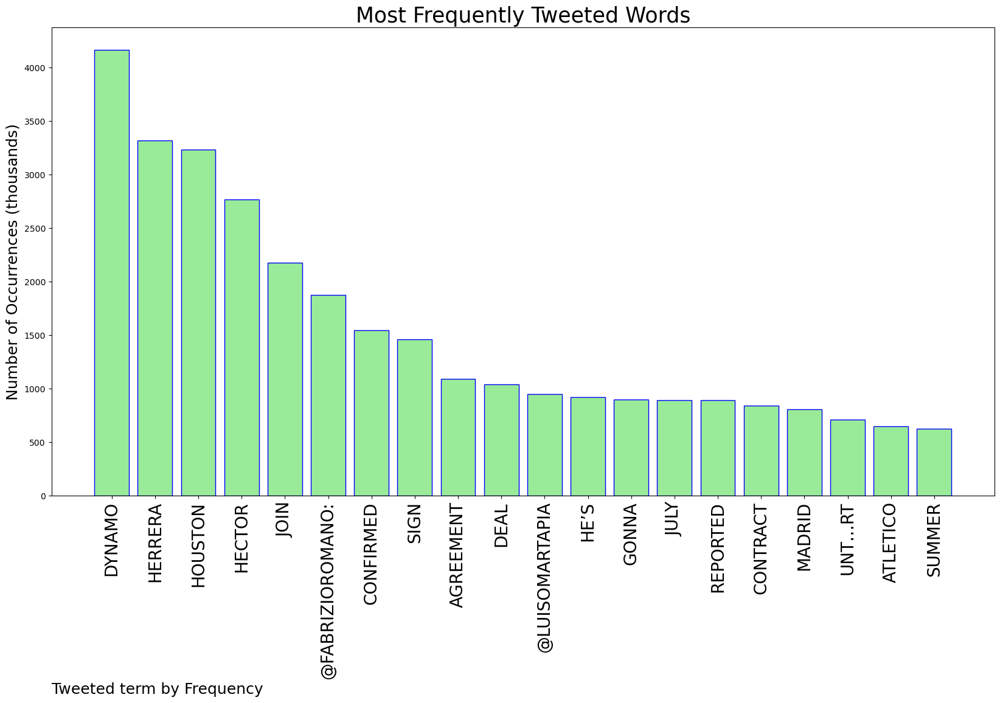
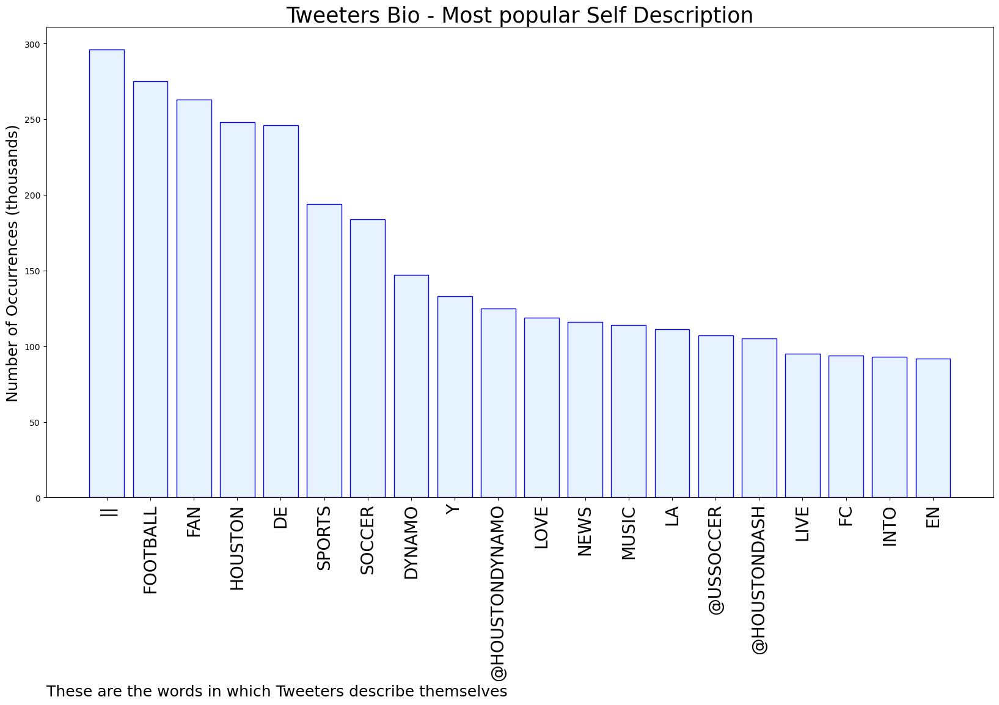

# MURCHIE85 TWITTER PROCESSING 
&#x1F34E; **TOPIC = "Dynamo"**

## AUTOMATED RESEARCH SUMMARY

*note: Image pulled from web automatically, not connected to author.
  
<b> This report is AUTOMATED and not hand crafted, it is designed for pulling metrics on a given keyword or hashtag and performs a series of reporting and analysis.</b>

|                **Sample-Tweets**        |
| :-------------: |
| @ManagerTactical This Is a New Era For Houston. #HoldItDown https://t.co/qYDU8bw0cV |
| RT @ShaneMeneer: Andriy Voronin has quit Dynamo Moscow.Andriy Voronin, who represented Liverpool during his playing career, said he could… |
| @KeepingTabsPod @GenOrangeRadio I WANT TO SCREAM IM SO EXCITED! Sunday was a thesis for how bad we need HH. Very ex… https://t.co/GJBbnBfxid |

The most popular user is: **dynamo_dani**

 RT @chimigraphic: hi! I made some yoongi day layouts 🤍🐱
feel free to use them 😁🍊#yoongiday https://t.co/Go90ttw1rm

## RELATED METRICS 
| Metric | Value |
| ------------- | ------------- |
| #1 Most tweeted to  | **FabrizioRomano** |
| #2 Most tweeted to  | **LuisOmarTapia** |
| #3 Most tweeted to  | **brfootball** |
| NewProfiles (less than 10 days) | 0.54%  |
| Tweeters with < 10 followers  | 3.64%|
| Tweeters with > 1000000 followers  | 0.14%  |

## MOST POPULAR TWEET TERMS 

| Popularity Rank  | Term |
| ------------- | ------------- |
| first  | **DYNAMO**  |
| second  | **HERRERA**  |
| third  | **HOUSTON** |
| fourth  | **HECTOR**  |
| fifth  | **JOIN**  |

## Twitter Bio Analysis
### SENTIMENT ANALYSIS

VIEWS WERE : **SUBJECTIVE**  (40.0%) & **NEGATIVELY-SUBJECTIVE** (0.0%) **OBJECTIVE** (60.0%)

### TWEET SAMPLE 
| Random value picked from array |
| ------------- |
|RT @DeadlineDayLive: 📝 DEAL DONE: Houston Dynamo have signed Héctor Herrera on a free transfer. The Mexican will join MLS in the summer whe… |

### MOST RETWEETED 

| The most retweeted user is: **dynamo_dani**  |
| ------------- |
| RT @chimigraphic: hi! I made some yoongi day layouts 🤍🐱feel free to use them 😁🍊#yoongiday https://t.co/Go90ttw1rm |

### CONCLUSION & EXTERNAL ANALYSIS

*This is my [Adam McMurchie`s] opinion on the data from the tweets, it serves as no objective truth.Since the tweets themselves are a mixture of fact & opinion. 
Authors analytical summary on request.
**RECOMMENDATIONS** WILL BE UPDATED IN NEXT  24 HOURS  