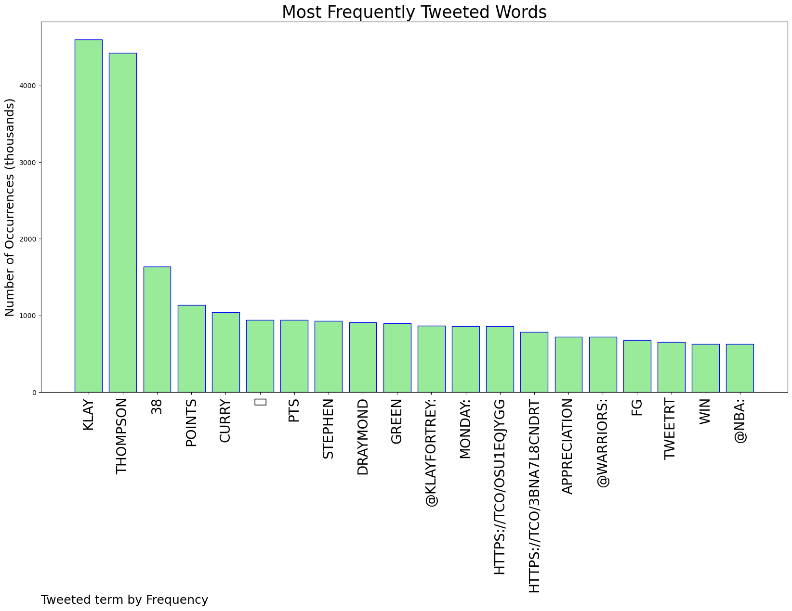
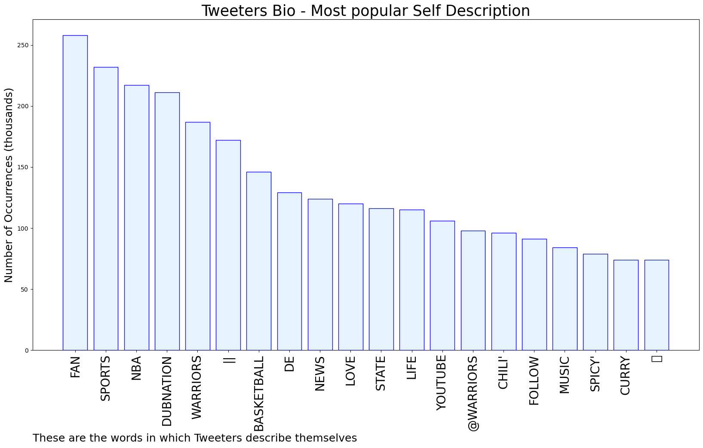

# MURCHIE85 TWITTER PROCESSING 
&#x1F34E; **TOPIC = "Klay Thompson"**

## AUTOMATED RESEARCH SUMMARY

*note: Image pulled from web automatically, not connected to author.
  
<b> This report is AUTOMATED and not hand crafted, it is designed for pulling metrics on a given keyword or hashtag and performs a series of reporting and analysis.</b>

|                **Sample-Tweets**        |
| :-------------: |
| RT @NBA: 🏀 FINAL SCORE THREAD 🏀Klay Thompson erupts for a season-high 38 PTS to lead the @warriors to the win in The Bay! #DubNation Kl… |
| RT @anthonyVslater: Klay Thompson: “Everyone makes a big deal about my shooting, man. I’m not happy. But I know these nights (15-of-23 for… |
| RT @KlayForTrey: Stephen Curry, Klay Thompson, and Draymond Green on Monday: https://t.co/osu1EqJYgg https://t.co/3BnA7l8Cnd |

The most popular user is: **jameezy9**

 RT @TylerIAm: Klay Thompson gets home after a long day of work and hangs that goatee up on his coat rack

## RELATED METRICS 
| Metric | Value |
| ------------- | ------------- |
| #1 Most tweeted to  | **warriors** |
| #2 Most tweeted to  | **KlayForTrey** |
| #3 Most tweeted to  | **NBA** |
| NewProfiles (less than 10 days) | 0.84%  |
| Tweeters with < 10 followers  | 5.62%|
| Tweeters with > 1000000 followers  | 0.16%  |

## MOST POPULAR TWEET TERMS 

| Popularity Rank  | Term |
| ------------- | ------------- |
| first  | **KLAY**  |
| second  | **THOMPSON**  |
| third  | **38** |
| fourth  | **POINTS**  |
| fifth  | **CURRY**  |

## Twitter Bio Analysis
### SENTIMENT ANALYSIS

VIEWS WERE : **SUBJECTIVE**  (40.0%) & **NEGATIVELY-SUBJECTIVE** (33.33%) **OBJECTIVE** (26.67%)

### TWEET SAMPLE 
| Random value picked from array |
| ------------- |
|RT @warriors: KLAY THOMPSON APPRECIATION TWEET |

### MOST RETWEETED 

| The most retweeted user is: **jameezy9**  |
| ------------- |
| RT @TylerIAm: Klay Thompson gets home after a long day of work and hangs that goatee up on his coat rack |

### CONCLUSION & EXTERNAL ANALYSIS

*This is my [Adam McMurchie`s] opinion on the data from the tweets, it serves as no objective truth.Since the tweets themselves are a mixture of fact & opinion. 
Authors analytical summary on request.
**RECOMMENDATIONS** WILL BE UPDATED IN NEXT  24 HOURS  