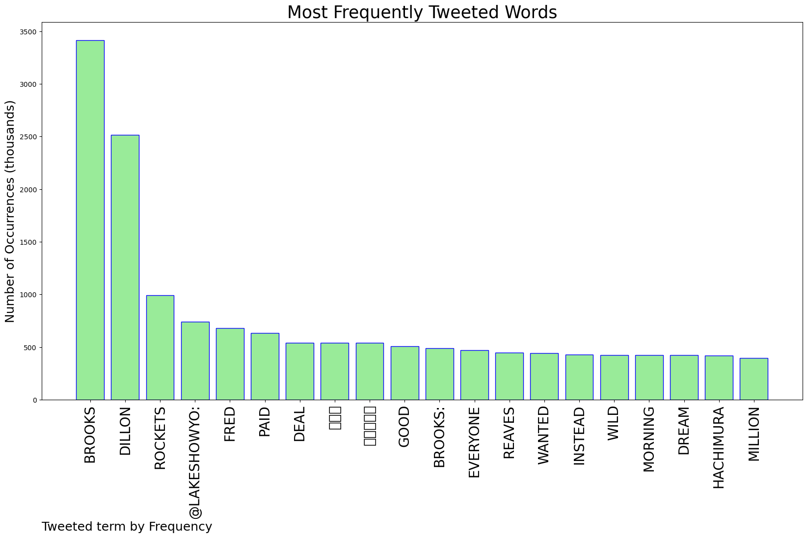
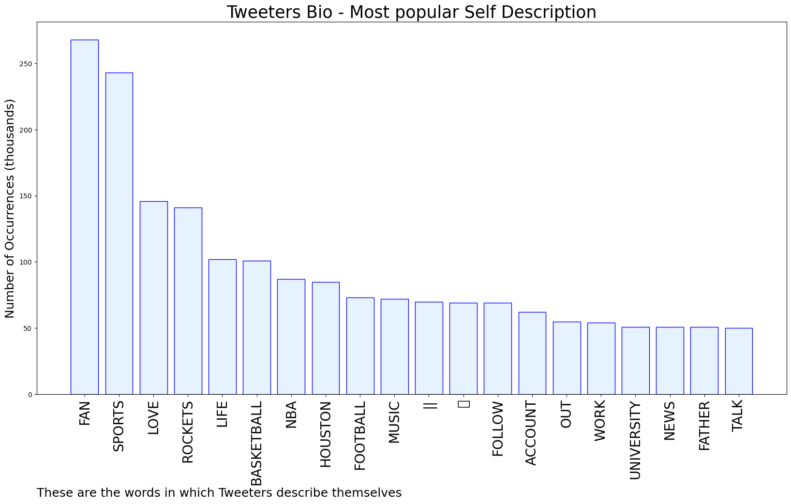

# MURCHIE85 TWITTER PROCESSING 
&#x1F34E; **TOPIC = "Brooks"**

## AUTOMATED RESEARCH SUMMARY

*note: Image pulled from web automatically, not connected to author.
  
<b> This report is AUTOMATED and not hand crafted, it is designed for pulling metrics on a given keyword or hashtag and performs a series of reporting and analysis.</b>

|                **Sample-Tweets**        |
| :-------------: |
| RT @dangercart: Imagine waking up in the morning owing Fred VanVleet and Dillon Brooks over $200 million |
| Congrats to @TalorGooch. Guy is absolutely ridiculous. Gotta feel for Bryson there, seems like he’s been working so… https://t.co/gKogFG4842 |
| RT @TheNBACentel: “I took Ja Morant’s gun with me to the negotiation.”- Dillon Brooks on his 4-year, $80M deal https://t.co/5wJ0EKEWbA |

The most popular user is: **brooks_ron**

 RT @Faa111faaeth: THE $CHAIN AIRDROP IS LIVE! 👁

🔗 https://t.co/tV1u9KRiuB

#bnb #airdrop #xpr #CoinMarketCap #musk #elon #twt #wallet #col…

## RELATED METRICS 
| Metric | Value |
| ------------- | ------------- |
| #1 Most tweeted to  | **LakeShowYo** |
| #2 Most tweeted to  | **NBAMemes** |
| #3 Most tweeted to  | **wojespn** |
| NewProfiles (less than 10 days) | 0.56%  |
| Tweeters with < 10 followers  | 5.96%|
| Tweeters with > 1000000 followers  | 0.06%  |

## MOST POPULAR TWEET TERMS 

| Popularity Rank  | Term |
| ------------- | ------------- |
| first  | **BROOKS**  |
| second  | **DILLON**  |
| third  | **ROCKETS** |
| fourth  | **@LAKESHOWYO:**  |
| fifth  | **FRED**  |

## Twitter Bio Analysis
### SENTIMENT ANALYSIS

VIEWS WERE : **SUBJECTIVE**  (20.0%) & **NEGATIVELY-SUBJECTIVE** (6.67%) **OBJECTIVE** (73.33%)

### TWEET SAMPLE 
| Random value picked from array |
| ------------- |
|RT @TheNBACentel: “I took Ja Morant’s gun with me to the negotiation.”- Dillon Brooks on his 4-year, $80M deal https://t.co/5wJ0EKEWbA |

### MOST RETWEETED 

| The most retweeted user is: **brooks_ron**  |
| ------------- |
| RT @Faa111faaeth: THE $CHAIN AIRDROP IS LIVE! 👁🔗 https://t.co/tV1u9KRiuB#bnb #airdrop #xpr #CoinMarketCap #musk #elon #twt #wallet #col… |

### CONCLUSION & EXTERNAL ANALYSIS

*This is my [Adam McMurchie`s] opinion on the data from the tweets, it serves as no objective truth.Since the tweets themselves are a mixture of fact & opinion. 
Authors analytical summary on request.
**RECOMMENDATIONS** WILL BE UPDATED IN NEXT  24 HOURS  