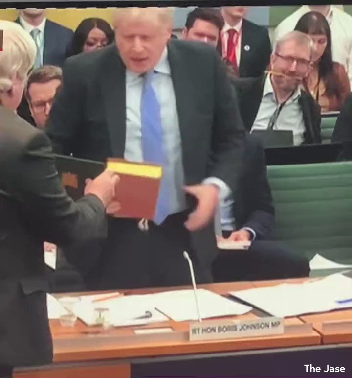
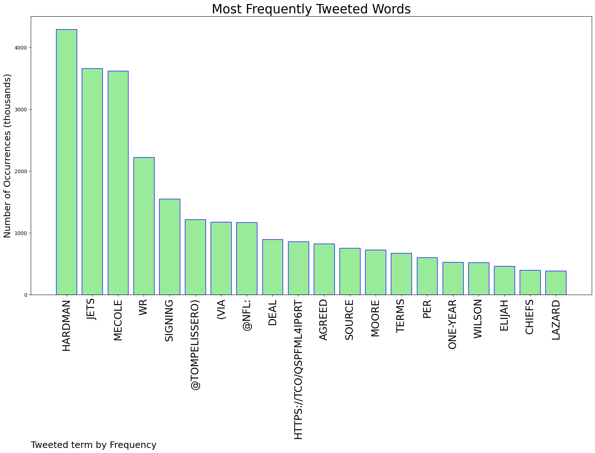
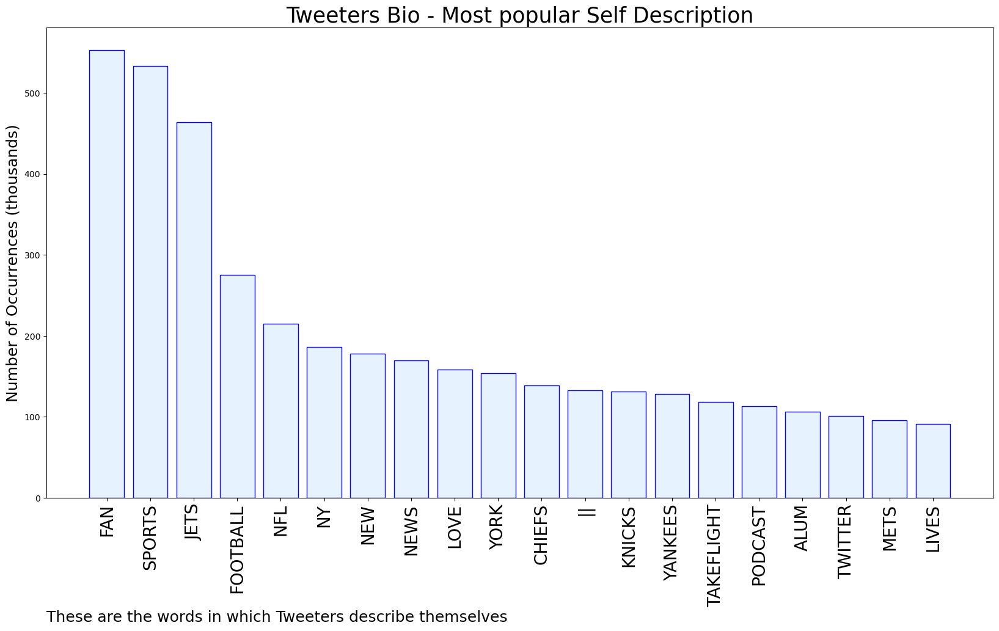
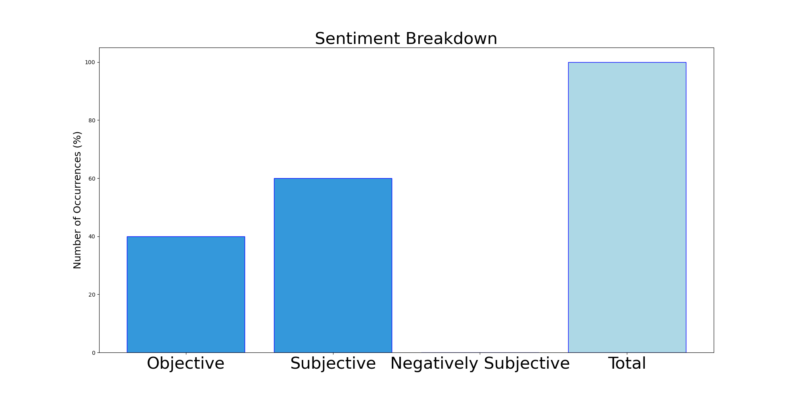

# MURCHIE85 TWITTER PROCESSING 
&#x1F34E; **TOPIC = "Hardman"**

## AUTOMATED RESEARCH SUMMARY

*note: Image pulled from web automatically, not connected to author.
  
<b> This report is AUTOMATED and not hand crafted, it is designed for pulling metrics on a given keyword or hashtag and performs a series of reporting and analysis.</b>

|                **Sample-Tweets**        |
| :-------------: |
| The #Jets are signing former #Chiefs Wide Receiver Mecole Hardman#NFLFreeAgency #NFLNews #NFL https://t.co/EJyNVudvjU |
| @NFL @TomPelissero Cause I don't see Wilson Lazard Moore Davis and Hardman being on the team next year one of them gotta be gone |
| RT @Willpa11: Newest Jet Mecole Hardman https://t.co/dzQsqlcJNe |

The most popular user is: **Pauline_Hardman**

 RT @PippaCrerar: 👀Fascinating insight into how No 10 reacted to my initial query about Partygate - all in the bundle drop just released by…

## RELATED METRICS 
| Metric | Value |
| ------------- | ------------- |
| #1 Most tweeted to  | **TomPelissero** |
| #2 Most tweeted to  | **NFL** |
| #3 Most tweeted to  | **JFowlerESPN** |
| NewProfiles (less than 10 days) | 0.18%  |
| Tweeters with < 10 followers  | 3.18%|
| Tweeters with > 1000000 followers  | 0.18%  |

## MOST POPULAR TWEET TERMS 

| Popularity Rank  | Term |
| ------------- | ------------- |
| first  | **HARDMAN**  |
| second  | **JETS**  |
| third  | **MECOLE** |
| fourth  | **WR**  |
| fifth  | **SIGNING**  |

## Twitter Bio Analysis
### SENTIMENT ANALYSIS

VIEWS WERE : **SUBJECTIVE**  (60.0%) & **NEGATIVELY-SUBJECTIVE** (0.0%) **OBJECTIVE** (40.0%)

### TWEET SAMPLE 
| Random value picked from array |
| ------------- |
|RT @NFL: Jets signing WR Mecole Hardman. (via @TomPelissero) https://t.co/QsPfMl4Ip6 |

### MOST RETWEETED 

| The most retweeted user is: **Pauline_Hardman**  |
| ------------- |
| RT @PippaCrerar: 👀Fascinating insight into how No 10 reacted to my initial query about Partygate - all in the bundle drop just released by… |

### CONCLUSION & EXTERNAL ANALYSIS

*This is my [Adam McMurchie`s] opinion on the data from the tweets, it serves as no objective truth.Since the tweets themselves are a mixture of fact & opinion. 
Authors analytical summary on request.
**RECOMMENDATIONS** WILL BE UPDATED IN NEXT  24 HOURS  