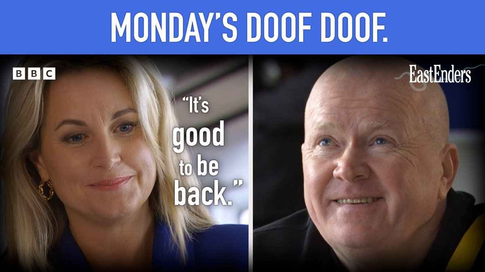
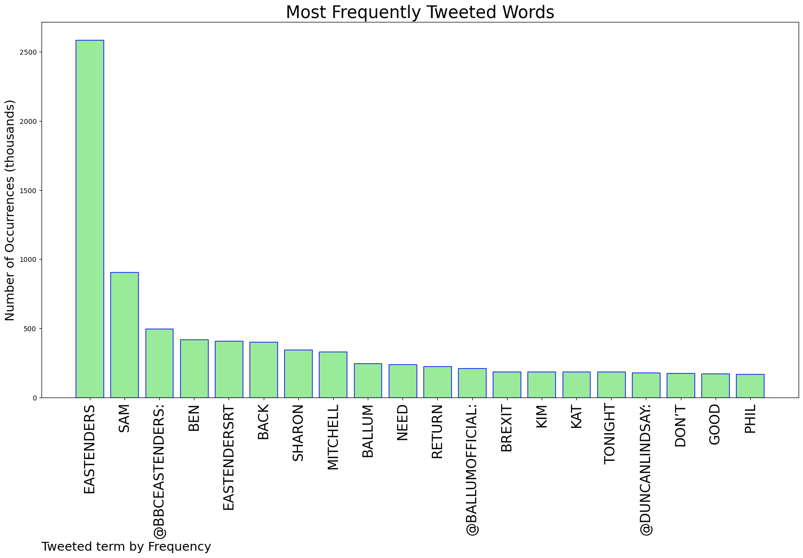
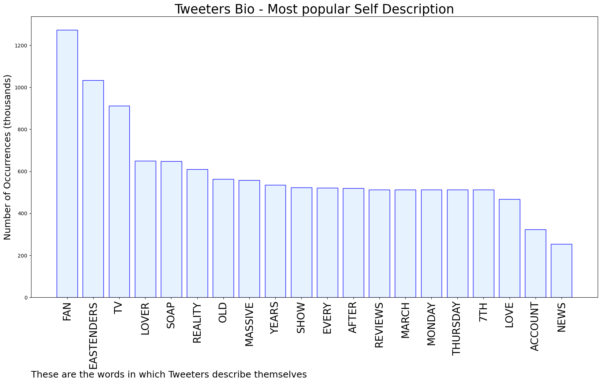
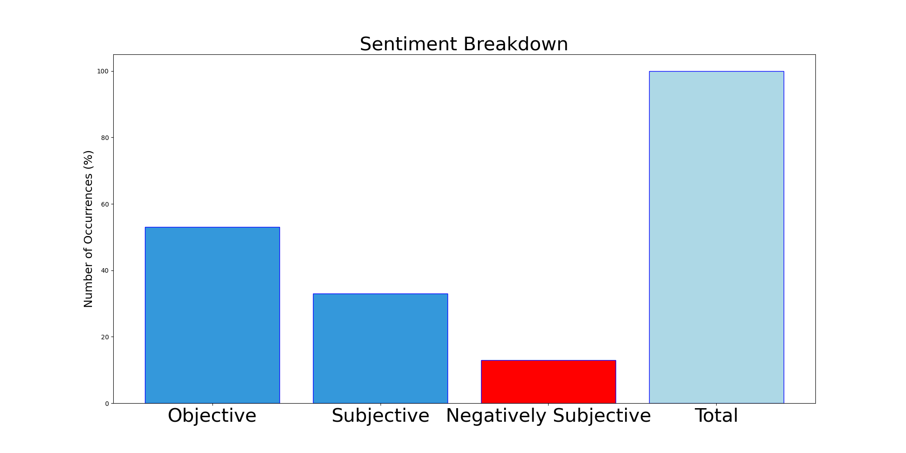

# MURCHIE85 TWITTER PROCESSING 
&#x1F34E; **TOPIC = "#EastEnders"**

## AUTOMATED RESEARCH SUMMARY

*note: Image pulled from web automatically, not connected to author.
  
<b> This report is AUTOMATED and not hand crafted, it is designed for pulling metrics on a given keyword or hashtag and performs a series of reporting and analysis.</b>

|                **Sample-Tweets**        |
| :-------------: |
| "EastEnders" #Eastenders https://t.co/VF0czLMcqi |
| Marriage no wait I’ve lost count #EastEnders |
| RT @BallumOfficial: An actual wink!#EastEnders #Ballum https://t.co/7xz9KKKQZb |

The most popular user is: **lilywebb__**

 RT @ShaunInBrum: As a kid, gutted that EastEnders didn't do set tours, I sent #JuneBrown a disposable camera &amp; asked if she could snap some…

## RELATED METRICS 
| Metric | Value |
| ------------- | ------------- |
| #1 Most tweeted to  | **bbceastenders** |
| #2 Most tweeted to  | **BallumOfficial** |
| #3 Most tweeted to  | **DuncanLindsay** |
| NewProfiles (less than 10 days) | 0.94%  |
| Tweeters with < 10 followers  | 2.9%|
| Tweeters with > 1000000 followers  | 0.52%  |

## MOST POPULAR TWEET TERMS 

| Popularity Rank  | Term |
| ------------- | ------------- |
| first  | **EASTENDERS**  |
| second  | **SAM**  |
| third  | **@BBCEASTENDERS:** |
| fourth  | **BEN**  |
| fifth  | **EASTENDERSRT**  |

## Twitter Bio Analysis
### SENTIMENT ANALYSIS

VIEWS WERE : **SUBJECTIVE**  (33.33%) & **NEGATIVELY-SUBJECTIVE** (13.33%) **OBJECTIVE** (53.33%)

### TWEET SAMPLE 
| Random value picked from array |
| ------------- |
|There not being a gay/bi Branning brother has always been a missed opportunity. #EastEnders |

### MOST RETWEETED 

| The most retweeted user is: **lilywebb__**  |
| ------------- |
| RT @ShaunInBrum: As a kid, gutted that EastEnders didn't do set tours, I sent #JuneBrown a disposable camera &amp; asked if she could snap some… |

### CONCLUSION & EXTERNAL ANALYSIS

*This is my [Adam McMurchie`s] opinion on the data from the tweets, it serves as no objective truth.Since the tweets themselves are a mixture of fact & opinion. 
Authors analytical summary on request.
**RECOMMENDATIONS** WILL BE UPDATED IN NEXT  24 HOURS  