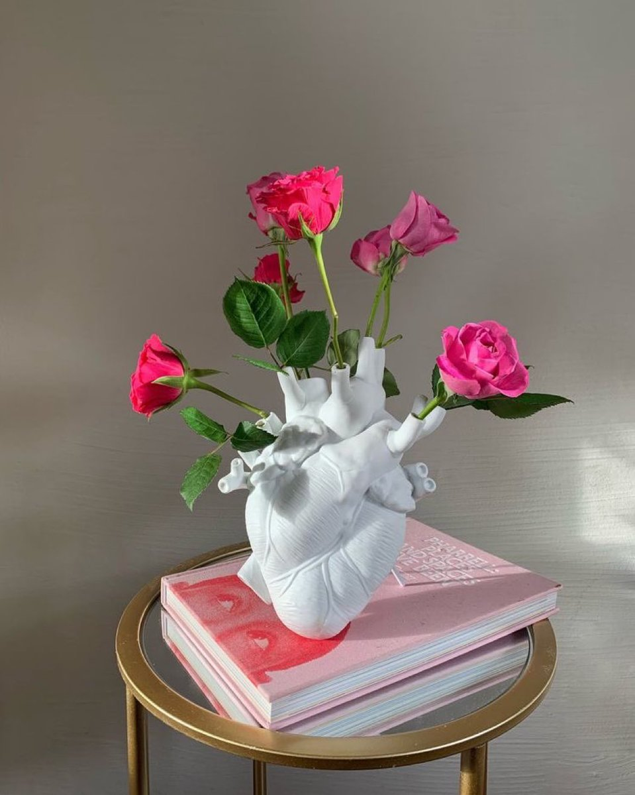
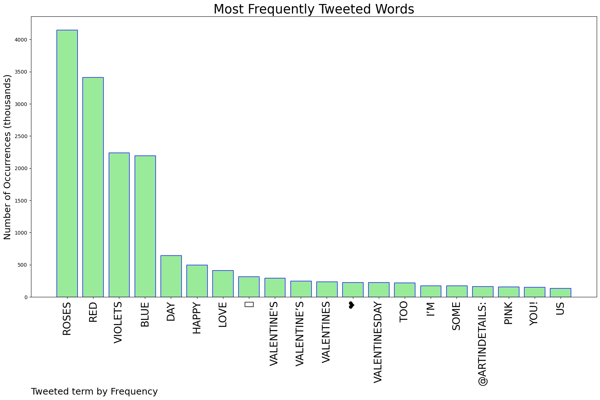
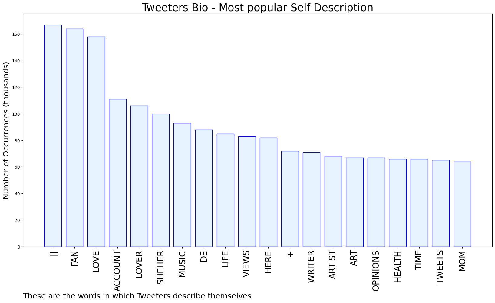

# MURCHIE85 TWITTER PROCESSING 
&#x1F34E; **TOPIC = "Roses"**

## AUTOMATED RESEARCH SUMMARY

*note: Image pulled from web automatically, not connected to author.
  
<b> This report is AUTOMATED and not hand crafted, it is designed for pulling metrics on a given keyword or hashtag and performs a series of reporting and analysis.</b>

|                **Sample-Tweets**        |
| :-------------: |
| RT @PharmaFactz: Roses are red,Violets are blue, nausea and vomiting. |
| RT @mrmorgandoing: arthur is having a picnic with charles. after they finish eating, arthur surprises him with roses and a ring and tells h… |
| RT @artindetails: red roses https://t.co/UnFe2fsgbN |

The most popular user is: **kpop_roses**

 RT @btschartsdailys: [K-media] In a Interview with Lee Jungjae he mentioned how he met with Taehyung 

"I went to a private meeting and met…

## RELATED METRICS 
| Metric | Value |
| ------------- | ------------- |
| #1 Most tweeted to  | **artindetails** |
| #2 Most tweeted to  | **tedcruz** |
| #3 Most tweeted to  | **ecb** |
| NewProfiles (less than 10 days) | 0.22%  |
| Tweeters with < 10 followers  | 3.86%|
| Tweeters with > 1000000 followers  | 0.12%  |

## MOST POPULAR TWEET TERMS 

| Popularity Rank  | Term |
| ------------- | ------------- |
| first  | **ROSES**  |
| second  | **RED**  |
| third  | **VIOLETS** |
| fourth  | **BLUE**  |
| fifth  | **DAY**  |

## Twitter Bio Analysis
### SENTIMENT ANALYSIS

VIEWS WERE : **SUBJECTIVE**  (40.0%) & **NEGATIVELY-SUBJECTIVE** (33.33%) **OBJECTIVE** (26.67%)

### TWEET SAMPLE 
| Random value picked from array |
| ------------- |
|RT @NOAAClimate: Happy Valentine's Day! Here's a little climate poem.Roses are red,Violets are blue,Our planet is warming...Yes, it's… |

### MOST RETWEETED 

| The most retweeted user is: **kpop_roses**  |
| ------------- |
| RT @btschartsdailys: [K-media] In a Interview with Lee Jungjae he mentioned how he met with Taehyung "I went to a private meeting and met… |

### CONCLUSION & EXTERNAL ANALYSIS

*This is my [Adam McMurchie`s] opinion on the data from the tweets, it serves as no objective truth.Since the tweets themselves are a mixture of fact & opinion. 
Authors analytical summary on request.
**RECOMMENDATIONS** WILL BE UPDATED IN NEXT  24 HOURS  