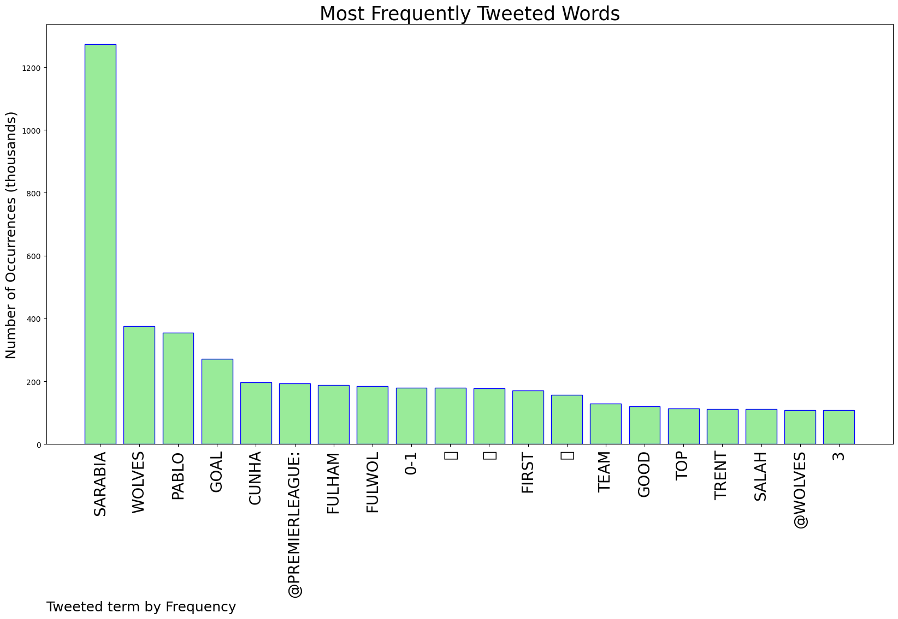
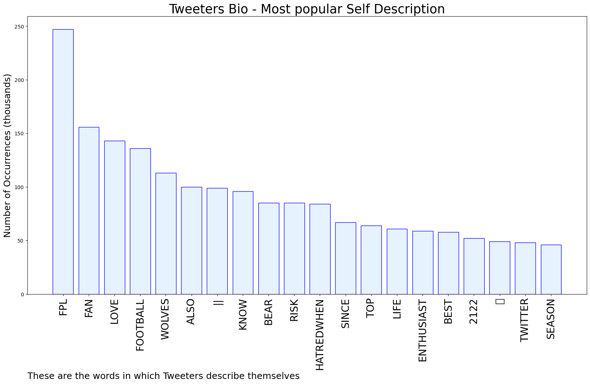

# MURCHIE85 TWITTER PROCESSING 
&#x1F34E; **TOPIC = "Sarabia"**

## AUTOMATED RESEARCH SUMMARY

*note: Image pulled from web automatically, not connected to author.
  
<b> This report is AUTOMATED and not hand crafted, it is designed for pulling metrics on a given keyword or hashtag and performs a series of reporting and analysis.</b>

|                **Sample-Tweets**        |
| :-------------: |
| @Greyhead19 Sarabia still has to play LIV |
| @FootballForeca3 Where’s Sarabia 🧐 |
| RT @StefanWolves90: Sarabia is a poor poor player |

The most popular user is: **manuel_sarabia**

 RT @elonmusk: The new CEO of Twitter is amazing https://t.co/yBqWFUDIQH

## RELATED METRICS 
| Metric | Value |
| ------------- | ------------- |
| #1 Most tweeted to  | **premierleague** |
| #2 Most tweeted to  | **Wolves** |
| #3 Most tweeted to  | **FPLOlympian** |
| NewProfiles (less than 10 days) | 0.47%  |
| Tweeters with < 10 followers  | 7.04%|
| Tweeters with > 1000000 followers  | 0.8%  |

## MOST POPULAR TWEET TERMS 

| Popularity Rank  | Term |
| ------------- | ------------- |
| first  | **SARABIA**  |
| second  | **WOLVES**  |
| third  | **PABLO** |
| fourth  | **GOAL**  |
| fifth  | **CUNHA**  |

## Twitter Bio Analysis
### SENTIMENT ANALYSIS

VIEWS WERE : **SUBJECTIVE**  (33.33%) & **NEGATIVELY-SUBJECTIVE** (13.33%) **OBJECTIVE** (53.33%)

### TWEET SAMPLE 
| Random value picked from array |
| ------------- |
|@FPL__Raptor Mahrez minutes, looking at Sarabia for a hit so bit risky |

### MOST RETWEETED 

| The most retweeted user is: **manuel_sarabia**  |
| ------------- |
| RT @elonmusk: The new CEO of Twitter is amazing https://t.co/yBqWFUDIQH |

### CONCLUSION & EXTERNAL ANALYSIS

*This is my [Adam McMurchie`s] opinion on the data from the tweets, it serves as no objective truth.Since the tweets themselves are a mixture of fact & opinion. 
Authors analytical summary on request.
**RECOMMENDATIONS** WILL BE UPDATED IN NEXT  24 HOURS  